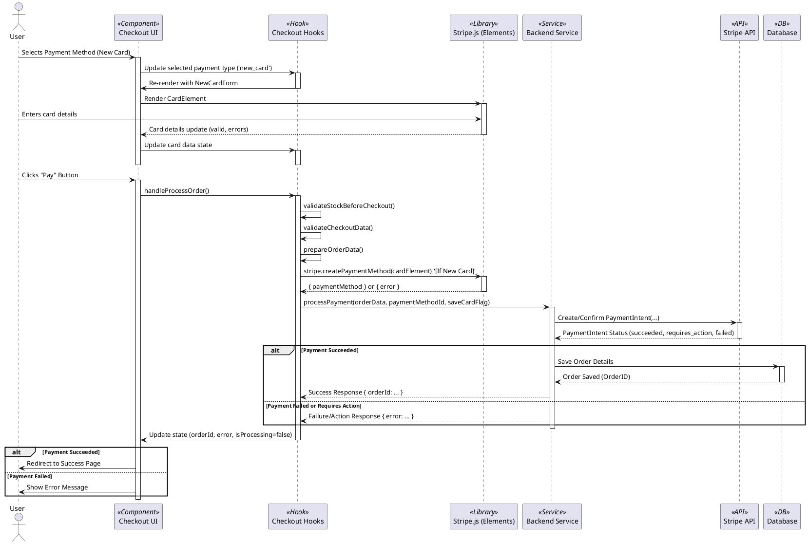

# Stripe Payment Integration Documentation

## 1. Overview

This document details the integration of Stripe for processing online payments within the Cactilia application. The goal is to provide a clear understanding of the frontend workflow, component interactions, state management, and the crucial handoff to the backend for secure payment processing.

The integration utilizes `@stripe/react-stripe-js` and `@stripe/stripe-js` on the frontend to securely collect payment information using Stripe Elements. The final payment confirmation is handled server-side via a dedicated backend service, adhering to security best practices.

## 2. Prerequisites & Setup

Before the payment flow can function correctly, ensure the following setup is complete:

* **Stripe Account:** A Stripe account is required.
* **API Keys:** Obtain your Stripe API keys (Publishable Key and Secret Key).
* **Environment Variables:** The **Publishable Key** must be configured in your frontend environment variables. Create a `.env` file in the project root (if it doesn't exist) and add:

  ```env
  VITE_STRIPE_PUBLISHABLE_KEY=pk_test_xxxxxxxxxxxxxxxxxxxxxxxxxxxxxx
  ```

  *Replace `pk_test_...` with your actual Stripe Publishable Key (use test keys for development).*

  The **Secret Key** should **NEVER** be exposed in the frontend code. It must only be used on your secure backend server.

## 3. Core Components & Hooks

The Stripe payment flow involves several key components and hooks working together:

| File / Hook                                                                         | Responsibility                                                                                                    |
| :---------------------------------------------------------------------------------- | :---------------------------------------------------------------------------------------------------------------- |
| `src/contexts/StripeContext.jsx`                                                  | Initializes `loadStripe` with the publishable key and provides the base Stripe `<Elements>` context wrapper.  |
| `src/modules/shop/pages/CheckoutPage.jsx`                                         | Entry point for checkout. Handles auth/cart checks, renders Stripe `<Elements>`, provides `CheckoutProvider`. |
| `src/modules/shop/context/CheckoutContext.jsx`                                    | Central context provider for checkout state. Aggregates state and functions from specialized hooks.               |
| `src/modules/shop/features/checkout/hooks/useCheckout.js`                         | Hook to consume `CheckoutContext`.                                                                              |
| `src/modules/shop/context/hooks/useOrderProcessor.js`                             | Core hook containing the multi-step order processing logic (validation, data prep, payment initiation).           |
| `src/modules/shop/context/hooks/useAddressManager.js`                             | Manages shipping address state and logic.                                                                         |
| `src/modules/shop/context/hooks/usePaymentManager.js`                             | Manages payment method selection state (saved cards, new card, OXXO).                                             |
| `src/modules/shop/features/checkout/components/CheckoutContent.jsx`               | Orchestrates the main checkout UI, renders `CheckoutForm` and `CheckoutSummaryPanel`.                         |
| `src/modules/shop/features/checkout/components/CheckoutForm.jsx`                  | Container component rendering distinct sections (Address, Shipping, Payment, Billing, Notes).                     |
| `src/modules/shop/features/checkout/components/sections/PaymentSection.jsx`       | Renders the `PaymentMethodSelector`.                                                                            |
| `src/modules/shop/features/checkout/components/payment/PaymentMethodSelector.jsx` | Displays available payment options (OXXO, saved cards), renders `NewCardForm`.                                  |
| `src/modules/shop/features/checkout/components/payment/NewCardForm.jsx`           | Renders the Stripe `CardElement` for securely collecting new card details.                                      |
| `src/modules/shop/features/checkout/components/CheckoutSummaryPanel.jsx`          | Displays the order summary and contains the final "Pay" button triggering the order processing.                   |
| `src/modules/shop/features/checkout/services/index.js` (`processPayment`)       | Frontend service function responsible for calling the backend API to process the payment.                         |

## 4. Detailed Payment Flow

The process involves several steps, coordinating UI components, context, hooks, and backend interaction:

1. **Initialization:**

   * `StripeProvider` (likely wrapping the app in `main.jsx` or `App.jsx`) calls `loadStripe` with the publishable key.
   * When the user navigates to `/checkout`, `CheckoutPage.jsx` mounts.
   * `CheckoutPage.jsx` verifies authentication and cart contents.
   * `CheckoutPage.jsx` renders the Stripe `<Elements>` provider and the `CheckoutProvider`.
2. **Checkout UI Rendering:**

   * `CheckoutProvider` initializes its state and specialized hooks (`useAddressManager`, `usePaymentManager`, `useOrderProcessor`, etc.).
   * `CheckoutContent.jsx` renders, consuming state from `useCheckout`.
   * `CheckoutContent.jsx` renders `CheckoutForm` and `CheckoutSummaryPanel`, passing necessary props and callbacks.
   * `CheckoutForm.jsx` renders section components (`AddressSection`, `ShippingOptionsSection`, `PaymentSection`, etc.).
3. **Payment Method Selection:**

   * `PaymentSection.jsx` renders `PaymentMethodSelector.jsx`.
   * `PaymentMethodSelector.jsx` displays options:
     * **OXXO:** Renders `OxxoPaymentOption`. Selecting it calls `handleOxxoSelect` (from `usePaymentManager`).
     * **Saved Cards:** Fetches and displays saved cards (via `usePaymentManager`). Selecting one calls `handlePaymentSelect`.
     * **New Card:** Renders an option to add a new card. Selecting it calls `handleNewCardSelect`.
4. **New Card Input:**

   * If "New Card" is selected, `PaymentMethodSelector.jsx` renders `NewCardForm.jsx`.
   * `NewCardForm.jsx` renders the Stripe `CardElement`.
   * User enters card details and cardholder name.
   * `CardElement` securely handles input and validation. State changes (completeness, errors) are propagated up via `onCardChange` to `usePaymentManager`.
   * User can optionally check "Save card". This state is managed via `onSaveCardChange`.
5. **Final Order Placement:**

   * User reviews the order in `CheckoutSummaryPanel`.
   * The "Pay" button's enabled state is controlled by `isButtonDisabled` in `CheckoutContent.jsx`, checking for valid address, shipping, payment selection, and stock.
   * Clicking "Pay" triggers the `processOrderWithChecks` function passed to `CheckoutSummaryPanel`. This function is actually `handleProcessOrder` from `useCheckout`.
6. **Order Processing (`useOrderProcessor`):**

   * `handleProcessOrder` (in `CheckoutContext`) calls `processOrder` within `useOrderProcessor`.
   * `processOrder`:
     * Sets `isProcessing` state to `true`.
     * Performs final stock validation (`validateStockBeforeCheckout`).
     * Performs final data validation (`validateCheckoutData`).
     * Prepares the final order data (`prepareOrderData`).
     * Calls `createAndProcessOrder`.
7. **Payment Method Creation & Backend Call (`createAndProcessOrder`):**

   * **If New Card:**
     * Gets the `CardElement` instance via `elements.getElement(CardElement)`.
     * Calls `stripe.createPaymentMethod({ type: 'card', card: cardElement, ... })` to get a `paymentMethodId` from Stripe.
   * **If Saved Card:**
     * Retrieves the stored `stripePaymentMethodId` associated with the selected card.
   * Calls the `processPayment` service function, passing the prepared `orderData`, the `paymentMethodId` (for cards) or payment type ('oxxo'), customer email (for OXXO), and the `saveCard` flag.
8. **Backend Processing (`processPayment` Service Call):**

   * The `processPayment` function sends a request to your backend API endpoint.
   * **Backend Responsibility (Crucial):**
     * Receives order data and payment details.
     * Performs server-side validation.
     * Creates/retrieves a Stripe **PaymentIntent** using the **Stripe Secret Key**.
     * **Confirms the PaymentIntent with Stripe**, providing the `paymentMethodId` or `payment_method_types: ['oxxo']`. Includes `setup_future_usage: 'on_session'` if the user requested to save the card.
     * Handles potential 3D Secure authentication steps if required by Stripe.
     * Saves the order details to the database upon successful payment confirmation (or pending for OXXO).
     * Returns a success/failure response to the frontend (potentially including the order ID or client secret if 3DS is needed).
9. **Frontend Response Handling:**

   * `useOrderProcessor` receives the response from `processPayment`.
   * If successful:
     * Clears the cart (via Redux `clearCartWithSync`, unless OXXO).
     * Sets the `orderId`.
     * Redirects the user to the order success page (`/shop/order-success/:orderId`).
   * If failed:
     * Sets the error state (`setError`).
     * Resets the processing state (`setIsProcessing(false)`).
     * Keeps the user on the checkout page to fix the issue.

## 5. Sequence Diagram (PlantUML)



*(You can render this PlantUML code using tools like the PlantUML website, plugins for IDEs, or Markdown previewers that support it.)*

## 6. Backend Interaction

As highlighted in the flow and diagram, the frontend **does not** directly confirm payments with Stripe. This is a critical security measure. The `processPayment` service acts as a bridge to the backend API.

**The backend is responsible for:**

1. **Receiving** order data and payment details from the frontend.
2. **Validating** the data server-side.
3. **Calculating** the final amount securely.
4. Interacting with the Stripe API using the **Secret Key** to:
   * Create or retrieve a **PaymentIntent**.
   * **Confirm** the PaymentIntent with the provided `paymentMethodId` (for cards) or using OXXO details.
   * Handle potential 3D Secure authentication requests from Stripe.
   * Optionally save payment methods (`setup_future_usage`).
5. **Updating** the order status in the database based on the Stripe confirmation result.
6. **Handling Stripe Webhooks:** This is essential for reliability. The backend should listen for and securely handle webhook events (verifying signatures) to asynchronously confirm payment statuses, especially for methods like OXXO or if the user closes the browser during 3DS. Key events to handle include:
   * `payment_intent.succeeded`: Payment completed successfully.
   * `payment_intent.payment_failed`: Payment failed.
   * `payment_intent.processing`: Payment is processing (relevant for some methods).
   * `charge.succeeded`: Often useful for logging/cross-referencing successful charges.
   * `setup_intent.succeeded` / `setup_intent.setup_failed`: If using SetupIntents for saving cards.
   * (Consider `checkout.session.completed` if using Stripe Checkout sessions).
7. **Returning** an appropriate response to the frontend.

## 7. Supported Payment Methods

Based on the analysis, the current implementation supports:

* **Credit/Debit Cards:** Via Stripe `CardElement` (New Cards) and saved Stripe Payment Methods.
* **OXXO:** Via a dedicated selection option, requiring backend confirmation via webhooks.

## 8. Areas for Improvement / Future Work

* **Robust Error Handling:** Enhance error messages displayed to the user for different failure scenarios (Stripe declines, stock issues, server errors). Provide clearer guidance.
* **Stripe Webhooks:** Ensure comprehensive and idempotent backend webhook handling is implemented for all relevant events (`payment_intent.succeeded`, `payment_intent.payment_failed`, `payment_intent.processing`, `charge.succeeded`, `setup_intent.succeeded`, `setup_intent.setup_failed`, etc.) to guarantee order status accuracy. Verify webhook signatures.
* **Code Complexity:** The nesting of contexts and hooks (`CheckoutContext` -> `useOrderProcessor` -> `usePaymentManager`, etc.) is quite deep. Consider refactoring to simplify state management if complexity becomes problematic (e.g., exploring state machines or alternative patterns).
* **Testing:** Add more comprehensive unit, integration, and end-to-end tests covering various payment scenarios, including errors and edge cases. Mock Stripe interactions effectively.
* **`useStripe` Hook:** The custom `useStripe` hook in `StripeContext.jsx` currently only provides `stripeReady`. It could be enhanced or removed if `useStripe` and `useElements` from `@stripe/react-stripe-js` are always used directly where needed.
* **Payment Element:** Consider migrating from the classic `CardElement` to the newer Stripe **Payment Element**. This single element can handle multiple payment methods (cards, wallets, bank redirects) dynamically based on your Stripe dashboard settings, simplifying the addition of future payment options.
* **UI Feedback:** Improve visual feedback during processing (e.g., more specific loading states, disabling form fields while processing).
* **Security Audit:** Regularly review both frontend and backend code for security best practices related to payment processing.

## 9. Running Locally

* Ensure the `VITE_STRIPE_PUBLISHABLE_KEY` is set in your `.env` file.
* Make sure your backend service (which handles the `processPayment` call) is running and configured with the Stripe Secret Key.
* For testing webhooks locally, consider using the Stripe CLI (`stripe listen --forward-to <your_backend_webhook_endpoint>`).

## 10. TODO List

This list summarizes actionable items based on the analysis and potential areas for improvement:

- [ ] **Backend:** Verify/Implement robust, idempotent webhook handling for key events (`payment_intent.succeeded`, `payment_intent.payment_failed`, `payment_intent.processing`, `charge.succeeded`, `setup_intent.succeeded`, etc.) with signature verification.
- [ ] **Frontend:** Enhance user-facing error messages for different payment failure scenarios (Stripe decline, stock, server error).
- [ ] **Frontend:** Improve UI feedback during payment processing (e.g., more specific loading states, disabling fields).
- [ ] **Testing:** Add comprehensive integration and end-to-end tests for the checkout flow, covering success, failure, OXXO, and card saving scenarios. Mock Stripe interactions.
- [ ] **Refactoring:** Evaluate the complexity of the nested checkout hooks/context. Consider refactoring if it hinders maintainability.
- [ ] **Frontend:** Review the custom `useStripe` hook in `StripeContext.jsx` - enhance its functionality or remove it if `useStripe`/`useElements` from the library are sufficient.
- [ ] **Future:** Evaluate migrating from `CardElement` to the Stripe `Payment Element` to simplify supporting multiple payment methods.
- [ ] **Security:** Schedule and perform a security audit focused on the payment integration (both frontend and backend).
