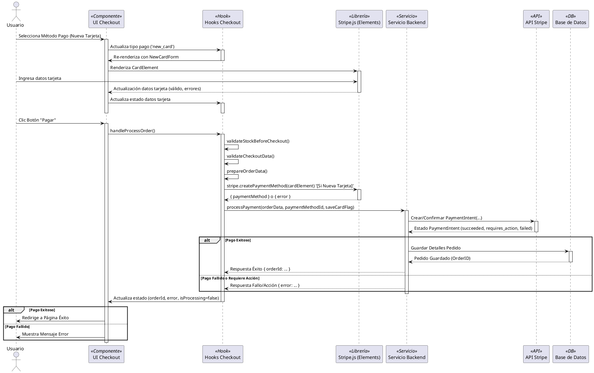

# Documentación de Integración de Stripe

## 1. Resumen General

Este documento detalla la integración de Stripe para procesar pagos en línea dentro de la aplicación Cactilia. El objetivo es proporcionar una comprensión clara del flujo de trabajo del frontend, las interacciones de los componentes, la gestión del estado y el traspaso crucial al backend para el procesamiento seguro de pagos.

La integración utiliza `@stripe/react-stripe-js` y `@stripe/stripe-js` en el frontend para recopilar de forma segura la información de pago utilizando Stripe Elements. La confirmación final del pago se maneja del lado del servidor a través de un servicio backend dedicado, adhiriéndose a las mejores prácticas de seguridad.

## 2. Prerrequisitos y Configuración

Antes de que el flujo de pago pueda funcionar correctamente, asegúrese de que la siguiente configuración esté completa:

*   **Cuenta de Stripe:** Se requiere una cuenta de Stripe.
*   **Claves API:** Obtenga sus claves API de Stripe (Clave Publicable y Clave Secreta).
*   **Variables de Entorno:** La **Clave Publicable** debe configurarse en las variables de entorno de su frontend. Cree un archivo `.env` en la raíz del proyecto (si no existe) y agregue:

    ```env
    VITE_STRIPE_PUBLISHABLE_KEY=pk_test_xxxxxxxxxxxxxxxxxxxxxxxxxxxxxx
    ```

    *Reemplace `pk_test_...` con su Clave Publicable real de Stripe (use claves de prueba para desarrollo).*

    La **Clave Secreta** **NUNCA** debe exponerse en el código del frontend. Solo debe usarse en su servidor backend seguro.

## 3. Componentes y Hooks Centrales

El flujo de pago de Stripe involucra varios componentes y hooks clave que trabajan juntos:

| Archivo / Hook                                                                      | Responsabilidad                                                                                                    |
| :---------------------------------------------------------------------------------- | :----------------------------------------------------------------------------------------------------------------- |
| `src/contexts/StripeContext.jsx`                                                  | Inicializa `loadStripe` con la clave publicable y proporciona el contenedor base del contexto `<Elements>` de Stripe. |
| `src/modules/shop/pages/CheckoutPage.jsx`                                         | Punto de entrada para el checkout. Maneja verificaciones de autenticación/carrito, renderiza `<Elements>`, proporciona `CheckoutProvider`. |
| `src/modules/shop/context/CheckoutContext.jsx`                                    | Proveedor de contexto central para el estado del checkout. Agrega estado y funciones de hooks especializados.   |
| `src/modules/shop/features/checkout/hooks/useCheckout.js`                         | Hook para consumir `CheckoutContext`.                                                                              |
| `src/modules/shop/context/hooks/useOrderProcessor.js`                             | Hook central que contiene la lógica de procesamiento de pedidos en múltiples pasos (validación, preparación de datos, inicio de pago). |
| `src/modules/shop/context/hooks/useAddressManager.js`                             | Gestiona el estado y la lógica de la dirección de envío.                                                          |
| `src/modules/shop/context/hooks/usePaymentManager.js`                             | Gestiona el estado de selección del método de pago (tarjetas guardadas, nueva tarjeta, OXXO).                      |
| `src/modules/shop/features/checkout/components/CheckoutContent.jsx`               | Orquesta la interfaz de usuario principal del checkout, renderiza `CheckoutForm` y `CheckoutSummaryPanel`.          |
| `src/modules/shop/features/checkout/components/CheckoutForm.jsx`                  | Componente contenedor que renderiza secciones distintas (Dirección, Envío, Pago, Facturación, Notas).          |
| `src/modules/shop/features/checkout/components/sections/PaymentSection.jsx`       | Renderiza el `PaymentMethodSelector`.                                                                            |
| `src/modules/shop/features/checkout/components/payment/PaymentMethodSelector.jsx` | Muestra las opciones de pago disponibles (OXXO, tarjetas guardadas), renderiza `NewCardForm`.                  |
| `src/modules/shop/features/checkout/components/payment/NewCardForm.jsx`           | Renderiza el `CardElement` de Stripe para recopilar de forma segura los detalles de la nueva tarjeta.            |
| `src/modules/shop/features/checkout/components/CheckoutSummaryPanel.jsx`          | Muestra el resumen del pedido y contiene el botón final "Pagar" que activa el procesamiento del pedido.         |
| `src/modules/shop/features/checkout/services/index.js` (`processPayment`)       | Función de servicio del frontend responsable de llamar a la API del backend para procesar el pago.              |

## 4. Flujo Detallado del Pago

El proceso implica varios pasos, coordinando componentes de UI, contexto, hooks e interacción con el backend:

1.  **Inicialización:**
    *   `StripeProvider` (probablemente envolviendo la aplicación en `main.jsx` o `App.jsx`) llama a `loadStripe` con la clave publicable.
    *   Cuando el usuario navega a `/checkout`, `CheckoutPage.jsx` se monta.
    *   `CheckoutPage.jsx` verifica la autenticación y el contenido del carrito.
    *   `CheckoutPage.jsx` renderiza el proveedor `<Elements>` de Stripe y el `CheckoutProvider`.

2.  **Renderizado de la UI del Checkout:**
    *   `CheckoutProvider` inicializa su estado y hooks especializados (`useAddressManager`, `usePaymentManager`, `useOrderProcessor`, etc.).
    *   `CheckoutContent.jsx` se renderiza, consumiendo el estado de `useCheckout`.
    *   `CheckoutContent.jsx` renderiza `CheckoutForm` y `CheckoutSummaryPanel`, pasando las props y callbacks necesarios.
    *   `CheckoutForm.jsx` renderiza los componentes de sección (`AddressSection`, `ShippingOptionsSection`, `PaymentSection`, etc.).

3.  **Selección del Método de Pago:**
    *   `PaymentSection.jsx` renderiza `PaymentMethodSelector.jsx`.
    *   `PaymentMethodSelector.jsx` muestra las opciones:
        *   **OXXO:** Renderiza `OxxoPaymentOption`. Seleccionarlo llama a `handleOxxoSelect` (de `usePaymentManager`).
        *   **Tarjetas Guardadas:** Obtiene y muestra las tarjetas guardadas (vía `usePaymentManager`). Seleccionar una llama a `handlePaymentSelect`.
        *   **Nueva Tarjeta:** Renderiza una opción para agregar una nueva tarjeta. Seleccionarlo llama a `handleNewCardSelect`.

4.  **Ingreso de Nueva Tarjeta:**
    *   Si se selecciona "Nueva Tarjeta", `PaymentMethodSelector.jsx` renderiza `NewCardForm.jsx`.
    *   `NewCardForm.jsx` renderiza el `CardElement` de Stripe.
    *   El usuario ingresa los detalles de la tarjeta y el nombre del titular.
    *   `CardElement` maneja de forma segura la entrada y la validación. Los cambios de estado (completitud, errores) se propagan hacia arriba a través de `onCardChange` a `usePaymentManager`.
    *   El usuario puede marcar opcionalmente "Guardar tarjeta". Este estado se gestiona a través de `onSaveCardChange`.

5.  **Realización Final del Pedido:**
    *   El usuario revisa el pedido en `CheckoutSummaryPanel`.
    *   El estado habilitado del botón "Pagar" es controlado por `isButtonDisabled` en `CheckoutContent.jsx`, verificando la dirección válida, envío, selección de pago y stock.
    *   Hacer clic en "Pagar" activa la función `processOrderWithChecks` pasada a `CheckoutSummaryPanel`. Esta función es en realidad `handleProcessOrder` de `useCheckout`.

6.  **Procesamiento del Pedido (`useOrderProcessor`):**
    *   `handleProcessOrder` (en `CheckoutContext`) llama a `processOrder` dentro de `useOrderProcessor`.
    *   `processOrder`:
        *   Establece el estado `isProcessing` a `true`.
        *   Realiza la validación final de stock (`validateStockBeforeCheckout`).
        *   Realiza la validación final de datos (`validateCheckoutData`).
        *   Prepara los datos finales del pedido (`prepareOrderData`).
        *   Llama a `createAndProcessOrder`.

7.  **Creación del Método de Pago y Llamada al Backend (`createAndProcessOrder`):**
    *   **Si es Nueva Tarjeta:**
        *   Obtiene la instancia de `CardElement` a través de `elements.getElement(CardElement)`.
        *   Llama a `stripe.createPaymentMethod({ type: 'card', card: cardElement, ... })` para obtener un `paymentMethodId` de Stripe.
    *   **Si es Tarjeta Guardada:**
        *   Recupera el `stripePaymentMethodId` almacenado asociado con la tarjeta seleccionada.
    *   Llama a la función de servicio `processPayment`, pasando los `orderData` preparados, el `paymentMethodId` (para tarjetas) o el tipo de pago ('oxxo'), el correo electrónico del cliente (para OXXO) y el indicador `saveCard`.

8.  **Procesamiento del Backend (Llamada al Servicio `processPayment`):**
    *   La función `processPayment` envía una solicitud a su endpoint de la API del backend.
    *   **Responsabilidad del Backend (Crucial):**
        *   Recibe los datos del pedido y los detalles del pago.
        *   Realiza la validación del lado del servidor.
        *   Crea/recupera un **PaymentIntent** de Stripe utilizando la **Clave Secreta de Stripe**.
        *   **Confirma el PaymentIntent con Stripe**, proporcionando el `paymentMethodId` o `payment_method_types: ['oxxo']`. Incluye `setup_future_usage: 'on_session'` si el usuario solicitó guardar la tarjeta.
        *   Maneja los posibles pasos de autenticación 3D Secure si Stripe lo requiere.
        *   Guarda los detalles del pedido en la base de datos tras la confirmación exitosa del pago (o pendiente para OXXO).
        *   Devuelve una respuesta de éxito/fracaso al frontend (potencialmente incluyendo el ID del pedido o el client secret si se necesita 3DS).

9.  **Manejo de la Respuesta del Frontend:**
    *   `useOrderProcessor` recibe la respuesta de `processPayment`.
    *   Si tiene éxito:
        *   Limpia el carrito (vía Redux `clearCartWithSync`, a menos que sea OXXO).
        *   Establece el `orderId`.
        *   Redirige al usuario a la página de éxito del pedido (`/shop/order-success/:orderId`).
    *   Si falla:
        *   Establece el estado de error (`setError`).
        *   Restablece el estado de procesamiento (`setIsProcessing(false)`).
        *   Mantiene al usuario en la página de checkout para corregir el problema.

## 5. Diagrama de Secuencia (PlantUML)



*(Puedes renderizar este código PlantUML usando herramientas como el sitio web de PlantUML, plugins para IDEs o visores de Markdown que lo soporten.)*

## 6. Interacción con el Backend

Como se destaca en el flujo y el diagrama, el frontend **no** confirma directamente los pagos con Stripe. Esta es una medida de seguridad crítica. El servicio `processPayment` actúa como un puente hacia la API del backend.

**El backend es responsable de:**

1.  **Recibir** los datos del pedido y los detalles del pago desde el frontend.
2.  **Validar** los datos del lado del servidor.
3.  **Calcular** el monto final de forma segura.
4.  Interactuar con la API de Stripe usando la **Clave Secreta** para:
    *   Crear o recuperar un **PaymentIntent**.
    *   **Confirmar** el PaymentIntent con el `paymentMethodId` proporcionado (para tarjetas) o usando los detalles de OXXO.
    *   Manejar posibles solicitudes de autenticación 3D Secure de Stripe.
    *   Opcionalmente guardar métodos de pago (`setup_future_usage`).
5.  **Actualizar** el estado del pedido en la base de datos según el resultado de la confirmación de Stripe.
6.  **Manejar Webhooks de Stripe:** Esto es esencial para la fiabilidad. El backend debe escuchar y manejar de forma segura los eventos de webhook (verificando firmas) para confirmar asincrónicamente los estados de los pagos, especialmente para métodos como OXXO o si el usuario cierra el navegador durante 3DS. Eventos clave a manejar incluyen:
    *   `payment_intent.succeeded`: Pago completado con éxito.
    *   `payment_intent.payment_failed`: Pago fallido.
    *   `payment_intent.processing`: El pago se está procesando (relevante para algunos métodos).
    *   `charge.succeeded`: A menudo útil para registrar/cruzar referencias de cargos exitosos.
    *   `setup_intent.succeeded` / `setup_intent.setup_failed`: Si se usan SetupIntents para guardar tarjetas.
    *   (Considerar `checkout.session.completed` si se usan sesiones de Stripe Checkout).
7.  **Devolver** una respuesta apropiada al frontend.

## 7. Métodos de Pago Soportados

Según el análisis, la implementación actual soporta:

*   **Tarjetas de Crédito/Débito:** Vía `CardElement` de Stripe (Nuevas Tarjetas) y métodos de pago guardados de Stripe.
*   **OXXO:** Vía una opción de selección dedicada, que requiere confirmación del backend a través de webhooks.

## 8. Áreas de Mejora / Trabajo Futuro

*   **Manejo Robusto de Errores:** Mejorar los mensajes de error mostrados al usuario para diferentes escenarios de fallo (rechazos de Stripe, problemas de stock, errores del servidor). Proporcionar una guía más clara.
*   **Webhooks de Stripe:** Asegurar que se implemente un manejo de webhooks de backend completo e idempotente para todos los eventos relevantes (`payment_intent.succeeded`, `payment_intent.payment_failed`, `payment_intent.processing`, `charge.succeeded`, `setup_intent.succeeded`, `setup_intent.setup_failed`, etc.) para garantizar la precisión del estado del pedido. Verificar las firmas de los webhooks.
*   **Complejidad del Código:** El anidamiento de contextos y hooks (`CheckoutContext` -> `useOrderProcessor` -> `usePaymentManager`, etc.) es bastante profundo. Considerar refactorizar para simplificar la gestión del estado si la complejidad se vuelve problemática (p. ej., explorar máquinas de estado o patrones alternativos).
*   **Pruebas:** Agregar pruebas unitarias, de integración y end-to-end más completas que cubran varios escenarios de pago, incluidos errores y casos límite. Simular (mock) las interacciones de Stripe eficazmente.
*   **Hook `useStripe`:** El hook personalizado `useStripe` en `StripeContext.jsx` actualmente solo proporciona `stripeReady`. Podría mejorarse o eliminarse si `useStripe` y `useElements` de `@stripe/react-stripe-js` siempre se usan directamente donde se necesitan.
*   **Payment Element:** Considerar la migración del `CardElement` clásico al **Payment Element** más nuevo de Stripe. Este único elemento puede manejar múltiples métodos de pago (tarjetas, billeteras, redirecciones bancarias) dinámicamente según la configuración de su panel de Stripe, simplificando la adición de futuras opciones de pago.
*   **Feedback de UI:** Mejorar el feedback visual durante el procesamiento (p. ej., estados de carga más específicos, deshabilitar campos de formulario mientras se procesa).
*   **Auditoría de Seguridad:** Revisar periódicamente el código tanto del frontend como del backend en busca de mejores prácticas de seguridad relacionadas con el procesamiento de pagos.

## 9. Ejecución Local

*   Asegúrese de que `VITE_STRIPE_PUBLISHABLE_KEY` esté configurada en su archivo `.env`.
*   Asegúrese de que su servicio backend (que maneja la llamada `processPayment`) esté en ejecución y configurado con la Clave Secreta de Stripe.
*   Para probar webhooks localmente, considere usar la CLI de Stripe (`stripe listen --forward-to <su_endpoint_webhook_backend>`).

## 10. Lista de Tareas (TODO)

Esta lista resume elementos accionables basados en el análisis y las posibles áreas de mejora:

- [ ] **Backend:** Verificar/Implementar manejo de webhooks robusto e idempotente para eventos clave (`payment_intent.succeeded`, `payment_intent.payment_failed`, `payment_intent.processing`, `charge.succeeded`, `setup_intent.succeeded`, etc.) con verificación de firmas.
- [ ] **Frontend:** Mejorar los mensajes de error orientados al usuario para diferentes escenarios de fallo de pago (rechazo de Stripe, stock, error del servidor).
- [ ] **Frontend:** Mejorar el feedback de la interfaz de usuario durante el procesamiento del pago (p. ej., estados de carga más específicos, deshabilitar campos).
- [ ] **Pruebas:** Agregar pruebas de integración y end-to-end completas para el flujo de checkout, cubriendo escenarios de éxito, fallo, OXXO y guardado de tarjetas. Simular (mock) las interacciones de Stripe.
- [ ] **Refactorización:** Evaluar la complejidad de los hooks/contexto anidados del checkout. Considerar refactorizar si dificulta la mantenibilidad.
- [ ] **Frontend:** Revisar el hook personalizado `useStripe` en `StripeContext.jsx`: mejorar su funcionalidad o eliminarlo si `useStripe`/`useElements` de la librería son suficientes.
- [ ] **Futuro:** Evaluar la migración de `CardElement` al `Payment Element` de Stripe para simplificar el soporte de múltiples métodos de pago.
- [ ] **Seguridad:** Programar y realizar una auditoría de seguridad centrada en la integración de pagos (tanto frontend como backend). 