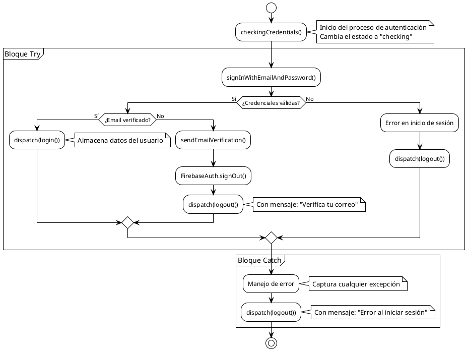

# PCB-M-02: AUTENTICACIÓN DE USUARIO

## Módulo del sistema:
Autenticación

## Historia de usuario: 
HU-A02 - Como visitante quiero iniciar sesión para acceder a mi cuenta y funciones personalizadas

## Número y nombre de la prueba:
PCB-M-02 - Autenticación de usuario

## Realizado por:
Valentin Alejandro Perez Zurita

## Fecha
15 de Abril del 2025


## Código Fuente


```js
export const startEmailSignIn = (email, password) => {
  return async (dispatch) => {
    dispatch(checkingCredentials());

    try {
      // 1) Sign in with email and password
      const userCredential = await signInWithEmailAndPassword(FirebaseAuth, email, password);
      const { uid, displayName, photoURL, email: userEmail } = userCredential.user;
      const user = userCredential.user;

      // 2) If email is not verified, send email verification
      if (!user.emailVerified) {
        await sendEmailVerification(user);
        
        // 2.1) Sign out in Firebase Auth
        await FirebaseAuth.signOut();

        // 2.2) Sign out in Redux
        dispatch(logout({ errorMessage: "Debes verificar tu correo. Te enviamos un nuevo enlace." }));

        // 2.3) Return error message
        return { ok: false, errorMessage: "Debes verificar tu correo. Te enviamos un nuevo enlace." };
      }

      // 3) If email is verified, dispatch login
      dispatch(login({ uid, email: userEmail, displayName, photoURL }));

      // 4) Return ok: true
      return { ok: true };

    } catch (error) {
      console.error("Error en el inicio de sesión:", error.message);

      // Dispatch logout
      dispatch(logout({ errorMessage: "Error al iniciar sesión. Inténtalo de nuevo más tarde." }));

      // Return error message
      return { ok: false, errorMessage: "Error al iniciar sesión. Inténtalo de nuevo más tarde." };
    }
  };
};
```


## Diagrama de flujo





## Cálculo de la Complejidad Ciclomática


**Número de regiones:**
- Regiones: 4

**Fórmula Aristas - Nodos + 2**
- Nodos: 13
- Aristas: 15
- Cálculo: V(G) = 15 - 13 + 2 = 4

**Nodos predicado + 1**
- Nodos predicado (decisiones): 3 (corresponden a las decisiones: "¿Credenciales válidas?", "¿Email verificado?" y la decisión implícita del bloque try-catch)
- Cálculo: V(G) = 3 + 1 = 4

**Conclusión:** La complejidad ciclomática es 4, lo que implica que se deben identificar 4 caminos independientes dentro del grafo.


## Determinación del Conjunto Básico de Caminos Independientes


| Nº | Descripción | Secuencia de nodos |
|---|---|---|
| 1 | Flujo principal exitoso (camino feliz) | Inicio → checkingCredentials → signInWithEmailAndPassword → ¿Credenciales válidas? (Sí) → ¿Email verificado? (Sí) → dispatch(login()) → Fin |
| 2 | Email no verificado | Inicio → checkingCredentials → signInWithEmailAndPassword → ¿Credenciales válidas? (Sí) → ¿Email verificado? (No) → sendEmailVerification → FirebaseAuth.signOut() → dispatch(logout()) → Fin |
| 3 | Credenciales inválidas | Inicio → checkingCredentials → signInWithEmailAndPassword → ¿Credenciales válidas? (No) → Error en inicio de sesión → dispatch(logout()) → Fin |
| 4 | Error inesperado (excepción) | Inicio → checkingCredentials → signInWithEmailAndPassword → Manejo de error (catch) → dispatch(logout()) → Fin |


## Derivación de Casos de Prueba


| Camino | Caso de Prueba | Datos de Entrada | Resultado Esperado |
|---|---|---|---|
| 1 | Inicio de sesión exitoso | email: "usuario.verificado@example.com" <br> password: "Password123" <br> usuario: objeto userCredential con emailVerified=true | Se despacha la acción login con los datos del usuario y retorna {ok: true}. El usuario queda autenticado y se redirige a su página de perfil. |
| 2 | Email no verificado | email: "usuario.sinverificar@example.com" <br> password: "Password123" <br> usuario: objeto userCredential con emailVerified=false | Se envía un nuevo email de verificación, se cierra la sesión en Firebase, se despacha la acción logout con mensaje de error sobre verificación, y retorna {ok: false, errorMessage: "Debes verificar tu correo. Te enviamos un nuevo enlace."}. |
| 3 | Credenciales incorrectas | email: "usuario.inexistente@example.com" <br> password: "PasswordIncorrecta" <br> Error: "auth/wrong-password" o "auth/user-not-found" | Se captura el error en el bloque catch, se despacha logout con mensaje de error genérico y retorna {ok: false, errorMessage: "Error al iniciar sesión. Inténtalo de nuevo más tarde."}. |
| 4 | Error de conexión | email: "usuario.normal@example.com" <br> password: "Password123" <br> Error: "auth/network-request-failed" | Se captura la excepción en el bloque catch, se despacha logout con mensaje de error genérico y retorna {ok: false, errorMessage: "Error al iniciar sesión. Inténtalo de nuevo más tarde."}. |