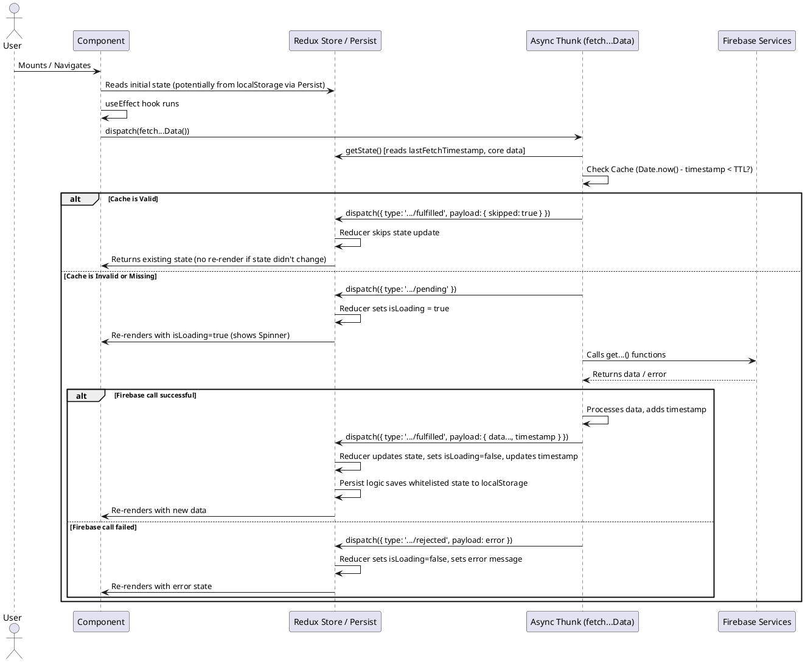

# Optimización de Estado con Redux y Redux-Persist

Este documento describe el patrón implementado para optimizar la carga y gestión del estado en secciones clave de la aplicación (Homepage, ShopPage, ContactPage) utilizando Redux Toolkit, Redux Thunk y Redux Persist.

## Objetivos

* **Mejorar el rendimiento:** Reducir llamadas innecesarias a Firestore.
* **Mejorar la experiencia de usuario:** Cargas más rápidas en navegación y refrescos de página.
* **Centralizar la lógica de estado:** Facilitar el mantenimiento y la depuración.
* **Reutilizar datos:** Compartir datos comunes (como la información de la empresa) entre componentes.

## Patrón General Implementado

El flujo principal para las páginas optimizadas sigue estos pasos:

1. **Componente:** Al montarse (`useEffect`), despacha una acción *thunk* (`fetch...Data`) si los datos aún no están cargados o si el caché ha expirado.
2. **Thunk (`createAsyncThunk`):**
   * Verifica si existe un caché válido en el estado de Redux (`lastFetchTimestamp` vs `CACHE_TTL`).
   * Si el caché es válido, el thunk finaliza inmediatamente y devuelve `{ skipped: true }`.
   * Si el caché no es válido o no existe, realiza las llamadas necesarias a los servicios de Firebase (idealmente en paralelo con `Promise.allSettled`).
   * Procesa los datos obtenidos.
   * Si la carga es exitosa, devuelve el payload con los datos y un nuevo `timestamp`.
   * Si falla, devuelve un error (`rejectWithValue`).
3. **Reducer (`extraReducers`):**
   * Maneja los estados `pending`, `fulfilled`, y `rejected` del thunk.
   * Si la acción es `fulfilled` pero `payload.skipped` es `true`, no modifica el estado (usa el caché existente).
   * Si la acción es `fulfilled` y no se saltó, actualiza el estado con los nuevos datos y el `timestamp`.
   * Actualiza los estados `isLoading` y `error` correspondientemente.
4. **Redux Persist:**
   * Guarda automáticamente en `localStorage` (o el storage configurado) las partes del estado especificadas en la `whitelist` de la configuración de persistencia (`store.js`).
   * Al iniciar la aplicación, rehidrata el store de Redux con los datos persistidos.
5. **Componente:** Selecciona los datos necesarios del store Redux usando `useSelector`. React re-renderizará el componente cuando los datos cambien.

## Slices Clave

* **`homepageSlice.js`:** Gestiona los datos específicos de la página de inicio (contenido de secciones, productos destacados, categorías destacadas, imágenes de colecciones).
* **`shopPageSlice.js`:** Gestiona los datos de la tienda (todos los productos, categorías, filtros, paginación, configuración del banner).
* **`siteConfigSlice.js`:** Gestiona datos globales del sitio (información de la empresa, horarios, enlaces de redes sociales).

## Persistencia (`redux-persist`)

La persistencia se configura en `src/store/store.js`:

* Se define un `persistConfig` para cada slice que se desea persistir.
* La propiedad `key` define el nombre bajo el cual se guardará en el storage.
* La propiedad `storage` indica dónde guardar (usualmente `storage` de `redux-persist/lib/storage` para localStorage).
* **Importante:** La `whitelist` especifica *exactamente* qué partes del estado de ese slice se deben guardar. Esto es crucial para no persistir estados temporales como `isLoading` o `error`, ni grandes listas que podrían cambiar frecuentemente si no se desea.
* Se usa `persistReducer` para envolver el reducer original con la lógica de persistencia.
* En `main.jsx` (o donde se inicializa la app React), se envuelve la aplicación con `<PersistGate loading={null} persistor={persistor}>` para asegurar que la rehidratación ocurra antes de renderizar la app.

```javascript
// Ejemplo de configuración en store.js
const homepagePersistConfig = {
  key: 'homepage',
  storage,
  whitelist: ['pageData', 'featuredProducts', 'featuredCategories', 'collectionImages', 'lastFetchTimestamp'] 
};
const persistedHomepageReducer = persistReducer(homepagePersistConfig, homepageReducer);

// ...en configureStore
reducer: {
  // ...otros reducers
  homepage: persistedHomepageReducer,
  // ...
}
```

## Cache Basado en Tiempo (TTL)

Dentro de cada thunk (`fetch...Data`), se implementa una lógica simple de caché basado en tiempo:

1. Se define una constante `CACHE_TTL` en el slice (ej: `6 * 60 * 60 * 1000` para 6 horas).
2. Al inicio del thunk, se obtiene el `lastFetchTimestamp` del estado actual.
3. Se compara `Date.now() - lastFetchTimestamp` con `CACHE_TTL`.
4. Si la diferencia es menor que el TTL (y ya existen los datos esenciales), se considera el caché válido y se retorna `{ skipped: true }`.
5. Si el fetch se realiza y es exitoso, se actualiza `lastFetchTimestamp` en el estado con `Date.now()`.

```javascript
// Ejemplo en el thunk fetchHomepageData
const CACHE_TTL = 6 * 60 * 60 * 1000; // 6 horas

// ... dentro del async (_, { getState }) => {
const { pageData: existingPageData, lastFetchTimestamp } = getState().homepage;

if (lastFetchTimestamp && (Date.now() - lastFetchTimestamp < CACHE_TTL) && existingPageData) {
  return { skipped: true };
}

// ... proceder con el fetch ...

// ... en el return del fetch exitoso ...
return { products, categories, pageData, collectionImages, timestamp: Date.now() };
// ...

// ... en el reducer fulfilled ...
state.lastFetchTimestamp = action.payload.timestamp;
// ...
```

## Selectores

Se definen selectores simples (ej: `selectHomepageData`) o memoizados con `createSelector` (especialmente útil para datos derivados como productos filtrados) para acceder al estado desde los componentes.

```javascript
// Ejemplo en homepageSlice.js
export const selectHomepageData = (state) => state.homepage;
export const selectHomepageFeaturedProducts = (state) => state.homepage.featuredProducts;
```

## Componentes

Los componentes React ahora son más sencillos:

* Usan `useDispatch` para despachar las acciones thunk (generalmente en `useEffect`).
* Usan `useSelector` para obtener los datos necesarios del estado Redux.
* Renderizan UI basada en el estado (`isLoading`, `error`, y los datos mismos).

```jsx
// Ejemplo en HomePage.jsx
import { useEffect } from 'react';
import { useSelector, useDispatch } from 'react-redux';
import { fetchHomepageData, selectHomepageData, selectHomepageIsLoading } from '...';

function HomePage() {
  const dispatch = useDispatch();
  const { pageData, featuredProducts } = useSelector(selectHomepageData);
  const isLoading = useSelector(selectHomepageIsLoading);

  useEffect(() => {
    // El thunk internamente decide si hacer fetch o no basado en caché
    dispatch(fetchHomepageData());
  }, [dispatch]);

  if (isLoading) {
    return <Spinner />;
  }

  // ... renderizar usando pageData, featuredProducts ...
}
```

## Diagrama de Flujo (PlantUML)



## Cómo Configurar / Extender

* **Añadir Persistencia a otro Slice:**
  1. Crea un `persistConfig` en `store.js` con `key` y `whitelist`.
  2. Envuelve el reducer del slice con `persistReducer`.
  3. Asegúrate de que el `persistedReducer` se use en `configureStore`.
* **Ajustar TTL:** Modifica la constante `CACHE_TTL` dentro del slice correspondiente.
* **Crear un Nuevo Slice Optimizado:** Sigue el patrón: crea el slice, el thunk con lógica de caché, configura la persistencia si es necesario, y úsalo en el componente.
