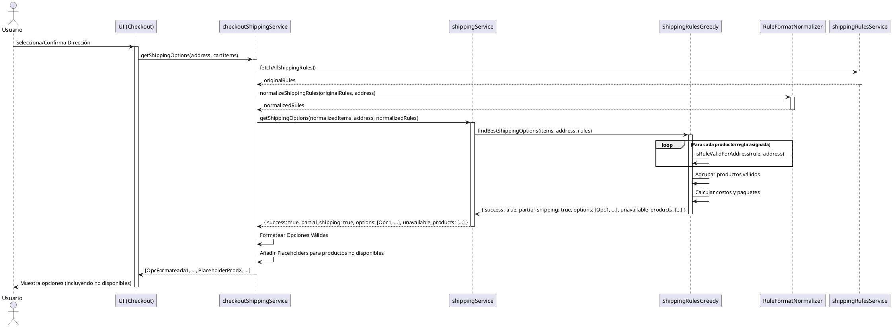
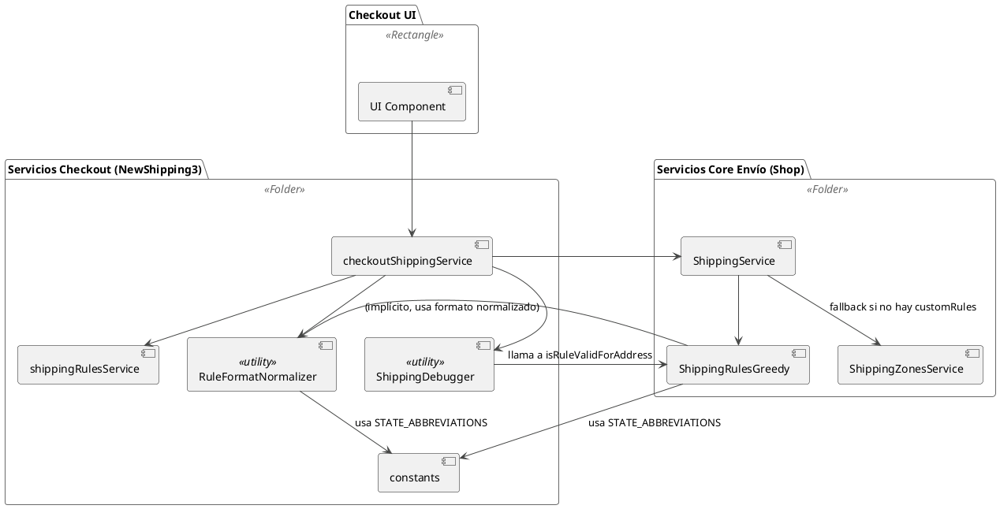

## Documentación del Módulo de Cálculo de Envíos

### 1. Descripción General

Este módulo es responsable de determinar las opciones de envío disponibles y sus costos para el carrito de compras de un usuario, basándose en la dirección de entrega y un conjunto de reglas de envío configurables almacenadas en Firebase.

El sistema utiliza un enfoque "Greedy" modificado que prioriza las reglas más específicas (Código Postal > Estado > Nacional) y maneja escenarios de **envío parcial**, donde algunos productos del carrito pueden no tener cobertura para la dirección seleccionada, pero otros sí.

### 2. Componentes Principales

El cálculo de envío involucra la interacción de varios servicios y utilidades clave:

*   **`checkoutShippingService.js` (`NewShipping3/services`):**
    *   **Rol:** Adaptador principal y punto de entrada para la UI del checkout.
    *   **Responsabilidades:**
        *   Recibe la dirección y los ítems del carrito desde la UI.
        *   Orquesta la obtención y normalización de reglas (`shippingRulesService`, `RuleFormatNormalizer`).
        *   Llama al `ShippingService` subyacente para obtener el cálculo.
        *   Interpreta el resultado (incluyendo éxito total, parcial o fallo).
        *   Formatea las opciones válidas y añade placeholders para productos no cubiertos (en caso parcial).
        *   Devuelve las opciones formateadas a la UI.
*   **`ShippingService.js` (`shop/features/checkout/services/shipping`):**
    *   **Rol:** Orquestador intermedio.
    *   **Responsabilidades:**
        *   Recibe la dirección y el carrito normalizados.
        *   Obtiene las reglas (ya sea de Firebase o las pasadas como parámetro).
        *   Llama al algoritmo central (`findBestShippingOptionsGreedy`).
        *   **Importante:** Devuelve el **objeto de resultado completo** (incluyendo `success`, `partial_shipping`, `options`, `unavailable_products`) a `checkoutShippingService`.
*   **`ShippingRulesGreedy.js` (`shop/features/checkout/services/shipping`):**
    *   **Rol:** Corazón del cálculo de envíos.
    *   **Responsabilidades:**
        *   Implementa la función `isRuleValidForAddress` para validar reglas contra la dirección (usando abreviaturas de estado).
        *   Implementa la lógica `findBestShippingOptionsGreedy`:
            *   Filtra reglas válidas por producto para la dirección dada.
            *   Detecta si el envío será parcial o completo.
            *   Agrupa productos válidos bajo la mejor regla aplicable (considerando prioridad y costo).
            *   Calcula costos detallados por grupo, incluyendo división en paquetes según peso/cantidad y cargos extra.
            *   Genera descripciones detalladas para cada opción.
            *   Devuelve un objeto resultado estructurado (`{ success, options, partial_shipping?, unavailable_products? }`).
*   **`RuleFormatNormalizer.js` (`NewShipping3/utils`):**
    *   **Rol:** Preprocesador de reglas.
    *   **Responsabilidades:**
        *   Toma las reglas crudas de Firebase.
        *   Las convierte al formato esperado por el algoritmo Greedy (`coverage_type`, `coverage_values`).
        *   Normaliza valores (ej. 'estado_VER' a `coverage_type: 'state'`, `coverage_values: ['ver']`; 'nacional' a `coverage_type: 'national'`).
*   **`constants.js` (`NewShipping3/constants`):**
    *   **Rol:** Almacena constantes, incluyendo `STATE_ABBREVIATIONS` para mapear nombres completos de estados a abreviaturas.
*   **`ShippingDebugger.js` (`NewShipping3/utils`):**
    *   **Rol:** Utilidad de depuración.
    *   **Responsabilidades:**
        *   Imprime información detallada sobre la dirección, productos y reglas (ya normalizadas).
        *   Valida cada regla normalizada contra la dirección usando la función `isRuleValidForAddress` canónica.

### 3. Flujo de Datos (Simplificado)

```
UI (Checkout) -> checkoutShippingService.getShippingOptions(address, cartItems)
    |
    -> fetchAllShippingRules()
    -> normalizeShippingRules(rules, address)
    -> ShippingDebugger(address, cartItems, normalizedRules) // Log para depuración
    -> shippingService.getShippingOptions(normalizedItems, address, normalizedRules)
        |
        -> findBestShippingOptionsGreedy(items, address, rules)
            |
            -> isRuleValidForAddress(rule, address) // Para cada regla/producto
            -> // Lógica de agrupación y cálculo de costos
            <- Devuelve { success, options, partial_shipping?, ... }
        |
        <- Devuelve { success, options, partial_shipping?, ... } // Pasa el resultado completo
    |
    -> // Procesa el resultado:
       // - Si !success -> []
       // - Si success: Formatea options, si partial_shipping=true añade placeholders
    <- Devuelve [opciones_formateadas] a la UI
```

### 4. Diagramas UML (PlantUML)

Puedes usar un visor online de PlantUML (como el oficial o integrado en algunas herramientas) para generar los diagramas a partir de este código.

**a) Diagrama de Secuencia (Flujo Principal con Envío Parcial)**



**b) Diagrama de Componentes (Dependencias)**



### 5. Consideraciones y Puntos Clave

*   **Normalización:** Es fundamental que `RuleFormatNormalizer` genere tipos de cobertura consistentes (`national`, `state`, `zip`) y que `isRuleValidForAddress` los compare correctamente.
*   **Manejo Parcial:** La clave del éxito fue asegurar que `ShippingService` devolviera el objeto resultado completo y que `checkoutShippingService` lo interpretara correctamente para formatear la salida a la UI.
*   **Configuración de Reglas:** La lógica de costos, división de paquetes, envío gratis por monto, etc., depende fuertemente de la configuración de cada regla y sus `opciones_mensajeria` en Firebase. Errores en esta configuración (ej. límite de 1 producto por paquete en regla nacional) pueden llevar a costos inesperados.
*   **Depuración:** `ShippingDebugger` es útil para una visión general, pero para problemas complejos, añadir logs temporales en puntos específicos (como hicimos) sigue siendo necesario.

---

**Próximos Pasos Sugeridos:**

1.  **Crear Archivo:** Guarda esta documentación en un archivo Markdown (p.ej., `docs/shipping-calculation.md` o una sección en el README principal del proyecto).
2.  **Generar Imágenes:** Genera las imágenes PNG/SVG desde el código PlantUML e incrústalas en el archivo Markdown.
3.  **Revisar y Refinar:** Lee la documentación y ajústala según sea necesario para mayor claridad o para añadir detalles específicos de tu implementación.
4.  **Mantener Actualizada:** ¡Lo más importante! Asegúrate de actualizar esta documentación si realizas cambios significativos en el flujo o la lógica de cálculo de envíos. 