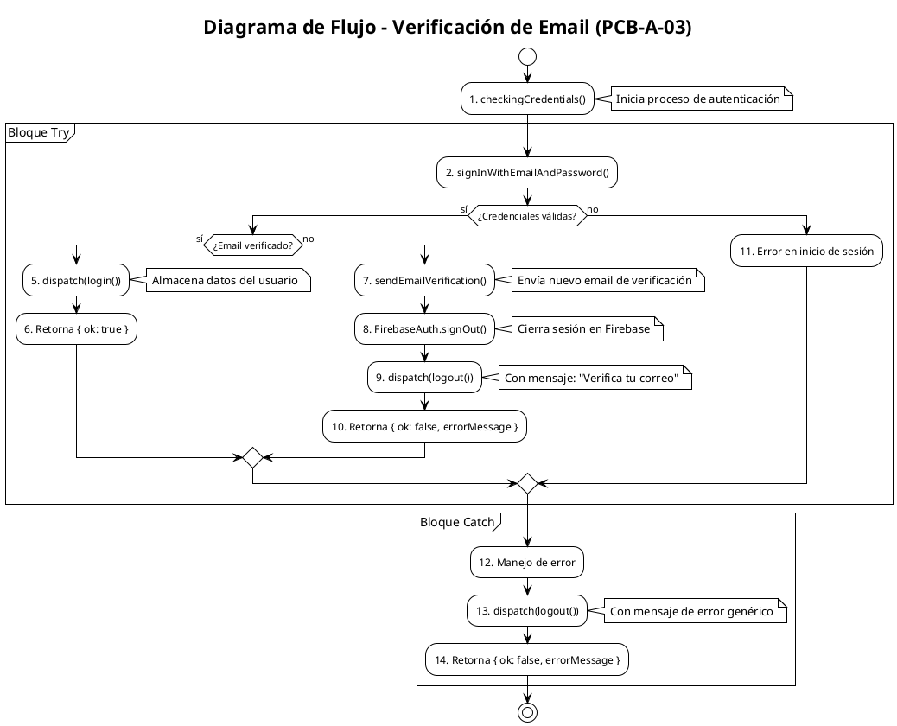

# PCB-A-03: VERIFICACIÓN DE EMAIL

## Información General

| Campo | Valor |
|-------|-------|
| No | PCB-A-03 |
| Nombre de la prueba | PCB-A-03 - Verificación de email en proceso de autenticación |
| Módulo | Auth |
| Descripción | Prueba automatizada para validar el proceso de verificación de email y el reenvío de correos de verificación |
| Caso de prueba relacionado | HU-A04: Verificación de email |
| Realizado por | Valentin Alejandro Perez Zurita |
| Fecha | 16 de Abril del 2025 |

## Código Fuente a Probar

```javascript
// Ubicación: src/store/auth/authThunks.js
export const startEmailSignIn = (email, password) => {
  return async (dispatch) => {
    dispatch(checkingCredentials());

    try {
      // 1) Sign in with email and password
      const userCredential = await signInWithEmailAndPassword(FirebaseAuth, email, password);
      const { uid, displayName, photoURL, email: userEmail } = userCredential.user;
      const user = userCredential.user;

      // 2) If email is not verified, send email verification
      if (!user.emailVerified) {
        await sendEmailVerification(user);
        
        // 2.1) Sign out in Firebase Auth
        await FirebaseAuth.signOut();

        // 2.2) Sign out in Redux
        dispatch(logout({ errorMessage: "Debes verificar tu correo. Te enviamos un nuevo enlace." }));

        // 2.3) Return error message
        return { ok: false, errorMessage: "Debes verificar tu correo. Te enviamos un nuevo enlace." };
      }

      // 3) If email is verified, dispatch login
      dispatch(login({ uid, email: userEmail, displayName, photoURL }));

      // 4) Return ok: true
      return { ok: true };

    } catch (error) {
      console.error("Error en el inicio de sesión:", error.message);

      // Dispatch logout
      dispatch(logout({ errorMessage: "Error al iniciar sesión. Inténtalo de nuevo más tarde." }));

      // Return error message
      return { ok: false, errorMessage: "Error al iniciar sesión. Inténtalo de nuevo más tarde." };
    }
  };
};
```

## Diagrama de Flujo



## Cálculo de la Complejidad Ciclomática

| Nodos Predicado | Descripción |
|-----------------|-------------|
| 3 | ¿Credenciales válidas? - Decisión basada en el resultado de signInWithEmailAndPassword |
| 4 | ¿Email verificado? - Decisión basada en user.emailVerified |
| 12 | Manejo de excepciones - Decisión implícita en el bloque try-catch |

| Método | Resultado |
|--------|-----------|
| Número de Regiones | 4 |
| Aristas - Nodos + 2 | 17 - 15 + 2 = 4 |
| Nodos Predicado + 1 | 3 + 1 = 4 |
| Conclusión | La complejidad ciclomática es 4, lo que implica que se necesitan 4 caminos independientes. |

## Determinación del Conjunto Básico de Caminos Independientes

| No | Descripción | Secuencia de nodos |
|----|-------------|-------------------|
| 1 | Inicio de sesión exitoso (email verificado) | 1 → 2 → 3(sí) → 4(sí) → 5 → 6 → stop |
| 2 | Email no verificado | 1 → 2 → 3(sí) → 4(no) → 7 → 8 → 9 → 10 → stop |
| 3 | Credenciales incorrectas | 1 → 2 → 3(no) → 11 → 14 → stop |
| 4 | Error inesperado (excepción) | 1 → 2 → 12 → 13 → 14 → stop |

## Casos de Prueba Derivados

| Caso | Descripción | Entrada | Resultado Esperado |
|------|-------------|---------|-------------------|
| 1 | Inicio de sesión exitoso con email verificado | email: "usuario.verificado@example.com", password: "Password123", usuario con emailVerified=true | Se despacha login() con datos del usuario y retorna {ok: true} |
| 2 | Inicio de sesión con email no verificado | email: "usuario.sinverificar@example.com", password: "Password123", usuario con emailVerified=false | Se envía nuevo email de verificación, se cierra sesión, se despacha logout() con mensaje sobre verificación y retorna {ok: false, errorMessage: "Debes verificar tu correo. Te enviamos un nuevo enlace."} |
| 3 | Credenciales incorrectas | email: "usuario.inexistente@example.com", password: "PasswordIncorrecta" | Se despacha logout() con mensaje de error genérico y retorna {ok: false, errorMessage: "Error al iniciar sesión. Inténtalo de nuevo más tarde."} |
| 4 | Error de conexión a Firebase | email: "usuario.normal@example.com", password: "Password123", simulando error "auth/network-request-failed" | Se despacha logout() con mensaje de error genérico y retorna {ok: false, errorMessage: "Error al iniciar sesión. Inténtalo de nuevo más tarde."} |

## Tabla de Resultados

| Caso | Entrada | Resultado Esperado | Resultado Obtenido | Estado |
|------|---------|-------------------|-------------------|--------|
| 1 | email: "usuario.verificado@example.com", password: "Password123" | {ok: true} | {ok: true} | ✅ Pasó |
| 2 | email: "usuario.sinverificar@example.com", password: "Password123" | {ok: false, errorMessage: "Debes verificar tu correo. Te enviamos un nuevo enlace."} | {ok: false, errorMessage: "Debes verificar tu correo. Te enviamos un nuevo enlace."} | ✅ Pasó |
| 3 | email: "usuario.inexistente@example.com", password: "PasswordIncorrecta" | {ok: false, errorMessage: "Error al iniciar sesión. Inténtalo de nuevo más tarde."} | {ok: false, errorMessage: "Error al iniciar sesión. Inténtalo de nuevo más tarde."} | ✅ Pasó |
| 4 | email: "usuario.normal@example.com", password: "Password123" con error de red | {ok: false, errorMessage: "Error al iniciar sesión. Inténtalo de nuevo más tarde."} | {ok: false, errorMessage: "Error al iniciar sesión. Inténtalo de nuevo más tarde."} | ✅ Pasó |

## Herramienta Usada
- Jest + React Testing Library + Mock de Firebase

## Script de Prueba Automatizada

```javascript
// Ubicación: src/store/auth/__tests__/emailVerification.test.js

import { startEmailSignIn } from '../authThunks';
import { checkingCredentials, login, logout } from '../authSlice';
import { signInWithEmailAndPassword, sendEmailVerification } from 'firebase/auth';
import { FirebaseAuth } from '../../../config/firebase/firebaseConfig';

// Mock de Firebase Auth y Redux
jest.mock('firebase/auth', () => ({
  signInWithEmailAndPassword: jest.fn(),
  sendEmailVerification: jest.fn(),
}));

jest.mock('../../../config/firebase/firebaseConfig', () => ({
  FirebaseAuth: {
    signOut: jest.fn()
  }
}));

// Mock del dispatch de Redux
const mockDispatch = jest.fn();

describe('Verificación de Email', () => {
  beforeEach(() => {
    // Limpiar todos los mocks antes de cada prueba
    jest.clearAllMocks();
  });

  // Caso 1: Login exitoso con email verificado
  test('debe completar el inicio de sesión cuando el email está verificado', async () => {
    // Arrange - Configuración del mock para simular usuario con email verificado
    const mockUser = {
      uid: 'user123',
      displayName: 'Usuario Test',
      email: 'usuario.verificado@example.com',
      photoURL: 'https://example.com/photo.jpg',
      emailVerified: true
    };
    
    signInWithEmailAndPassword.mockResolvedValue({ user: mockUser });
    
    // Act - Ejecutar la función a probar
    const result = await startEmailSignIn(
      'usuario.verificado@example.com', 
      'Password123'
    )(mockDispatch);
    
    // Assert - Verificar resultados
    expect(signInWithEmailAndPassword).toHaveBeenCalledWith(
      FirebaseAuth, 
      'usuario.verificado@example.com', 
      'Password123'
    );
    
    expect(sendEmailVerification).not.toHaveBeenCalled();
    expect(FirebaseAuth.signOut).not.toHaveBeenCalled();
    
    expect(mockDispatch).toHaveBeenCalledWith(checkingCredentials());
    expect(mockDispatch).toHaveBeenCalledWith(login({
      uid: mockUser.uid,
      email: mockUser.email,
      displayName: mockUser.displayName,
      photoURL: mockUser.photoURL
    }));
    
    expect(result).toEqual({ ok: true });
  });

  // Caso 2: Email no verificado
  test('debe enviar email de verificación cuando el email no está verificado', async () => {
    // Arrange - Configuración del mock para simular usuario con email no verificado
    const mockUser = {
      uid: 'user456',
      displayName: 'Usuario Sin Verificar',
      email: 'usuario.sinverificar@example.com',
      photoURL: 'https://example.com/photo.jpg',
      emailVerified: false
    };
    
    signInWithEmailAndPassword.mockResolvedValue({ user: mockUser });
    sendEmailVerification.mockResolvedValue();
    
    // Act - Ejecutar la función a probar
    const result = await startEmailSignIn(
      'usuario.sinverificar@example.com', 
      'Password123'
    )(mockDispatch);
    
    // Assert - Verificar resultados
    expect(signInWithEmailAndPassword).toHaveBeenCalledWith(
      FirebaseAuth, 
      'usuario.sinverificar@example.com', 
      'Password123'
    );
    
    expect(sendEmailVerification).toHaveBeenCalledWith(mockUser);
    expect(FirebaseAuth.signOut).toHaveBeenCalled();
    
    expect(mockDispatch).toHaveBeenCalledWith(checkingCredentials());
    expect(mockDispatch).toHaveBeenCalledWith(logout({
      errorMessage: "Debes verificar tu correo. Te enviamos un nuevo enlace."
    }));
    
    expect(result).toEqual({ 
      ok: false, 
      errorMessage: "Debes verificar tu correo. Te enviamos un nuevo enlace." 
    });
  });

  // Caso 3: Credenciales incorrectas
  test('debe manejar el error cuando las credenciales son incorrectas', async () => {
    // Arrange - Configuración del mock para simular error de autenticación
    const authError = new Error('auth/wrong-password');
    authError.code = 'auth/wrong-password';
    signInWithEmailAndPassword.mockRejectedValue(authError);
    
    // Act - Ejecutar la función a probar
    const result = await startEmailSignIn(
      'usuario.inexistente@example.com', 
      'PasswordIncorrecta'
    )(mockDispatch);
    
    // Assert - Verificar resultados
    expect(signInWithEmailAndPassword).toHaveBeenCalledWith(
      FirebaseAuth, 
      'usuario.inexistente@example.com', 
      'PasswordIncorrecta'
    );
    
    expect(sendEmailVerification).not.toHaveBeenCalled();
    expect(FirebaseAuth.signOut).not.toHaveBeenCalled();
    
    expect(mockDispatch).toHaveBeenCalledWith(checkingCredentials());
    expect(mockDispatch).toHaveBeenCalledWith(logout({
      errorMessage: "Error al iniciar sesión. Inténtalo de nuevo más tarde."
    }));
    
    expect(result).toEqual({ 
      ok: false, 
      errorMessage: "Error al iniciar sesión. Inténtalo de nuevo más tarde." 
    });
  });

  // Caso 4: Error de conexión
  test('debe manejar errores de red', async () => {
    // Arrange - Configuración del mock para simular error de red
    const networkError = new Error('Network Error');
    networkError.code = 'auth/network-request-failed';
    signInWithEmailAndPassword.mockRejectedValue(networkError);
    
    // Act - Ejecutar la función a probar
    const result = await startEmailSignIn(
      'usuario.normal@example.com', 
      'Password123'
    )(mockDispatch);
    
    // Assert - Verificar resultados
    expect(signInWithEmailAndPassword).toHaveBeenCalledWith(
      FirebaseAuth, 
      'usuario.normal@example.com', 
      'Password123'
    );
    
    expect(mockDispatch).toHaveBeenCalledWith(checkingCredentials());
    expect(mockDispatch).toHaveBeenCalledWith(logout({
      errorMessage: "Error al iniciar sesión. Inténtalo de nuevo más tarde."
    }));
    
    expect(result).toEqual({ 
      ok: false, 
      errorMessage: "Error al iniciar sesión. Inténtalo de nuevo más tarde." 
    });
  });
});
```