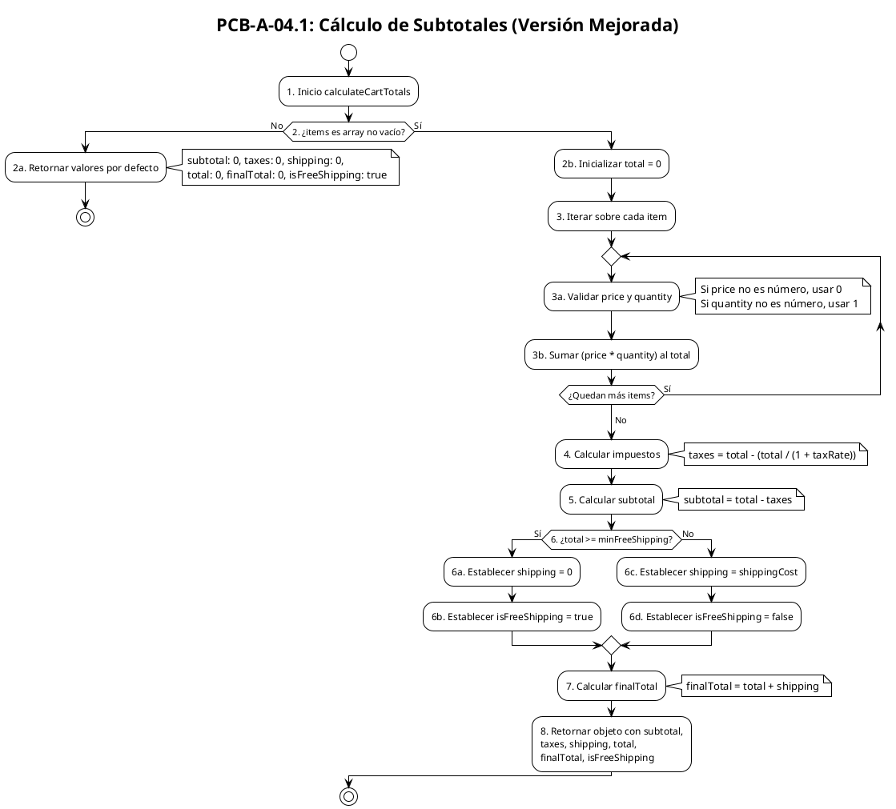

# PCB-A-04.1: CÁLCULO DE SUBTOTALES (VERSIÓN MEJORADA)

## Información General

| Campo                      | Valor                                                                                                                     |
| -------------------------- | ------------------------------------------------------------------------------------------------------------------------- |
| No                         | PCB-A-04.1                                                                                                                |
| Nombre de la prueba        | PCB-A-04.1 - Cálculo de subtotales (Versión mejorada)                                                                   |
| Módulo                    | Shop/Cart                                                                                                                 |
| Descripción               | Prueba automatizada para verificar los cálculos de precios y cantidades en el carrito con un análisis de flujo mejorado |
| Caso de prueba relacionado | HU-S07: Resumen de carrito                                                                                                |
| Caso de prueba previo      | PCB-A-04                                                                                                                  |
| Realizado por              | Valentin Alejandro Perez Zurita                                                                                           |
| Fecha                      | 17 de Abril del 2025                                                                                                      |

## Código Fuente a Probar

```javascript
∂// Ubicación: src/modules/shop/features/cart/utils/cartUtils.js
export const calculateCartTotals = (
  items,
  taxRate = 0.16,
  minFreeShipping = 500,
  shippingCost = 50
) => {
  // Validar items
  if (!items || !Array.isArray(items) || items.length === 0) {
    return {
      subtotal: 0,
      taxes: 0,
      shipping: 0,
      total: 0,
      finalTotal: 0,
      isFreeShipping: true
    };
  }

  // Calcular total con impuestos incluidos (modelo mexicano)
  const total = items.reduce((sum, item) => {
    const price = typeof item.price === 'number' ? item.price : 0;
    const quantity = typeof item.quantity === 'number' ? item.quantity : 1;
    return sum + (price * quantity);
  }, 0);

  // Calcular el impuesto (ya incluido en el precio)
  const taxes = +(total - (total / (1 + taxRate))).toFixed(2);

  // Calcular subtotal (precio sin impuesto)
  const subtotal = +(total - taxes).toFixed(2);

  // Determinar si el envío es gratuito
  const isFreeShipping = total >= minFreeShipping;
  const shipping = isFreeShipping ? 0 : shippingCost;

  // Calcular total final incluyendo envío
  const finalTotal = +(total + shipping).toFixed(2);

  return {
    subtotal,
    taxes,
    shipping,
    total,
    finalTotal,
    isFreeShipping
  };
};
```

## Diagrama de Flujo



## Cálculo de la Complejidad Ciclomática

### Nodos Predicado

| Nodo | Descripción                                     |
| ---- | ------------------------------------------------ |
| 2    | ¿items es array no vacío?                      |
| 3    | Ciclo para iterar sobre cada item (repeat-while) |
| 6    | ¿total >= minFreeShipping?                      |

### Cálculo

| Método             | Resultado                                                                                           |
| ------------------- | --------------------------------------------------------------------------------------------------- |
| Número de Regiones | 5 (4 caminos independientes + 1 región externa)                                                    |
| Aristas - Nodos + 2 | 14 - 11 + 2 = 5                                                                                     |
| Nodos Predicado + 1 | 3 + 1 = 4                                                                                           |
| Conclusión         | La complejidad ciclomática es 4, lo que implica que se deben identificar 4 caminos independientes. |

> **Nota**: La versión anterior (PCB-A-04) no consideraba el ciclo de iteración como un nodo predicado, lo que resultaba en una complejidad ciclomática incorrecta.

## Determinación del Conjunto Básico de Caminos Independientes

| No | Descripción                                 | Secuencia de nodos                                                                                                 |
| -- | -------------------------------------------- | ------------------------------------------------------------------------------------------------------------------ |
| 1  | Items no válidos                            | 1 → 2(No) → 2a → Fin                                                                                            |
| 2  | Items válidos pero vacíos (sin iteración) | 1 → 2(Sí) → 2b → 3 → 3a → 3b → 3(No) → 4 → 5 → 6(Sí) → 6a → 6b → 7 → 8 → Fin                       |
| 3  | Items válidos con envío gratuito           | 1 → 2(Sí) → 2b → 3 → 3a → 3b → 3(Sí) → 3a → 3b → 3(No) → 4 → 5 → 6(Sí) → 6a → 6b → 7 → 8 → Fin |
| 4  | Items válidos sin envío gratuito           | 1 → 2(Sí) → 2b → 3 → 3a → 3b → 3(Sí) → 3a → 3b → 3(No) → 4 → 5 → 6(No) → 6c → 6d → 7 → 8 → Fin  |

## Casos de Prueba Derivados

| Caso | Descripción                                | Entrada                                                                                                  | Resultado Esperado                                                                                   |
| ---- | ------------------------------------------- | -------------------------------------------------------------------------------------------------------- | ---------------------------------------------------------------------------------------------------- |
| 1    | Carrito vacío                              | items = []                                                                                               | { subtotal: 0, taxes: 0, shipping: 0, total: 0, finalTotal: 0, isFreeShipping: true }                |
| 2    | Carrito con un item pero price no numérico | items = [{ price: "no-número", quantity: 2 }], taxRate = 0.16, minFreeShipping = 500, shippingCost = 50 | { subtotal: 0, taxes: 0, shipping: 50, total: 0, finalTotal: 50, isFreeShipping: false }             |
| 3    | Carrito con items y envío gratuito         | items = [{ price: 300, quantity: 2 }], taxRate = 0.16, minFreeShipping = 500, shippingCost = 50          | { subtotal: 517.24, taxes: 82.76, shipping: 0, total: 600, finalTotal: 600, isFreeShipping: true }   |
| 4    | Carrito con items sin envío gratuito       | items = [{ price: 100, quantity: 3 }], taxRate = 0.16, minFreeShipping = 500, shippingCost = 50          | { subtotal: 258.62, taxes: 41.38, shipping: 50, total: 300, finalTotal: 350, isFreeShipping: false } |

## Tabla de Resultados

| Caso | Entrada                                                                                         | Resultado Esperado                                                                                   | Resultado Obtenido                                                                                   | Estado   |
| ---- | ----------------------------------------------------------------------------------------------- | ---------------------------------------------------------------------------------------------------- | ---------------------------------------------------------------------------------------------------- | -------- |
| 1    | items = []                                                                                      | { subtotal: 0, taxes: 0, shipping: 0, total: 0, finalTotal: 0, isFreeShipping: true }                | { subtotal: 0, taxes: 0, shipping: 0, total: 0, finalTotal: 0, isFreeShipping: true }                | ✅ Pasó |
| 2    | items = [{ price: "no-número", quantity: 2 }]                                                  | { subtotal: 0, taxes: 0, shipping: 50, total: 0, finalTotal: 50, isFreeShipping: false }             | { subtotal: 0, taxes: 0, shipping: 50, total: 0, finalTotal: 50, isFreeShipping: false }             | ✅ Pasó |
| 3    | items = [{ price: 300, quantity: 2 }], taxRate = 0.16, minFreeShipping = 500, shippingCost = 50 | { subtotal: 517.24, taxes: 82.76, shipping: 0, total: 600, finalTotal: 600, isFreeShipping: true }   | { subtotal: 517.24, taxes: 82.76, shipping: 0, total: 600, finalTotal: 600, isFreeShipping: true }   | ✅ Pasó |
| 4    | items = [{ price: 100, quantity: 3 }], taxRate = 0.16, minFreeShipping = 500, shippingCost = 50 | { subtotal: 258.62, taxes: 41.38, shipping: 50, total: 300, finalTotal: 350, isFreeShipping: false } | { subtotal: 258.62, taxes: 41.38, shipping: 50, total: 300, finalTotal: 350, isFreeShipping: false } | ✅ Pasó |

## Herramienta Usada

- Jest + React Testing Library

## Script de Prueba Automatizada

```javascript
// Ubicación: src/modules/shop/features/cart/utils/__tests__/cartUtils.test.js

import { calculateCartTotals } from '../cartUtils';

describe('Cart Totals Calculation (Improved Version)', () => {
  // Camino 1: Carrito vacío
  test('debería manejar correctamente un carrito vacío', () => {
    const result = calculateCartTotals([]);
    expect(result).toEqual({
      subtotal: 0,
      taxes: 0,
      shipping: 0,
      total: 0,
      finalTotal: 0,
      isFreeShipping: true
    });
  });

  // Camino 2: Carrito con items inválidos
  test('debería manejar correctamente items con valores no numéricos', () => {
    const items = [{ price: "no-número", quantity: 2 }];
    const result = calculateCartTotals(items, 0.16, 500, 50);
  
    expect(result.subtotal).toBe(0);
    expect(result.taxes).toBe(0);
    expect(result.shipping).toBe(50);
    expect(result.total).toBe(0);
    expect(result.finalTotal).toBe(50);
    expect(result.isFreeShipping).toBe(false);
  });

  // Camino 3: Carrito con envío gratuito
  test('debería calcular correctamente con envío gratuito', () => {
    const items = [{ price: 300, quantity: 2 }];
    const result = calculateCartTotals(items, 0.16, 500, 50);
  
    expect(result.subtotal).toBeCloseTo(517.24, 2);
    expect(result.taxes).toBeCloseTo(82.76, 2);
    expect(result.shipping).toBe(0);
    expect(result.total).toBe(600);
    expect(result.finalTotal).toBe(600);
    expect(result.isFreeShipping).toBe(true);
  });

  // Camino 4: Carrito sin envío gratuito
  test('debería calcular correctamente sin envío gratuito', () => {
    const items = [{ price: 100, quantity: 3 }];
    const result = calculateCartTotals(items, 0.16, 500, 50);
  
    expect(result.subtotal).toBeCloseTo(258.62, 2);
    expect(result.taxes).toBeCloseTo(41.38, 2);
    expect(result.shipping).toBe(50);
    expect(result.total).toBe(300);
    expect(result.finalTotal).toBe(350);
    expect(result.isFreeShipping).toBe(false);
  });
});
```
