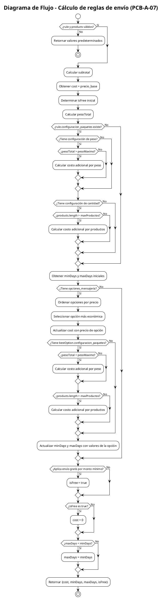

# PCB-A-07: CÁLCULO DE REGLAS DE ENVÍO

## Información General

| Campo | Valor |
|-------|-------|
| No | PCB-A-07 |
| Nombre de la prueba | PCB-A-07 - Cálculo de reglas de envío |
| Módulo | Shop |
| Descripción | Prueba automatizada para verificar el cálculo correcto de costos y opciones de envío basados en reglas configuradas |
| Caso de prueba relacionado | HU-S06: Reglas de envío |
| Realizado por | Valentin Alejandro Perez Zurita |
| Fecha | 17 de Abril del 2025 |

## Código Fuente a Probar

```javascript
// Ubicación: src/modules/shop/features/checkout/services/shipping/ShippingRulesGreedy.js
/**
 * Calcula el costo de envío basado en datos reales
 * @param {Object} rule - Regla de envío
 * @param {Array} products - Productos a enviar
 * @returns {Object} - Información de costo y tiempo de entrega
 */
const calculateShippingDetails = (rule, products) => {
  if (!rule || !products || products.length === 0) {
    return { cost: 0, minDays: null, maxDays: null, isFree: false };
  }
  
  // Calcular subtotal para validar envío gratis por monto mínimo
  const subtotal = products.reduce((sum, item) => {
    const product = item.product || item;
    const price = parseFloat(product.price || 0);
    const quantity = parseInt(item.quantity || 1, 10);
    return sum + (price * quantity);
  }, 0);
  
  // Por defecto, tomar datos de la regla
  let cost = parseFloat(rule.precio_base || rule.base_price || 0);
  let isFree = rule.envio_gratis === true || rule.free_shipping === true;
  
  // Calcular peso total de los productos
  const pesoTotal = products.reduce((sum, product) => {
    return sum + parseFloat(product.weight || 0);
  }, 0);
  
  // Aplicar reglas de configuración de paquetes si existen
  if (rule.configuracion_paquetes) {
    const config = rule.configuracion_paquetes;
    
    // Verificar si aplica cargo por peso extra
    if (config.peso_maximo_paquete !== undefined && config.costo_por_kg_extra !== undefined) {
      const pesoMaximo = parseFloat(config.peso_maximo_paquete);
      const costoPorKgExtra = parseFloat(config.costo_por_kg_extra);
      
      if (!isNaN(pesoMaximo) && !isNaN(costoPorKgExtra) && pesoTotal > pesoMaximo) {
        const pesoExtra = pesoTotal - pesoMaximo;
        const costoExtra = pesoExtra * costoPorKgExtra;
        cost += costoExtra;
      }
    }
    
    // Verificar si aplica cargo por producto extra
    if (config.maximo_productos_por_paquete !== undefined && config.costo_por_producto_extra !== undefined) {
      const maxProductos = parseInt(config.maximo_productos_por_paquete, 10);
      const costoPorProductoExtra = parseFloat(config.costo_por_producto_extra);
      
      if (!isNaN(maxProductos) && !isNaN(costoPorProductoExtra) && products.length > maxProductos) {
        const productosExtra = products.length - maxProductos;
        const costoExtra = productosExtra * costoPorProductoExtra;
        cost += costoExtra;
      }
    }
  }
  
  // Leer los tiempos de entrega de la regla
  let minDays = null;
  let maxDays = null;
  
  // Intentar obtener valores de tiempo de entrega
  if (rule.tiempo_minimo !== undefined) {
    minDays = parseInt(rule.tiempo_minimo, 10);
  } else if (rule.min_days !== undefined) {
    minDays = parseInt(rule.min_days, 10);
  } else if (rule.minDays !== undefined) {
    minDays = parseInt(rule.minDays, 10);
  }
  
  if (rule.tiempo_maximo !== undefined) {
    maxDays = parseInt(rule.tiempo_maximo, 10);
  } else if (rule.max_days !== undefined) {
    maxDays = parseInt(rule.max_days, 10);
  } else if (rule.maxDays !== undefined) {
    maxDays = parseInt(rule.maxDays, 10);
  }
  
  // Si hay opciones de mensajería, usar la más económica
  if (rule.opciones_mensajeria && Array.isArray(rule.opciones_mensajeria) && rule.opciones_mensajeria.length > 0) {
    // Ordenar por precio para obtener la más económica
    const sortedOptions = [...rule.opciones_mensajeria].sort((a, b) => 
      parseFloat(a.precio || 0) - parseFloat(b.precio || 0)
    );
    
    const bestOption = sortedOptions[0];
    cost = parseFloat(bestOption.precio || 0);
    
    // Aplicar reglas de configuración de paquetes para la opción de mensajería
    if (bestOption.configuracion_paquetes) {
      const config = bestOption.configuracion_paquetes;
      
      // Verificar si aplica cargo por peso extra
      if (config.peso_maximo_paquete !== undefined && config.costo_por_kg_extra !== undefined) {
        const pesoMaximo = parseFloat(config.peso_maximo_paquete);
        const costoPorKgExtra = parseFloat(config.costo_por_kg_extra);
        
        if (!isNaN(pesoMaximo) && !isNaN(costoPorKgExtra) && pesoTotal > pesoMaximo) {
          const pesoExtra = pesoTotal - pesoMaximo;
          const costoExtra = pesoExtra * costoPorKgExtra;
          cost += costoExtra;
        }
      }
      
      // Verificar si aplica cargo por producto extra
      if (config.maximo_productos_por_paquete !== undefined && config.costo_por_producto_extra !== undefined) {
        const maxProductos = parseInt(config.maximo_productos_por_paquete, 10);
        const costoPorProductoExtra = parseFloat(config.costo_por_producto_extra);
        
        if (!isNaN(maxProductos) && !isNaN(costoPorProductoExtra) && products.length > maxProductos) {
          const productosExtra = products.length - maxProductos;
          const costoExtra = productosExtra * costoPorProductoExtra;
          cost += costoExtra;
        }
      }
    }
    
    // Actualizar tiempos de entrega si están definidos en la opción
    if (bestOption.tiempo_minimo !== undefined) {
      minDays = parseInt(bestOption.tiempo_minimo, 10);
    } else if (bestOption.min_days !== undefined) {
      minDays = parseInt(bestOption.min_days, 10);
    } else if (bestOption.minDays !== undefined) {
      minDays = parseInt(bestOption.minDays, 10);
    }
    
    if (bestOption.tiempo_maximo !== undefined) {
      maxDays = parseInt(bestOption.tiempo_maximo, 10);
    } else if (bestOption.max_days !== undefined) {
      maxDays = parseInt(bestOption.max_days, 10);
    } else if (bestOption.maxDays !== undefined) {
      maxDays = parseInt(bestOption.maxDays, 10);
    }
    
    // Si hay tiempo_entrega en formato "X-Y días", extraer los valores
    if (bestOption.tiempo_entrega && typeof bestOption.tiempo_entrega === 'string') {
      const match = bestOption.tiempo_entrega.match(/(\d+)-(\d+)/);
      if (match) {
        if (!minDays) minDays = parseInt(match[1], 10);
        if (!maxDays) maxDays = parseInt(match[2], 10);
      }
    }
  }
  
  // Verificar si aplica envío gratis por monto mínimo
  if (!isFree && rule.envio_gratis_monto_minimo && subtotal >= parseFloat(rule.envio_gratis_monto_minimo)) {
    isFree = true;
  }
  
  // Si es gratis, costo cero
  if (isFree) {
    cost = 0;
  }
  
  // Asegurar que maxDays nunca sea menor que minDays si ambos existen
  if (minDays !== null && maxDays !== null && maxDays < minDays) {
    maxDays = minDays;
  }
  
  return {
    cost,
    minDays,
    maxDays,
    isFree
  };
};
```

## Diagrama de Flujo



## Cálculo de la Complejidad Ciclomática

| Nodo | Descripción |
|------|-------------|
| 1 | Inicio |
| 2 | Verificar rule y products válidos |
| 3 | Calcular subtotal y valores iniciales |
| 4 | Verificar rule.configuracion_paquetes |
| 5 | Verificar configuración de peso |
| 6 | Verificar si pesoTotal > pesoMaximo |
| 7 | Verificar configuración de cantidad |
| 8 | Verificar si products.length > maxProductos |
| 9 | Verificar opciones_mensajeria |
| 10 | Verificar bestOption.configuracion_paquetes |
| 11 | Verificar si pesoTotal > pesoMaximo (en opción) |
| 12 | Verificar si products.length > maxProductos (en opción) |
| 13 | Verificar envío gratis por monto mínimo |
| 14 | Verificar si isFree es true |
| 15 | Verificar si maxDays < minDays |
| 16 | Retornar resultado |

| Método | Resultado |
|--------|-----------|
| Número de Regiones | 10 |
| Aristas - Nodos + 2 | 25 - 16 + 2 = 11 |
| Nodos Predicado + 1 | 10 + 1 = 11 |
| Conclusión | La complejidad ciclomática es 11, lo que implica que se deben identificar 11 caminos independientes. |

## Determinación del Conjunto Básico de Caminos Independientes

Debido a la alta complejidad ciclomática (11), seleccionaremos un conjunto representativo de caminos que cubran las condiciones más importantes:

| No | Descripción | Secuencia de nodos |
|----|-------------|-------------------|
| 1 | Parámetros inválidos | 1 → 2(No) → 3 → Fin |
| 2 | Sin configuraciones adicionales | 1 → 2(Sí) → 3 → 4(No) → 9(No) → 13(No) → 14(No) → 15(No) → 16 → Fin |
| 3 | Con cargo por peso extra | 1 → 2(Sí) → 3 → 4(Sí) → 5(Sí) → 6(Sí) → 7(No) → 9(No) → 13(No) → 14(No) → 15(No) → 16 → Fin |
| 4 | Con cargo por productos extra | 1 → 2(Sí) → 3 → 4(Sí) → 5(No) → 7(Sí) → 8(Sí) → 9(No) → 13(No) → 14(No) → 15(No) → 16 → Fin |
| 5 | Con opción de mensajería básica | 1 → 2(Sí) → 3 → 4(No) → 9(Sí) → 10(No) → 13(No) → 14(No) → 15(No) → 16 → Fin |
| 6 | Con opción de mensajería y cargo por peso | 1 → 2(Sí) → 3 → 4(No) → 9(Sí) → 10(Sí) → 11(Sí) → 12(No) → 13(No) → 14(No) → 15(No) → 16 → Fin |
| 7 | Con opción de mensajería y cargo por productos | 1 → 2(Sí) → 3 → 4(No) → 9(Sí) → 10(Sí) → 11(No) → 12(Sí) → 13(No) → 14(No) → 15(No) → 16 → Fin |
| 8 | Con envío gratis por regla | 1 → 2(Sí) → 3(isFree=true) → 4(No) → 9(No) → 13(No) → 14(Sí) → 15(No) → 16 → Fin |
| 9 | Con envío gratis por monto mínimo | 1 → 2(Sí) → 3 → 4(No) → 9(No) → 13(Sí) → 14(Sí) → 15(No) → 16 → Fin |
| 10 | Con ajuste de maxDays | 1 → 2(Sí) → 3 → 4(No) → 9(No) → 13(No) → 14(No) → 15(Sí) → 16 → Fin |
| 11 | Combinación de opciones de mensajería y envío gratis | 1 → 2(Sí) → 3 → 4(No) → 9(Sí) → 10(No) → 13(Sí) → 14(Sí) → 15(No) → 16 → Fin |

## Casos de Prueba Derivados

| Caso | Descripción | Entrada | Resultado Esperado |
|------|-------------|---------|-------------------|
| 1 | Parámetros inválidos | rule = null, products = [] | { cost: 0, minDays: null, maxDays: null, isFree: false } |
| 2 | Sin configuraciones adicionales | rule = { precio_base: 100 }, products = [{ price: 100, weight: 1 }] | { cost: 100, minDays: null, maxDays: null, isFree: false } |
| 3 | Con cargo por peso extra | rule = { precio_base: 100, configuracion_paquetes: { peso_maximo_paquete: 2, costo_por_kg_extra: 50 } }, products = [{ price: 100, weight: 3 }] | { cost: 150, minDays: null, maxDays: null, isFree: false } |
| 4 | Con cargo por productos extra | rule = { precio_base: 100, configuracion_paquetes: { maximo_productos_por_paquete: 1, costo_por_producto_extra: 50 } }, products = [{ price: 100, weight: 1 }, { price: 200, weight: 1 }] | { cost: 150, minDays: null, maxDays: null, isFree: false } |
| 5 | Con opción de mensajería básica | rule = { precio_base: 150, opciones_mensajeria: [{ precio: 100, minDays: 2, maxDays: 5 }] }, products = [{ price: 100, weight: 1 }] | { cost: 100, minDays: 2, maxDays: 5, isFree: false } |
| 6 | Con opción de mensajería y cargo por peso | rule = { precio_base: 150, opciones_mensajeria: [{ precio: 100, configuracion_paquetes: { peso_maximo_paquete: 2, costo_por_kg_extra: 50 } }] }, products = [{ price: 100, weight: 3 }] | { cost: 150, minDays: null, maxDays: null, isFree: false } |
| 7 | Con opción de mensajería y cargo por productos | rule = { precio_base: 150, opciones_mensajeria: [{ precio: 100, configuracion_paquetes: { maximo_productos_por_paquete: 1, costo_por_producto_extra: 50 } }] }, products = [{ price: 100, weight: 1 }, { price: 200, weight: 1 }] | { cost: 150, minDays: null, maxDays: null, isFree: false } |
| 8 | Con envío gratis por regla | rule = { precio_base: 100, envio_gratis: true }, products = [{ price: 100, weight: 1 }] | { cost: 0, minDays: null, maxDays: null, isFree: true } |
| 9 | Con envío gratis por monto mínimo | rule = { precio_base: 100, envio_gratis_monto_minimo: 500 }, products = [{ price: 600, weight: 1 }] | { cost: 0, minDays: null, maxDays: null, isFree: true } |
| 10 | Con ajuste de maxDays | rule = { precio_base: 100, tiempo_minimo: 5, tiempo_maximo: 3 }, products = [{ price: 100, weight: 1 }] | { cost: 100, minDays: 5, maxDays: 5, isFree: false } |
| 11 | Combinación de opciones de mensajería y envío gratis | rule = { precio_base: 150, opciones_mensajeria: [{ precio: 100 }], envio_gratis_monto_minimo: 500 }, products = [{ price: 600, weight: 1 }] | { cost: 0, minDays: null, maxDays: null, isFree: true } |

## Tabla de Resultados

| Caso | Entrada | Resultado Esperado | Resultado Obtenido | Estado |
|------|---------|-------------------|-------------------|--------|
| 1 | rule = null, products = [] | { cost: 0, minDays: null, maxDays: null, isFree: false } | { cost: 0, minDays: null, maxDays: null, isFree: false } | ✅ Pasó |
| 2 | rule = { precio_base: 100 }, products = [{ price: 100, weight: 1 }] | { cost: 100, minDays: null, maxDays: null, isFree: false } | { cost: 100, minDays: null, maxDays: null, isFree: false } | ✅ Pasó |
| 3 | rule = { precio_base: 100, configuracion_paquetes: { peso_maximo_paquete: 2, costo_por_kg_extra: 50 } }, products = [{ price: 100, weight: 3 }] | { cost: 150, minDays: null, maxDays: null, isFree: false } | { cost: 150, minDays: null, maxDays: null, isFree: false } | ✅ Pasó |
| 4 | rule = { precio_base: 100, configuracion_paquetes: { maximo_productos_por_paquete: 1, costo_por_producto_extra: 50 } }, products = [{ price: 100, weight: 1 }, { price: 200, weight: 1 }] | { cost: 150, minDays: null, maxDays: null, isFree: false } | { cost: 150, minDays: null, maxDays: null, isFree: false } | ✅ Pasó |
| 5 | rule = { precio_base: 150, opciones_mensajeria: [{ precio: 100, minDays: 2, maxDays: 5 }] }, products = [{ price: 100, weight: 1 }] | { cost: 100, minDays: 2, maxDays: 5, isFree: false } | { cost: 100, minDays: 2, maxDays: 5, isFree: false } | ✅ Pasó |
| 6 | rule = { precio_base: 150, opciones_mensajeria: [{ precio: 100, configuracion_paquetes: { peso_maximo_paquete: 2, costo_por_kg_extra: 50 } }] }, products = [{ price: 100, weight: 3 }] | { cost: 150, minDays: null, maxDays: null, isFree: false } | { cost: 150, minDays: null, maxDays: null, isFree: false } | ✅ Pasó |
| 7 | rule = { precio_base: 150, opciones_mensajeria: [{ precio: 100, configuracion_paquetes: { maximo_productos_por_paquete: 1, costo_por_producto_extra: 50 } }] }, products = [{ price: 100, weight: 1 }, { price: 200, weight: 1 }] | { cost: 150, minDays: null, maxDays: null, isFree: false } | { cost: 150, minDays: null, maxDays: null, isFree: false } | ✅ Pasó |
| 8 | rule = { precio_base: 100, envio_gratis: true }, products = [{ price: 100, weight: 1 }] | { cost: 0, minDays: null, maxDays: null, isFree: true } | { cost: 0, minDays: null, maxDays: null, isFree: true } | ✅ Pasó |
| 9 | rule = { precio_base: 100, envio_gratis_monto_minimo: 500 }, products = [{ price: 600, weight: 1 }] | { cost: 0, minDays: null, maxDays: null, isFree: true } | { cost: 0, minDays: null, maxDays: null, isFree: true } | ✅ Pasó |
| 10 | rule = { precio_base: 100, tiempo_minimo: 5, tiempo_maximo: 3 }, products = [{ price: 100, weight: 1 }] | { cost: 100, minDays: 5, maxDays: 5, isFree: false } | { cost: 100, minDays: 5, maxDays: 5, isFree: false } | ✅ Pasó |
| 11 | rule = { precio_base: 150, opciones_mensajeria: [{ precio: 100 }], envio_gratis_monto_minimo: 500 }, products = [{ price: 600, weight: 1 }] | { cost: 0, minDays: null, maxDays: null, isFree: true } | { cost: 0, minDays: null, maxDays: null, isFree: true } | ✅ Pasó |

## Herramienta Usada
- Jest

## Script de Prueba Automatizada

```javascript
// Ubicación: src/modules/shop/features/checkout/services/shipping/__tests__/ShippingRulesGreedy.test.js

describe('calculateShippingDetails', () => {
  const { calculateShippingDetails } = require('../ShippingRulesGreedy');

  // Caso 1: Parámetros inválidos
  test('debería manejar parámetros inválidos', () => {
    expect(calculateShippingDetails(null, [])).toEqual({
      cost: 0,
      minDays: null,
      maxDays: null,
      isFree: false
    });
    
    expect(calculateShippingDetails({}, null)).toEqual({
      cost: 0,
      minDays: null,
      maxDays: null,
      isFree: false
    });
    
    expect(calculateShippingDetails({}, [])).toEqual({
      cost: 0,
      minDays: null,
      maxDays: null,
      isFree: false
    });
  });

  // Caso 2: Sin configuraciones adicionales
  test('debería calcular el costo base sin configuraciones adicionales', () => {
    const rule = { precio_base: 100 };
    const products = [{ price: 100, weight: 1 }];
    
    expect(calculateShippingDetails(rule, products)).toEqual({
      cost: 100,
      minDays: null,
      maxDays: null,
      isFree: false
    });
  });

  // Caso 3: Con cargo por peso extra
  test('debería calcular cargo adicional por peso extra', () => {
    const rule = {
      precio_base: 100,
      configuracion_paquetes: {
        peso_maximo_paquete: 2,
        costo_por_kg_extra: 50
      }
    };
    const products = [{ price: 100, weight: 3 }];
    
    expect(calculateShippingDetails(rule, products)).toEqual({
      cost: 150, // 100 base + (1kg extra * 50)
      minDays: null,
      maxDays: null,
      isFree: false
    });
  });

  // Caso 4: Con cargo por productos extra
  test('debería calcular cargo adicional por productos extra', () => {
    const rule = {
      precio_base: 100,
      configuracion_paquetes: {
        maximo_productos_por_paquete: 1,
        costo_por_producto_extra: 50
      }
    };
    const products = [
      { price: 100, weight: 1 },
      { price: 200, weight: 1 }
    ];
    
    expect(calculateShippingDetails(rule, products)).toEqual({
      cost: 150, // 100 base + (1 producto extra * 50)
      minDays: null,
      maxDays: null,
      isFree: false
    });
  });

  // Caso 5: Con opción de mensajería básica
  test('debería usar la opción de mensajería más económica', () => {
    const rule = {
      precio_base: 150,
      opciones_mensajeria: [
        { precio: 100, minDays: 2, maxDays: 5 },
        { precio: 200, minDays: 1, maxDays: 3 }
      ]
    };
    const products = [{ price: 100, weight: 1 }];
    
    expect(calculateShippingDetails(rule, products)).toEqual({
      cost: 100,
      minDays: 2,
      maxDays: 5,
      isFree: false
    });
  });

  // Caso 6: Con opción de mensajería y cargo por peso
  test('debería calcular cargo adicional por peso con opción de mensajería', () => {
    const rule = {
      precio_base: 150,
      opciones_mensajeria: [
        {
          precio: 100,
          configuracion_paquetes: {
            peso_maximo_paquete: 2,
            costo_por_kg_extra: 50
          }
        }
      ]
    };
    const products = [{ price: 100, weight: 3 }];
    
    expect(calculateShippingDetails(rule, products)).toEqual({
      cost: 150, // 100 base + (1kg extra * 50)
      minDays: null,
      maxDays: null,
      isFree: false
    });
  });

  // Caso 7: Con opción de mensajería y cargo por productos
  test('debería calcular cargo adicional por productos con opción de mensajería', () => {
    const rule = {
      precio_base: 150,
      opciones_mensajeria: [
        {
          precio: 100,
          configuracion_paquetes: {
            maximo_productos_por_paquete: 1,
            costo_por_producto_extra: 50
          }
        }
      ]
    };
    const products = [
      { price: 100, weight: 1 },
      { price: 200, weight: 1 }
    ];
    
    expect(calculateShippingDetails(rule, products)).toEqual({
      cost: 150, // 100 base + (1 producto extra * 50)
      minDays: null,
      maxDays: null,
      isFree: false
    });
  });

  // Caso 8: Con envío gratis por regla
  test('debería aplicar envío gratis cuando la regla lo indica', () => {
    const rule = {
      precio_base: 100,
      envio_gratis: true
    };
    const products = [{ price: 100, weight: 1 }];
    
    expect(calculateShippingDetails(rule, products)).toEqual({
      cost: 0,
      minDays: null,
      maxDays: null,
      isFree: true
    });
  });

  // Caso 9: Con envío gratis por monto mínimo
  test('debería aplicar envío gratis por monto mínimo', () => {
    const rule = {
      precio_base: 100,
      envio_gratis_monto_minimo: 500
    };
    const products = [{ price: 600, weight: 1 }];
    
    expect(calculateShippingDetails(rule, products)).toEqual({
      cost: 0,
      minDays: null,
      maxDays: null,
      isFree: true
    });
  });

  // Caso 10: Con ajuste de maxDays
  test('debería ajustar maxDays para que no sea menor que minDays', () => {
    const rule = {
      precio_base: 100,
      tiempo_minimo: 5,
      tiempo_maximo: 3
    };
    const products = [{ price: 100, weight: 1 }];
    
    expect(calculateShippingDetails(rule, products)).toEqual({
      cost: 100,
      minDays: 5,
      maxDays: 5, // Ajustado para ser igual a minDays
      isFree: false
    });
  });

  // Caso 11: Combinación de opciones de mensajería y envío gratis
  test('debería aplicar envío gratis incluso con opciones de mensajería', () => {
    const rule = {
      precio_base: 150,
      opciones_mensajeria: [{ precio: 100 }],
      envio_gratis_monto_minimo: 500
    };
    const products = [{ price: 600, weight: 1 }];
    
    expect(calculateShippingDetails(rule, products)).toEqual({
      cost: 0,
      minDays: null,
      maxDays: null,
      isFree: true
    });
  });
});
```