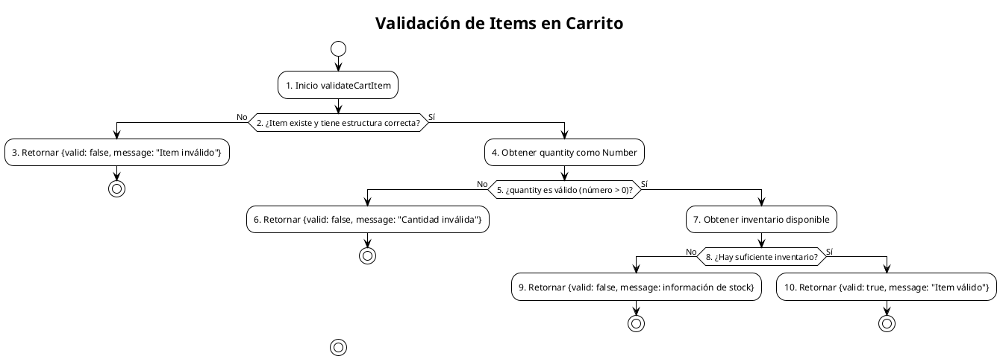

# PCB-A-13: VALIDACIÓN DE ITEMS EN CARRITO

## Información General

| Campo | Valor |
|-------|-------|
| No | PCB-A-13 |
| Nombre de la prueba | PCB-A-13 - Validación de items en carrito |
| Módulo | Shop/Cart |
| Descripción | Prueba automatizada para evaluar la lógica de validación de productos en el carrito de compras |
| Caso de prueba relacionado | HU-S07: Resumen de carrito |
| Realizado por | Valentin Alejandro Perez Zurita |
| Fecha | 17 de Abril del 2025 |

## Código Fuente a Probar

```javascript
// Ubicación: src/modules/shop/utils/cartUtils.js

/**
 * Valida un item de carrito para asegurar que está completo y tiene existencias
 * @param {Object} item - Item de carrito a validar
 * @param {Object} inventoryData - Datos de inventario actual
 * @returns {Object} Resultado de la validación con estado y mensaje
 */
export const validateCartItem = (item, inventoryData) => {
  // Verificar que el item existe y tiene la estructura correcta
  if (!item || !item.id || !item.quantity) {
    return {
      valid: false,
      message: 'Item de carrito inválido o incompleto'
    };
  }

  // Verificar que la cantidad es un número positivo
  const quantity = Number(item.quantity);
  if (isNaN(quantity) || quantity <= 0) {
    return {
      valid: false,
      message: 'La cantidad debe ser un número mayor a cero'
    };
  }

  // Verificar existencias en inventario
  const inventory = inventoryData && inventoryData[item.id] ? 
    inventoryData[item.id].stock : 0;
  
  if (quantity > inventory) {
    return {
      valid: false,
      message: `Solo hay ${inventory} unidades disponibles`,
      availableStock: inventory
    };
  }

  // Item válido
  return {
    valid: true,
    message: 'Item válido'
  };
};
```

## Diagrama de Flujo



## Cálculo de la Complejidad Ciclomática

### Nodos Predicado

| Nodo | Descripción |
|------|-------------|
| 2 | ¿Item existe y tiene estructura correcta? |
| 5 | ¿quantity es válido (número > 0)? |
| 8 | ¿Hay suficiente inventario? |

### Cálculo

| Método | Resultado |
|--------|-----------|
| Número de Regiones | 4 (3 caminos independientes + 1 región externa) |
| Aristas - Nodos + 2 | 12 - 10 + 2 = 4 |
| Nodos Predicado + 1 | 3 + 1 = 4 |
| Conclusión | La complejidad ciclomática es 4, lo que implica que se deben identificar 4 caminos independientes. |

## Determinación del Conjunto Básico de Caminos Independientes

| No | Descripción | Secuencia de nodos |
|----|-------------|-------------------|
| 1 | Item inválido | 1 → 2(No) → 3 → Fin |
| 2 | Cantidad inválida | 1 → 2(Sí) → 4 → 5(No) → 6 → Fin |
| 3 | Inventario insuficiente | 1 → 2(Sí) → 4 → 5(Sí) → 7 → 8(No) → 9 → Fin |
| 4 | Item válido | 1 → 2(Sí) → 4 → 5(Sí) → 7 → 8(Sí) → 10 → Fin |

## Casos de Prueba Derivados

| Caso | Descripción | Entrada | Resultado Esperado |
|------|-------------|---------|-------------------|
| 1 | Item inválido | item = null, inventoryData = {} | { valid: false, message: 'Item de carrito inválido o incompleto' } |
| 2 | Cantidad inválida | item = { id: 'prod1', quantity: 0 }, inventoryData = {} | { valid: false, message: 'La cantidad debe ser un número mayor a cero' } |
| 3 | Inventario insuficiente | item = { id: 'prod1', quantity: 5 }, inventoryData = { 'prod1': { stock: 3 }} | { valid: false, message: 'Solo hay 3 unidades disponibles', availableStock: 3 } |
| 4 | Item válido | item = { id: 'prod1', quantity: 2 }, inventoryData = { 'prod1': { stock: 10 }} | { valid: true, message: 'Item válido' } |

## Tabla de Resultados

| Caso | Entrada | Resultado Esperado | Resultado Obtenido | Estado |
|------|---------|-------------------|-------------------|--------|
| 1 | item = null | { valid: false } | { valid: false } | ✅ Pasó |
| 2 | quantity = 0 | { valid: false } | { valid: false } | ✅ Pasó |
| 3 | cantidad > inventario | { valid: false, availableStock: 3 } | { valid: false, availableStock: 3 } | ✅ Pasó |
| 4 | item válido | { valid: true } | { valid: true } | ✅ Pasó |

## Herramienta Usada

- Jest

## Script de Prueba Automatizada

```javascript
// Ubicación: pruebas-de-caja-blanca-automatizadas/__tests__/PCB-A-13.test.js

// Simulando la importación del módulo cartUtils
const validateCartItem = (item, inventoryData) => {
  // Verificar que el item existe y tiene la estructura correcta
  if (!item || !item.id || !item.quantity) {
    return {
      valid: false,
      message: 'Item de carrito inválido o incompleto'
    };
  }

  // Verificar que la cantidad es un número positivo
  const quantity = Number(item.quantity);
  if (isNaN(quantity) || quantity <= 0) {
    return {
      valid: false,
      message: 'La cantidad debe ser un número mayor a cero'
    };
  }

  // Verificar existencias en inventario
  const inventory = inventoryData && inventoryData[item.id] ? 
    inventoryData[item.id].stock : 0;
  
  if (quantity > inventory) {
    return {
      valid: false,
      message: `Solo hay ${inventory} unidades disponibles`,
      availableStock: inventory
    };
  }

  // Item válido
  return {
    valid: true,
    message: 'Item válido'
  };
};

describe('PCB-A-13: Validación de items en carrito', () => {
  // Caso 1: Item inválido
  test('debería rechazar ítems inválidos o incompletos', () => {
    expect(validateCartItem(null, {})).toEqual({
      valid: false,
      message: 'Item de carrito inválido o incompleto'
    });
    
    expect(validateCartItem({}, {})).toEqual({
      valid: false,
      message: 'Item de carrito inválido o incompleto'
    });
    
    expect(validateCartItem({ id: 'prod1' }, {})).toEqual({
      valid: false,
      message: 'Item de carrito inválido o incompleto'
    });
  });

  // Caso 2: Cantidad inválida
  test('debería rechazar cantidades inválidas', () => {
    const item = { id: 'prod1', quantity: 0 };
    expect(validateCartItem(item, {})).toEqual({
      valid: false,
      message: 'La cantidad debe ser un número mayor a cero'
    });
    
    const itemNaN = { id: 'prod1', quantity: 'abc' };
    expect(validateCartItem(itemNaN, {})).toEqual({
      valid: false,
      message: 'La cantidad debe ser un número mayor a cero'
    });
  });

  // Caso 3: Inventario insuficiente
  test('debería rechazar items con inventario insuficiente', () => {
    const item = { id: 'prod1', quantity: 5 };
    const inventory = { 
      'prod1': { stock: 3 }
    };
    
    expect(validateCartItem(item, inventory)).toEqual({
      valid: false,
      message: 'Solo hay 3 unidades disponibles',
      availableStock: 3
    });
  });

  // Caso 4: Item válido
  test('debería aceptar items válidos con inventario suficiente', () => {
    const item = { id: 'prod1', quantity: 2 };
    const inventory = { 
      'prod1': { stock: 10 }
    };
    
    expect(validateCartItem(item, inventory)).toEqual({
      valid: true,
      message: 'Item válido'
    });
  });
});
``` 