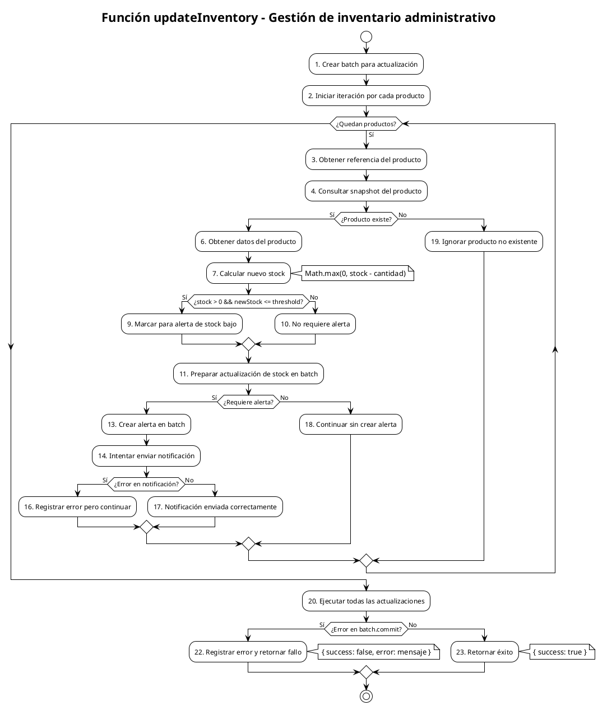

# PCB-M-07: GESTIÓN DE INVENTARIO ADMINISTRATIVO

## Módulo del sistema:
Administración

## Historia de usuario: 
HU-AD03 - Como administrador quiero actualizar el stock de productos y recibir alertas cuando el inventario esté bajo para mantener control efectivo del inventario

## Número y nombre de la prueba:
PCB-M-07 - Gestión de inventario administrativo

## Realizado por:
Valentin Alejandro Perez Zurita

## Fecha
18 de Abril del 2025


## Código Fuente


```js
/**
 * Función para actualizar el inventario después de una compra exitosa
 * Extracto de functions/payment/simulateOxxOPayment.js
 */
async function updateInventory(items) {
  // Obtener un batch para hacer múltiples actualizaciones
  const batch = admin.firestore().batch();

  // Iterar sobre cada producto en la orden
  for (const item of items) {
    const productRef = admin.firestore().collection('products').doc(item.id);
    const productSnap = await productRef.get();

    if (productSnap.exists) {
      const product = productSnap.data();
      const newStock = Math.max(0, (product.stock || 0) - item.quantity);

      // Verificar si es necesario emitir alerta de stock
      const needsAlert = product.stock > 0 && newStock <= (product.alertThreshold || 5);
      
      // Actualizar el stock
      batch.update(productRef, {
        stock: newStock,
        updatedAt: admin.firestore.FieldValue.serverTimestamp()
      });
      
      // Si es necesario, agregar notificación de stock bajo
      if (needsAlert) {
        const alertsRef = admin.firestore().collection('inventory_alerts');
        const alertData = {
          productId: item.id,
          productName: product.name || 'Producto sin nombre',
          previousStock: product.stock,
          currentStock: newStock,
          threshold: product.alertThreshold || 5,
          createdAt: admin.firestore.FieldValue.serverTimestamp(),
          status: 'pending',
          type: 'low_stock'
        };
        
        batch.set(alertsRef.doc(), alertData);
        
        // Intentar enviar notificación a administradores
        try {
          await sendLowStockNotification(alertData);
        } catch (notificationError) {
          console.error('Error enviando notificación de stock bajo:', notificationError);
          // Continuar a pesar del error en la notificación
        }
      }
    }
  }

  // Ejecutar todas las actualizaciones en un batch
  try {
    await batch.commit();
    return { success: true };
  } catch (batchError) {
    console.error('Error actualizando inventario:', batchError);
    return { success: false, error: batchError.message };
  }
}

/**
 * Función auxiliar para enviar notificaciones de stock bajo
 */
async function sendLowStockNotification(alertData) {
  try {
    // Obtener administradores que deban recibir notificaciones
    const adminsQuery = await admin.firestore()
      .collection('users')
      .where('role', 'in', ['admin', 'superadmin'])
      .where('settings.notifications.lowStock', '==', true)
      .limit(10)
      .get();
    
    if (adminsQuery.empty) {
      console.log('No hay administradores configurados para recibir alertas');
      return false;
    }
    
    // Preparar mensaje
    const message = {
      subject: `Alerta de stock bajo: ${alertData.productName}`,
      body: `El producto "${alertData.productName}" ha bajado a ${alertData.currentStock} unidades (por debajo del umbral de ${alertData.threshold})`,
      data: {
        type: 'low_stock',
        productId: alertData.productId,
        severity: alertData.currentStock === 0 ? 'critical' : 'warning'
      }
    };
    
    // Enviar notificación a cada administrador
    const promises = [];
    adminsQuery.forEach(adminDoc => {
      const adminData = adminDoc.data();
      if (adminData.email) {
        promises.push(
          sendEmail({
            to: adminData.email,
            subject: message.subject,
            html: `<p>${message.body}</p><p><a href="${process.env.ADMIN_URL}/inventory">Ver inventario</a></p>`
          })
        );
      }
    });
    
    await Promise.all(promises);
    return true;
  } catch (error) {
    console.error('Error en notificación de stock bajo:', error);
    return false;
  }
}
```


## Diagrama de flujo





## Cálculo de la Complejidad Ciclomática


**Número de regiones:**
- Regiones: 7

**Fórmula Aristas - Nodos + 2**
- Nodos: 23
- Aristas: 28
- Cálculo: V(G) = 28 - 23 + 2 = 7

**Nodos predicado + 1**
- Nodos predicado (decisiones): 6
  1. Decisión loop: ¿Quedan productos? (loop while)
  2. Decisión 1: ¿Producto existe? (Nodo 5)
  3. Decisión 2: ¿stock > 0 && newStock <= threshold? (Nodo 8)
  4. Decisión 3: ¿Requiere alerta? (Nodo 12)
  5. Decisión 4: ¿Error en notificación? (Nodo 15)
  6. Decisión 5: ¿Error en batch.commit? (Nodo 21)
- Cálculo: V(G) = 6 + 1 = 7

**Conclusión:** La complejidad ciclomática es 7, lo que implica que se deben identificar 7 caminos independientes dentro del grafo.


## Determinación del Conjunto Básico de Caminos Independientes


| Nº | Descripción | Secuencia de nodos |
|---|---|---|
| 1 | No hay productos (lista vacía) | 1 → 2 → (loop=No) → 20 → 21(No) → 23 → Fin |
| 2 | Producto no existe | 1 → 2 → (loop=Sí) → 3 → 4 → 5(No) → 19 → 2 → (loop=No) → 20 → 21(No) → 23 → Fin |
| 3 | Producto sin alerta de stock | 1 → 2 → (loop=Sí) → 3 → 4 → 5(Sí) → 6 → 7 → 8(No) → 10 → 11 → 12(No) → 18 → 2 → (loop=No) → 20 → 21(No) → 23 → Fin |
| 4 | Producto con alerta de stock, notificación exitosa | 1 → 2 → (loop=Sí) → 3 → 4 → 5(Sí) → 6 → 7 → 8(Sí) → 9 → 11 → 12(Sí) → 13 → 14 → 15(No) → 17 → 2 → (loop=No) → 20 → 21(No) → 23 → Fin |
| 5 | Producto con alerta de stock, error en notificación | 1 → 2 → (loop=Sí) → 3 → 4 → 5(Sí) → 6 → 7 → 8(Sí) → 9 → 11 → 12(Sí) → 13 → 14 → 15(Sí) → 16 → 2 → (loop=No) → 20 → 21(No) → 23 → Fin |
| 6 | Múltiples productos exitosos | 1 → 2 → (loop=Sí) → ... → 2 → (loop=Sí) → ... → 2 → (loop=No) → 20 → 21(No) → 23 → Fin |
| 7 | Error en commit del batch | 1 → 2 → (loop=Sí) → ... → 2 → (loop=No) → 20 → 21(Sí) → 22 → Fin |


## Derivación de Casos de Prueba


| Camino | Caso de Prueba | Datos de Entrada | Resultado Esperado |
|---|---|---|---|
| 1 | No hay productos | items = [] | Batch vacío, commit exitoso, retorna { success: true } |
| 2 | Producto no existe | items = [{ id: "prod123", quantity: 2 }], productSnap.exists = false | No se realiza actualización del producto inexistente, commit exitoso, retorna { success: true } |
| 3 | Producto sin alerta de stock | items = [{ id: "prod456", quantity: 1 }], productSnap = { exists: true, data: () => ({ stock: 15, alertThreshold: 5 }) } | Stock actualizado a 14, sin alerta generada, commit exitoso, retorna { success: true } |
| 4 | Producto con alerta, notificación exitosa | items = [{ id: "prod789", quantity: 3 }], productSnap = { exists: true, data: () => ({ stock: 7, name: "Cactus Mini", alertThreshold: 5 }) }, adminsQuery = [{ data: () => ({ email: "admin@example.com" }) }] | Stock actualizado a 4, alerta generada, notificación enviada correctamente, commit exitoso, retorna { success: true } |
| 5 | Producto con alerta, error en notificación | items = [{ id: "prod101", quantity: 2 }], productSnap = { exists: true, data: () => ({ stock: 6, name: "Suculenta", alertThreshold: 5 }) }, sendLowStockNotification arroja error | Stock actualizado a 4, alerta generada, error en notificación registrado pero no bloquea, commit exitoso, retorna { success: true } |
| 6 | Múltiples productos exitosos | items = [{ id: "prod1", quantity: 1 }, { id: "prod2", quantity: 2 }], ambos productos existen | Stock de ambos productos actualizado, commit exitoso, retorna { success: true } |
| 7 | Error en commit del batch | items = [{ id: "prod1", quantity: 1 }], batch.commit arroja error | Se registra el error, retorna { success: false, error: "Mensaje de error" } |
</rewritten_file> 