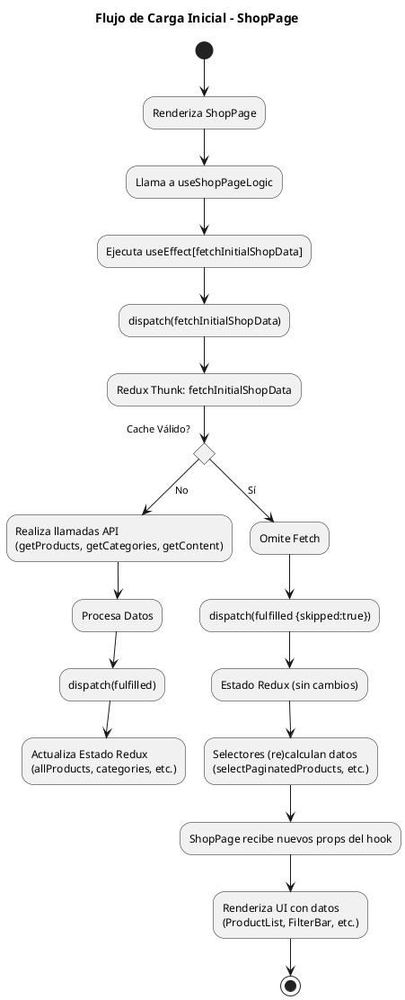
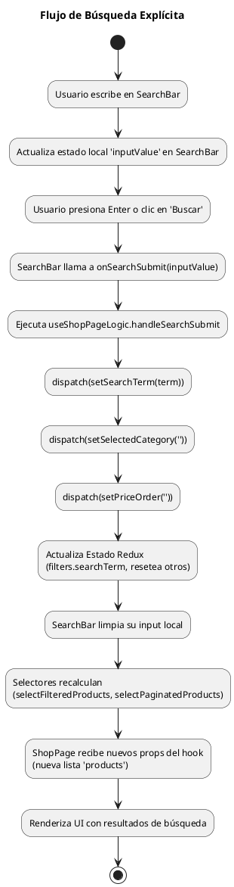
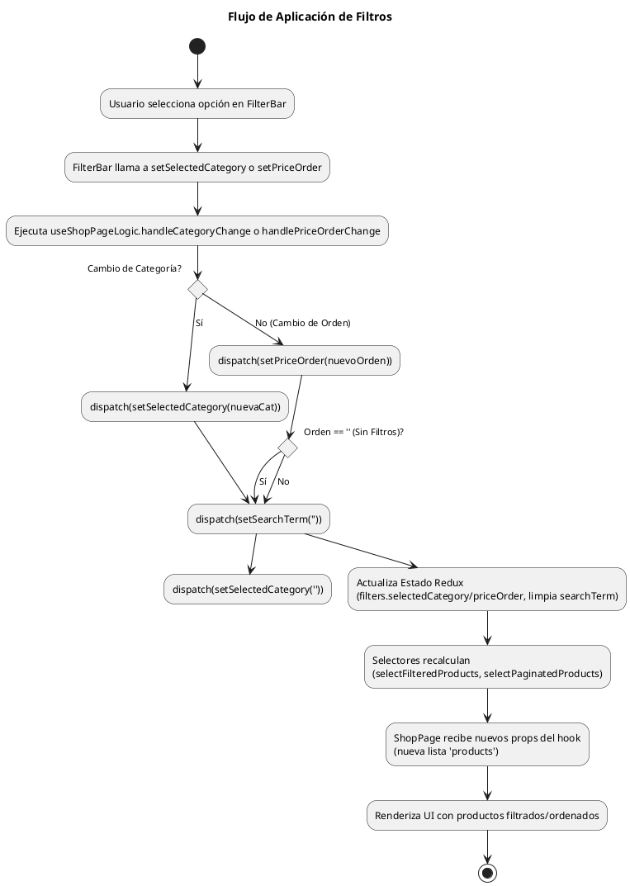

# Módulo de Tienda (`shop`)

## 1. Propósito y Descripción General

Este módulo encapsula toda la funcionalidad relacionada con la experiencia de compra del usuario final en la tienda online. Incluye la visualización de productos, filtros, búsqueda, detalles de producto, y la interacción inicial con el carrito de compras (a través de componentes delegados).

El objetivo es proporcionar una interfaz clara, eficiente y fácil de usar para que los clientes exploren y seleccionen productos.

## 2. Estructura de Carpetas

```
shop/
├── __tests__/           # Pruebas específicas del módulo
├── components/         # Componentes genéricos reutilizables DENTRO de shop (si aplica)
│   ├── common/
│   └── ui/
├── context/            # Contextos específicos de React para 'shop' (si aplica)
│   └── hooks/
├── data/               # Datos estáticos o mock data específicos
├── features/           # Sub-módulos funcionales principales
│   ├── cart/           # Componentes y lógica del carrito (parcialmente aquí)
│   ├── checkout/       # Componentes y lógica del proceso de pago
│   ├── order/          # Componentes y lógica post-compra
│   └── shop/           # Componentes específicos de la UI de la tienda (SearchBar, ProductList, etc.)
├── hooks/              # Hooks personalizados específicos del módulo (useShopPageLogic, useModal, etc.)
├── pages/              # Componentes de página (vistas principales como ShopPage)
├── router/             # Definición de rutas específicas del módulo
├── services/           # Lógica de negocio y llamadas API (si no se maneja centralmente)
├── styles/             # Estilos globales o compartidos del módulo
└── utils/              # Funciones de utilidad específicas del módulo
```

## 3. Componentes y Hooks Clave

* **`pages/ShopPage.jsx`**:
  * Componente principal que renderiza la vista de la tienda.
  * Actúa como un contenedor de presentación.
  * Orquesta los componentes UI (`HeroSection`, `SearchBar`, `FilterBar`, `ProductList`, `Pagination`, `ProductModal`, `StatusMessage`).
  * Delega la lógica principal al hook `useShopPageLogic`.
  * Maneja la lógica local del modal (`useModal`) y del carrito (`useCart`).
* **`hooks/useShopPageLogic.js`**:
  * Hook personalizado que encapsula la lógica central de la página.
  * Interactúa con Redux (dispatch, useSelector) para obtener datos (productos, categorías, filtros, paginación, banner) y despachar acciones.
  * Define y memoiza los manejadores de eventos para búsqueda, filtros y paginación.
  * Realiza cálculos derivados memoizados (ej: `bannerProps`).
  * Maneja efectos secundarios como la carga inicial de datos y la preselección de categorías.
* **`features/shop/ProductCard.jsx`**:
  * Muestra una tarjeta individual de producto en la lista.
  * Memoizado (`React.memo`) para optimizar rendimiento.
  * Utiliza `ImageComponent` con `loading="lazy"` para carga diferida de imágenes.
  * Incluye validación/normalización básica del producto.
  * Permite añadir al carrito (usando `CartButton`) y abrir el modal de detalles.
* **`features/shop/SearchBar.jsx`**:
  * Implementa la barra de búsqueda con **envío explícito** (clic o Enter).
  * Maneja el estado del input localmente.
  * Llama a `onSearchSubmit` (provisto por `useShopPageLogic`) al enviar.
  * Limpia el input después del envío.
* **`features/shop/FilterBar.jsx`**:
  * Contiene los `Dropdown` para filtrar por categoría y ordenar por precio/destacados.
  * Llama a los manejadores correspondientes (`handleCategoryChange`, `handlePriceOrderChange`) provistos por `useShopPageLogic`.
* **`features/shop/ProductList.jsx`**:
  * Renderiza la cuadrícula de componentes `ProductCard`.
* **`features/shop/Pagination.jsx`**:
  * Muestra los controles de paginación.
* **`features/shop/ProductModal.jsx`**:
  * Modal para mostrar detalles del producto.
  * Cargado de forma diferida (`React.lazy`).
  * Refactorizado internamente con subcomponentes para legibilidad.
  * Usa `useProductModal` para la lógica de cantidad/stock/añadir al carrito.
* **`hooks/useModal.js`**:
  * Hook reutilizable (probablemente) para gestionar el estado (abierto/cerrado, contenido) de un modal. Usado por `ShopPage` para `ProductModal`.
* **`features/cart/hooks/useCart.js`**:
  * Hook que provee la funcionalidad para interactuar con el carrito (ej: `handleAddToCart`).

## 4. Gestión de Estado (Redux)

* **Dependencia:** El módulo `shop` depende fuertemente del slice `shopPageSlice` ubicado en `src/store/slices/`.
* **Estrategia de Datos:** Actualmente, la estrategia es **cargar todos los productos activos** (`allProducts`) y categorías (`categories`) al montar la página (`fetchInitialShopData`) y almacenarlos en el estado de Redux.
* **Filtrado/Ordenación/Paginación:** Todas estas operaciones se realizan en el **frontend** mediante selectores derivados que operan sobre la lista `allProducts` completa.
* **Estado Clave en Redux:**
  * `allProducts`: Array completo de productos activos.
  * `categories`, `categoriesMap`: Información de categorías.
  * `filters`: Objeto con `searchTerm`, `selectedCategory`, `priceOrder`.
  * `pagination`: Objeto con `currentPage`, `pageSize`.
  * `isLoading`, `error`: Estado de carga y errores del fetch inicial.
  * `bannerConfig`, `bannerCollectionImages`: Datos para el banner.
* **Selectores Memoizados:** Se utiliza `createSelector` (de `@reduxjs/toolkit`/`reselect`) para crear selectores derivados memoizados (`selectFilteredProducts`, `selectPaginatedProducts`, etc.). Esto asegura que los cálculos complejos solo se rehagan cuando los datos de entrada relevantes cambien, optimizando el rendimiento.

## 5. Flujos de Datos y Procesos Clave

A continuación se muestran diagramas simplificados (PlantUML) de los flujos principales.

### 5.1 Carga Inicial de la Página



### 5.2 Flujo de Búsqueda Explícita



### 5.3 Flujo de Aplicación de Filtros (Categoría/Orden)



## 6. Optimizaciones Aplicadas

Durante el desarrollo y refactorización reciente, se aplicaron las siguientes optimizaciones:

* **Lazy Loading:** El `ProductModal` se carga de forma diferida para reducir el tamaño inicial del bundle. Las imágenes en `ProductCard` usan `loading="lazy"`.
* **Memoization:**
  * `ProductCard` usa `React.memo`.
  * `useShopPageLogic` utiliza `useCallback` para los manejadores de eventos y `useMemo` para cálculos derivados (`bannerProps`).
  * Los selectores de Redux utilizan `createSelector`.
* **Refactorización Lógica:** Se extrajo la lógica compleja de `ShopPage` al hook `useShopPageLogic`, mejorando la separación de conceptos y la legibilidad.
* **Refactorización UI (`ProductModal`):** Se refactorizó el JSX del modal usando subcomponentes internos para mejorar la mantenibilidad.
* **Búsqueda Explícita:** Se modificó la `SearchBar` para requerir un envío explícito, resolviendo conflictos de UX con los filtros.
* **Limpieza de Código:** Se eliminaron logs, código comentado y se tradujeron/mejoraron comentarios.
* **Centralización de Utilidades:** Se usa `src/utils/imageUtils.js`.

## 7. Consideraciones Futuras

* **Escalabilidad de Carga Inicial:** Si el catálogo de productos crece significativamente (miles de productos), la estrategia actual de cargar todo en `fetchInitialShopData` y filtrar/paginar en el cliente podría volverse un cuello de botella. Considerar migrar el filtrado, ordenación y paginación al backend (ej: Firebase Functions) para realizar consultas más específicas y reducir la carga inicial.
* **Pruebas:** Asegurar una cobertura de pruebas adecuada (unitaria, integración) para la lógica de filtros, búsqueda y el hook `useShopPageLogic`, siguiendo las guías del proyecto.
