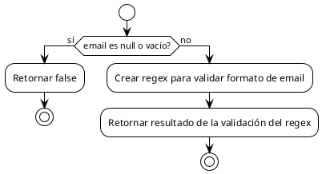

# PCB-A-01: VALIDACIÓN DE EMAIL

## Información General

| Campo | Valor |
|-------|-------|
| No | PCB-A-01 |
| Nombre de la prueba | PCB-A-01 - Validación de formato de email |
| Módulo | Auth/Shop |
| Descripción | Prueba automatizada para validar formatos de email en el registro de usuarios |
| Caso de prueba relacionado | HU-A01: Registro de usuario |
| Realizado por | Valentin Alejandro Perez Zurita |
| Fecha | 16 de Abril del 2025 |

## Código Fuente a Probar

```javascript
// Ubicación: src/modules/shop/utils/validation.js
export const isValidEmail = (email) => {
  if (!email) return false;
  const regex = /^[^\s@]+@[^\s@]+\.[^\s@]+$/;
  return regex.test(email);
};
```

## Diagrama de Flujo



## Cálculo de la Complejidad Ciclomática

| Nodo | Descripción |
|------|-------------|
| 1 | Inicio |
| 2 | ¿Email es null o vacío? |
| 3 | Retornar false |
| 4 | Crear regex y validar formato |

| Método | Resultado |
|--------|-----------|
| Número de Regiones | 2 |
| Aristas - Nodos + 2 | 4 - 4 + 2 = 2 |
| Nodos Predicado + 1 | 1 + 1 = 2 |
| Conclusión | La complejidad ciclomática es 2, lo que implica que se deben identificar 2 caminos independientes. |

## Determinación del Conjunto Básico de Caminos Independientes

| No | Descripción | Secuencia de nodos |
|----|-------------|-------------------|
| 1 | Email nulo o vacío | 1 → 2(Sí) → 3 → Fin |
| 2 | Email con formato válido o inválido | 1 → 2(No) → 4 → Fin |

## Casos de Prueba Derivados

| Caso | Descripción | Entrada | Resultado Esperado |
|------|-------------|---------|-------------------|
| 1 | Email nulo | null | false |
| 2 | Email vacío | "" | false |
| 3 | Email sin @ | "usuarioexample.com" | false |
| 4 | Email válido simple | "usuario@example.com" | true |

## Tabla de Resultados

| Caso | Entrada | Resultado Esperado | Resultado Obtenido | Estado |
|------|---------|-------------------|-------------------|--------|
| 1 | null | false | false | ✅ Pasó |
| 2 | "" | false | false | ✅ Pasó |
| 3 | "usuarioexample.com" | false | false | ✅ Pasó |
| 4 | "usuario@example.com" | true | true | ✅ Pasó |

## Herramienta Usada
- Jest + React Testing Library

## Script de Prueba Automatizada

```javascript
// Ubicación: src/modules/shop/utils/__tests__/validation.test.js

import { isValidEmail } from '../validation';

describe('Email Validation Function', () => {
  // Camino 1: Email nulo o vacío
  test('debería devolver false para email nulo', () => {
    expect(isValidEmail(null)).toBe(false);
  });

  test('debería devolver false para email vacío', () => {
    expect(isValidEmail('')).toBe(false);
  });

  // Camino 2: Email no nulo -> validación con regex
  test('debería devolver false para email sin @', () => {
    expect(isValidEmail('usuarioexample.com')).toBe(false);
  });

  test('debería devolver true para email válido simple', () => {
    expect(isValidEmail('usuario@example.com')).toBe(true);
  });
});
```