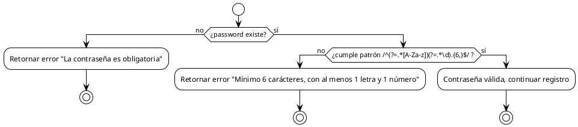

# PCB-A-02: VALIDACIÓN DE CONTRASEÑA

## Información General

| Campo | Valor |
|-------|-------|
| No | PCB-A-02 |
| Nombre de la prueba | PCB-A-02 - Validación de seguridad de contraseña |
| Módulo | Auth |
| Descripción | Prueba automatizada para validar los requisitos de seguridad de contraseñas en el registro de usuarios |
| Caso de prueba relacionado | HU-A01: Registro de usuario |
| Realizado por | Valentin Alejandro Perez Zurita |
| Fecha | 16 de Abril del 2025 |

## Código Fuente a Probar

```javascript
// Ubicación: src/modules/auth/components/signup-page/RegisterForm.jsx
// Validación de contraseña en el formulario de registro
{...register('password', {
  required: 'La contraseña es obligatoria',
  pattern: {
    value: /^(?=.*[A-Za-z])(?=.*\d).{6,}$/,
    message: 'Mínimo 6 carácteres, con al menos 1 letra y 1 número',
  },
})}
```

## Diagrama de Flujo



## Cálculo de la Complejidad Ciclomática

| Nodo | Descripción |
|------|-------------|
| 1 | Inicio |
| 2 | ¿Password existe? |
| 3 | Retornar error "La contraseña es obligatoria" |
| 4 | ¿Cumple patrón? |
| 5 | Retornar error "Mínimo 6 carácteres, con al menos 1 letra y 1 número" |
| 6 | Contraseña válida, continuar registro |

| Método | Resultado |
|--------|-----------|
| Número de Regiones | 3 |
| Aristas - Nodos + 2 | 7 - 6 + 2 = 3 |
| Nodos Predicado + 1 | 2 + 1 = 3 |
| Conclusión | La complejidad ciclomática es 3, lo que implica que se deben identificar 3 caminos independientes. |

## Determinación del Conjunto Básico de Caminos Independientes

| No | Descripción | Secuencia de nodos |
|----|-------------|-------------------|
| 1 | Contraseña no proporcionada | 1 → 2(no) → 3 → Fin |
| 2 | Contraseña no cumple requisitos | 1 → 2(sí) → 4(no) → 5 → Fin |
| 3 | Contraseña válida | 1 → 2(sí) → 4(sí) → 6 → Fin |

## Casos de Prueba Derivados

| Caso | Descripción | Entrada | Resultado Esperado |
|------|-------------|---------|-------------------|
| 1 | Contraseña vacía | "" | Error: "La contraseña es obligatoria" |
| 2 | Contraseña solo números | "123456" | Error: "Mínimo 6 carácteres, con al menos 1 letra y 1 número" |
| 3 | Contraseña solo letras | "abcdef" | Error: "Mínimo 6 carácteres, con al menos 1 letra y 1 número" |
| 4 | Contraseña corta pero con letra y número | "a1" | Error: "Mínimo 6 carácteres, con al menos 1 letra y 1 número" |
| 5 | Contraseña válida simple | "abc123" | Validación exitosa |
| 6 | Contraseña válida compleja | "Abc123XYZ!" | Validación exitosa |

## Tabla de Resultados

| Caso | Entrada | Resultado Esperado | Resultado Obtenido | Estado |
|------|---------|-------------------|-------------------|--------|
| 1 | "" | Error: "La contraseña es obligatoria" | Error: "La contraseña es obligatoria" | ✅ Pasó |
| 2 | "123456" | Error: "Mínimo 6 carácteres, con al menos 1 letra y 1 número" | Error: "Mínimo 6 carácteres, con al menos 1 letra y 1 número" | ✅ Pasó |
| 3 | "abcdef" | Error: "Mínimo 6 carácteres, con al menos 1 letra y 1 número" | Error: "Mínimo 6 carácteres, con al menos 1 letra y 1 número" | ✅ Pasó |
| 4 | "a1" | Error: "Mínimo 6 carácteres, con al menos 1 letra y 1 número" | Error: "Mínimo 6 carácteres, con al menos 1 letra y 1 número" | ✅ Pasó |
| 5 | "abc123" | Validación exitosa | Validación exitosa | ✅ Pasó |
| 6 | "Abc123XYZ!" | Validación exitosa | Validación exitosa | ✅ Pasó |

## Herramienta Usada
- Jest + React Testing Library

## Script de Prueba Automatizada

```javascript
// Ubicación: src/modules/auth/components/signup-page/__tests__/passwordValidation.test.js

import { render, screen } from '@testing-library/react';
import userEvent from '@testing-library/user-event';
import { useForm } from 'react-hook-form';
import { InputField } from '../../../../../shared/components';

// Componente de prueba para aislar la validación de contraseña
const PasswordValidationTest = () => {
  const { register, handleSubmit, formState: { errors } } = useForm({
    mode: 'onChange' // Para validar al cambiar, no solo al enviar
  });
  
  const onSubmit = (data) => console.log(data);
  
  return (
    <form onSubmit={handleSubmit(onSubmit)}>
      <InputField
        label="Password"
        type="password"
        placeholder="Ingresa tu contraseña"
        {...register('password', {
          required: 'La contraseña es obligatoria',
          pattern: {
            value: /^(?=.*[A-Za-z])(?=.*\d).{6,}$/,
            message: 'Mínimo 6 carácteres, con al menos 1 letra y 1 número',
          },
        })}
        errors={errors.password}
      />
      <button type="submit">Enviar</button>
    </form>
  );
};

describe('Validación de Contraseña', () => {
  // Camino 1: Contraseña no proporcionada
  test('debe mostrar error cuando la contraseña está vacía', async () => {
    render(<PasswordValidationTest />);
    
    // Simular clic en el campo y luego salir sin escribir nada
    const passwordInput = screen.getByLabelText(/password/i);
    await userEvent.click(passwordInput);
    await userEvent.tab(); // Mover foco al siguiente elemento
    
    // Verificar que aparece mensaje de error
    const errorMessage = await screen.findByText('La contraseña es obligatoria');
    expect(errorMessage).toBeInTheDocument();
  });

  // Camino 2: Contraseña no cumple requisitos
  test('debe mostrar error cuando la contraseña solo tiene números', async () => {
    render(<PasswordValidationTest />);
    
    const passwordInput = screen.getByLabelText(/password/i);
    await userEvent.type(passwordInput, '123456');
    await userEvent.tab();
    
    const errorMessage = await screen.findByText('Mínimo 6 carácteres, con al menos 1 letra y 1 número');
    expect(errorMessage).toBeInTheDocument();
  });

  test('debe mostrar error cuando la contraseña solo tiene letras', async () => {
    render(<PasswordValidationTest />);
    
    const passwordInput = screen.getByLabelText(/password/i);
    await userEvent.type(passwordInput, 'abcdef');
    await userEvent.tab();
    
    const errorMessage = await screen.findByText('Mínimo 6 carácteres, con al menos 1 letra y 1 número');
    expect(errorMessage).toBeInTheDocument();
  });

  test('debe mostrar error cuando la contraseña es muy corta', async () => {
    render(<PasswordValidationTest />);
    
    const passwordInput = screen.getByLabelText(/password/i);
    await userEvent.type(passwordInput, 'a1');
    await userEvent.tab();
    
    const errorMessage = await screen.findByText('Mínimo 6 carácteres, con al menos 1 letra y 1 número');
    expect(errorMessage).toBeInTheDocument();
  });

  // Camino 3: Contraseña válida
  test('no debe mostrar error con una contraseña válida simple', async () => {
    render(<PasswordValidationTest />);
    
    const passwordInput = screen.getByLabelText(/password/i);
    await userEvent.type(passwordInput, 'abc123');
    await userEvent.tab();
    
    // Verificar que no hay mensaje de error
    expect(screen.queryByText('La contraseña es obligatoria')).not.toBeInTheDocument();
    expect(screen.queryByText('Mínimo 6 carácteres, con al menos 1 letra y 1 número')).not.toBeInTheDocument();
  });

  test('no debe mostrar error con una contraseña válida compleja', async () => {
    render(<PasswordValidationTest />);
    
    const passwordInput = screen.getByLabelText(/password/i);
    await userEvent.type(passwordInput, 'Abc123XYZ!');
    await userEvent.tab();
    
    // Verificar que no hay mensaje de error
    expect(screen.queryByText('La contraseña es obligatoria')).not.toBeInTheDocument();
    expect(screen.queryByText('Mínimo 6 carácteres, con al menos 1 letra y 1 número')).not.toBeInTheDocument();
  });
});
```