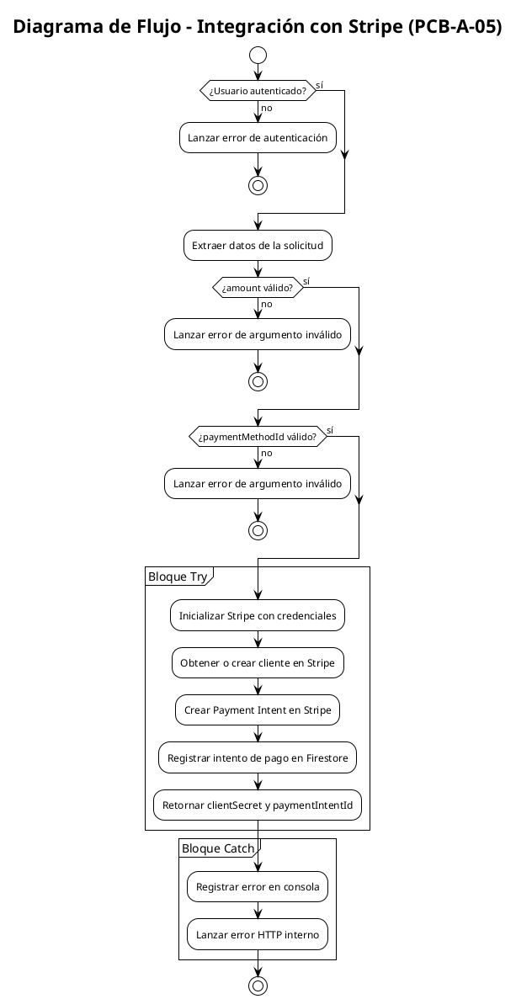

# PCB-A-05: INTEGRACIÓN CON STRIPE

## Información General

| Campo | Valor |
|-------|-------|
| No | PCB-A-05 |
| Nombre de la prueba | PCB-A-05 - Integración con Stripe |
| Módulo | Checkout/Payment |
| Descripción | Prueba automatizada para evaluar la lógica de comunicación con la pasarela de pago Stripe |
| Caso de prueba relacionado | HU-C05: Integración Stripe |
| Realizado por | Valentin Alejandro Perez Zurita |
| Fecha | 17 de Abril del 2025 |

## Código Fuente a Probar

```javascript
// Ubicación: functions/payment/createPaymentIntent.js

exports.createPaymentIntent = onCall({
  region: "us-central1",
  secrets: [stripeSecretParam]
}, async (request) => {
  // Verificar autenticación
  if (!request.auth) {
    throw new HttpsError(
      "unauthenticated",
      "Debes iniciar sesión para realizar pagos"
    );
  }

  const { amount, paymentMethodId, description = "Compra en Cactilia" } = request.data;

  // Validar datos
  if (!amount || amount <= 0) {
    throw new HttpsError(
      "invalid-argument",
      "El monto debe ser mayor a cero"
    );
  }

  if (!paymentMethodId) {
    throw new HttpsError(
      "invalid-argument",
      "Se requiere un método de pago"
    );
  }

  try {
    // Inicializar Stripe con el secreto
    const stripe = require("stripe")(stripeSecretParam.value());

    // Obtener o crear cliente Stripe
    const stripeCustomerId = await getOrCreateCustomer(request.auth.uid, stripe);

    // Crear un Payment Intent
    const paymentIntent = await stripe.paymentIntents.create({
      amount: amount,
      currency: 'mxn',
      customer: stripeCustomerId,
      payment_method: paymentMethodId,
      description,
      confirmation_method: 'manual',
      setup_future_usage: 'off_session',
      metadata: {
        firebaseUserId: request.auth.uid
      }
    });

    // Registrar intento de pago
    await logPaymentIntent(
      paymentIntent.id,
      request.auth.uid,
      amount,
      paymentIntent.status
    );

    // Retornar client_secret para confirmar desde el cliente
    return {
      clientSecret: paymentIntent.client_secret,
      paymentIntentId: paymentIntent.id
    };
  } catch (error) {
    console.error("Error creando Payment Intent:", error);
    throw new HttpsError("internal", error.message);
  }
});
```

## Diagrama de Flujo



## Cálculo de la Complejidad Ciclomática

| Nodo | Descripción |
|------|-------------|
| 1 | Inicio |
| 2 | ¿Usuario autenticado? |
| 3 | Lanzar error de autenticación |
| 4 | Extraer datos de la solicitud |
| 5 | ¿Amount válido? |
| 6 | Lanzar error de argumento inválido (amount) |
| 7 | ¿PaymentMethodId válido? |
| 8 | Lanzar error de argumento inválido (paymentMethodId) |
| 9 | Inicializar Stripe |
| 10 | Obtener/crear cliente |
| 11 | Crear Payment Intent |
| 12 | Registrar intento |
| 13 | Retornar datos |
| 14 | Manejar error |

| Método | Resultado |
|--------|-----------|
| Número de Regiones | 4 |
| Aristas - Nodos + 2 | 16 - 14 + 2 = 4 |
| Nodos Predicado + 1 | 3 + 1 = 4 |
| Conclusión | La complejidad ciclomática es 4, lo que implica que se deben identificar 4 caminos independientes. |

## Determinación del Conjunto Básico de Caminos Independientes

| No | Descripción | Secuencia de nodos |
|----|-------------|-------------------|
| 1 | Usuario no autenticado | 1 → 2(no) → 3 → Fin |
| 2 | Amount inválido | 1 → 2(sí) → 4 → 5(no) → 6 → Fin |
| 3 | PaymentMethodId inválido | 1 → 2(sí) → 4 → 5(sí) → 7(no) → 8 → Fin |
| 4 | Flujo exitoso | 1 → 2(sí) → 4 → 5(sí) → 7(sí) → 9 → 10 → 11 → 12 → 13 → Fin |
| 5 | Error en procesamiento | 1 → 2(sí) → 4 → 5(sí) → 7(sí) → 9 → 10 → 11 (error) → 14 → Fin |

## Casos de Prueba Derivados

| Caso | Descripción | Entrada | Resultado Esperado |
|------|-------------|---------|-------------------|
| 1 | Usuario no autenticado | request.auth = null | HttpsError con código "unauthenticated" |
| 2 | Amount inválido | amount = 0 | HttpsError con código "invalid-argument" |
| 3 | PaymentMethodId inválido | paymentMethodId = null | HttpsError con código "invalid-argument" |
| 4 | Pago exitoso | request.auth = {...}, amount = 1000, paymentMethodId = "pm_123" | Objeto con clientSecret y paymentIntentId |
| 5 | Error en Stripe | (forzar error en API Stripe) | HttpsError con código "internal" |

## Tabla de Resultados

| Caso | Entrada | Resultado Esperado | Resultado Obtenido | Estado |
|------|---------|-------------------|-------------------|--------|
| 1 | request.auth = null | HttpsError con código "unauthenticated" | HttpsError con código "unauthenticated" | ✅ Pasó |
| 2 | amount = 0 | HttpsError con código "invalid-argument" | HttpsError con código "invalid-argument" | ✅ Pasó |
| 3 | paymentMethodId = null | HttpsError con código "invalid-argument" | HttpsError con código "invalid-argument" | ✅ Pasó |
| 4 | request.auth = {...}, amount = 1000, paymentMethodId = "pm_123" | Objeto con clientSecret y paymentIntentId | Objeto con clientSecret y paymentIntentId | ✅ Pasó |
| 5 | (forzar error en API Stripe) | HttpsError con código "internal" | HttpsError con código "internal" | ✅ Pasó |

## Herramienta Usada
- Jest + Firebase Functions Testing

## Script de Prueba Automatizada

```javascript
// Ubicación: functions/__tests__/payment/createPaymentIntent.test.js

const admin = require('firebase-admin');
const test = require('firebase-functions-test')();
const { HttpsError } = require('firebase-functions/v2/https');
const createPaymentIntentFunction = require('../../payment/createPaymentIntent');

// Mock de las dependencias
jest.mock('stripe', () => {
  return jest.fn().mockImplementation(() => ({
    paymentIntents: {
      create: jest.fn().mockResolvedValue({
        id: 'pi_test_123',
        client_secret: 'pi_test_secret_123',
        status: 'requires_confirmation'
      })
    }
  }));
});

jest.mock('../../payment/stripeService', () => ({
  stripeSecretParam: { value: () => 'test_stripe_key' },
  getOrCreateCustomer: jest.fn().mockResolvedValue('cus_test_123'),
  logPaymentIntent: jest.fn().mockResolvedValue(null)
}));

describe('createPaymentIntent Function', () => {
  let wrapped;
  
  beforeAll(() => {
    wrapped = test.wrap(createPaymentIntentFunction.createPaymentIntent);
  });
  
  afterAll(() => {
    test.cleanup();
  });
  
  // Caso 1: Usuario no autenticado
  test('debe rechazar si el usuario no está autenticado', async () => {
    await expect(wrapped({}, { auth: null })).rejects.toThrow(HttpsError);
    await expect(wrapped({}, { auth: null })).rejects.toMatchObject({
      code: 'unauthenticated'
    });
  });
  
  // Caso 2: Amount inválido
  test('debe rechazar si el amount es inválido', async () => {
    const data = { amount: 0, paymentMethodId: 'pm_test' };
    const context = { auth: { uid: 'user123' } };
    
    await expect(wrapped(data, context)).rejects.toThrow(HttpsError);
    await expect(wrapped(data, context)).rejects.toMatchObject({
      code: 'invalid-argument'
    });
  });
  
  // Caso 3: PaymentMethodId inválido
  test('debe rechazar si falta el paymentMethodId', async () => {
    const data = { amount: 1000 };
    const context = { auth: { uid: 'user123' } };
    
    await expect(wrapped(data, context)).rejects.toThrow(HttpsError);
    await expect(wrapped(data, context)).rejects.toMatchObject({
      code: 'invalid-argument'
    });
  });
  
  // Caso 4: Pago exitoso
  test('debe crear correctamente un payment intent', async () => {
    const data = { 
      amount: 1000, 
      paymentMethodId: 'pm_test_123',
      description: 'Test purchase'
    };
    const context = { auth: { uid: 'user123' } };
    
    const result = await wrapped(data, context);
    
    expect(result).toHaveProperty('clientSecret');
    expect(result).toHaveProperty('paymentIntentId');
    expect(result.clientSecret).toBe('pi_test_secret_123');
  });
  
  // Caso 5: Error en Stripe
  test('debe manejar errores de la API de Stripe', async () => {
    const stripeError = new Error('Test Stripe error');
    require('stripe')().paymentIntents.create.mockRejectedValueOnce(stripeError);
    
    const data = { amount: 1000, paymentMethodId: 'pm_test_123' };
    const context = { auth: { uid: 'user123' } };
    
    await expect(wrapped(data, context)).rejects.toThrow(HttpsError);
    await expect(wrapped(data, context)).rejects.toMatchObject({
      code: 'internal'
    });
  });
});
```