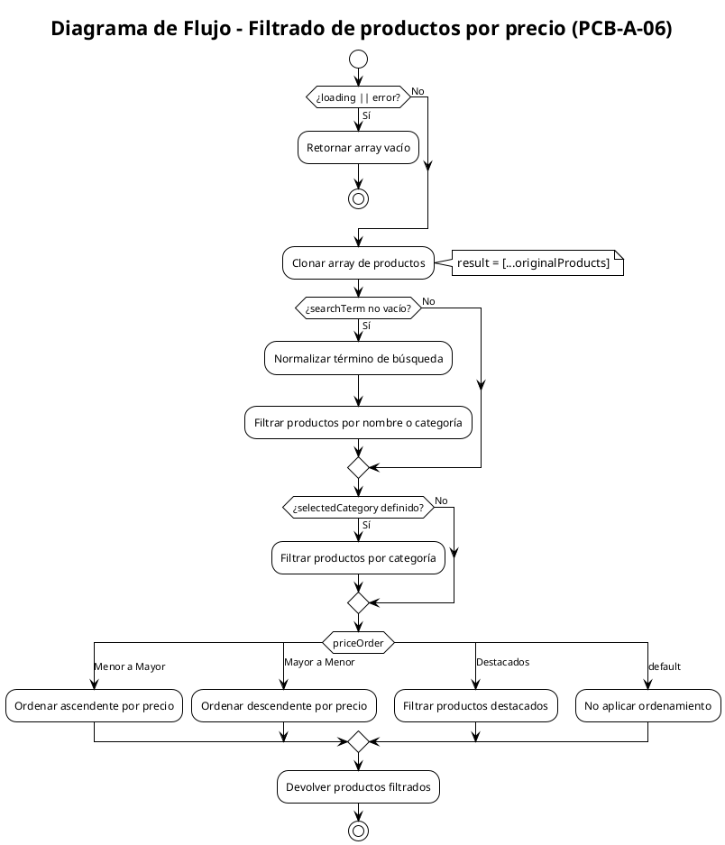

# PCB-A-06: FILTRADO DE PRODUCTOS POR PRECIO

## Información General

| Campo | Valor |
|-------|-------|
| No | PCB-A-06 |
| Nombre de la prueba | PCB-A-06 - Filtrado de productos por precio |
| Módulo | Shop |
| Descripción | Prueba automatizada para verificar el filtrado de productos según criterios como precio, categoría y destacados |
| Caso de prueba relacionado | HU-S03: Filtrado de productos |
| Realizado por | Valentin Alejandro Perez Zurita |
| Fecha | 17 de Abril del 2025 |

## Código Fuente a Probar

```javascript
// Ubicación: src/modules/shop/hooks/useProducts.js
const filteredProducts = useMemo(() => {
  // Si hay carga o error, devolver un array vacío
  if (loading || error) return [];

  let result = [...originalProducts];

  // Filtrar por término de búsqueda (nombre o categoría)
  if (searchTerm.trim() !== "") {
    const normalizedSearchTerm = searchTerm.toLowerCase().trim();
    result = result.filter((prod) => 
      // Buscar en el nombre del producto
      (prod.name && prod.name.toLowerCase().includes(normalizedSearchTerm)) || 
      // Buscar en la categoría del producto
      (prod.category && prod.category.toLowerCase().includes(normalizedSearchTerm))
    );
  }

  // Filtrar por categoría
  if (selectedCategory) {
    result = result.filter((prod) => prod.category?.toLowerCase() === selectedCategory.toLowerCase());
  }

  // Ordenar por precio
  switch (priceOrder) {
    case "Menor a Mayor":
      result.sort((a, b) => a.price - b.price);
      break;
    case "Mayor a Menor":
      result.sort((a, b) => b.price - a.price);
      break;
    case "Destacados":
      result = result.filter((prod) => prod.featured);
      break;
    default:
      break;
  }

  // Devolver los productos filtrados
  return result;

}, [originalProducts, loading, error, searchTerm, selectedCategory, priceOrder]);
```

## Diagrama de Flujo



## Cálculo de la Complejidad Ciclomática

| Nodo | Descripción |
|------|-------------|
| 1 | Inicio |
| 2 | ¿loading || error? |
| 3 | Retornar array vacío |
| 4 | Clonar array de productos |
| 5 | ¿searchTerm no vacío? |
| 6 | Normalizar término de búsqueda |
| 7 | Filtrar productos por nombre o categoría |
| 8 | ¿selectedCategory definido? |
| 9 | Filtrar productos por categoría |
| 10 | Switch priceOrder (4 casos) |
| 11 | Ordenar ascendente (Menor a Mayor) |
| 12 | Ordenar descendente (Mayor a Menor) |
| 13 | Filtrar productos destacados |
| 14 | No aplicar ordenamiento (default) |
| 15 | Devolver productos filtrados |

| Método | Resultado |
|--------|-----------|
| Número de Regiones | 7 |
| Aristas - Nodos + 2 | 20 - 15 + 2 = 7 |
| Nodos Predicado + 1 | 6 + 1 = 7 |
| Conclusión | La complejidad ciclomática es 7, lo que implica que se deben identificar 7 caminos independientes. |

## Determinación del Conjunto Básico de Caminos Independientes

| No | Descripción | Secuencia de nodos |
|----|-------------|-------------------|
| 1 | Loading o error activo | 1 → 2(Sí) → 3 → Fin |
| 2 | Sin filtros ni ordenamiento | 1 → 2(No) → 4 → 5(No) → 8(No) → 10(default) → 14 → 15 → Fin |
| 3 | Solo filtro por término de búsqueda | 1 → 2(No) → 4 → 5(Sí) → 6 → 7 → 8(No) → 10(default) → 14 → 15 → Fin |
| 4 | Solo filtro por categoría | 1 → 2(No) → 4 → 5(No) → 8(Sí) → 9 → 10(default) → 14 → 15 → Fin |
| 5 | Solo ordenamiento ascendente | 1 → 2(No) → 4 → 5(No) → 8(No) → 10(Menor a Mayor) → 11 → 15 → Fin |
| 6 | Solo ordenamiento descendente | 1 → 2(No) → 4 → 5(No) → 8(No) → 10(Mayor a Menor) → 12 → 15 → Fin |
| 7 | Solo filtro por destacados | 1 → 2(No) → 4 → 5(No) → 8(No) → 10(Destacados) → 13 → 15 → Fin |

## Casos de Prueba Derivados

| Caso | Descripción | Entrada | Resultado Esperado |
|------|-------------|---------|-------------------|
| 1 | Loading o error activo | loading = true, error = null, originalProducts = [{...}, {...}] | [] |
| 2 | Sin filtros ni ordenamiento | loading = false, error = null, originalProducts = [{id: "p1", name: "Producto 1", price: 100}, {id: "p2", name: "Producto 2", price: 200}], searchTerm = "", selectedCategory = "", priceOrder = "" | [{id: "p1", name: "Producto 1", price: 100}, {id: "p2", name: "Producto 2", price: 200}] |
| 3 | Solo filtro por término de búsqueda | loading = false, error = null, originalProducts = [{id: "p1", name: "Maceta Grande", price: 150}, {id: "p2", name: "Maceta Pequeña", price: 80}, {id: "p3", name: "Cactus Espinoso", price: 120}], searchTerm = "maceta", selectedCategory = "", priceOrder = "" | [{id: "p1", name: "Maceta Grande", price: 150}, {id: "p2", name: "Maceta Pequeña", price: 80}] |
| 4 | Solo filtro por categoría | loading = false, error = null, originalProducts = [{id: "p1", name: "Cactus A", category: "cactus", price: 100}, {id: "p2", name: "Suculenta B", category: "suculentas", price: 200}], searchTerm = "", selectedCategory = "cactus", priceOrder = "" | [{id: "p1", name: "Cactus A", category: "cactus", price: 100}] |
| 5 | Solo ordenamiento ascendente | loading = false, error = null, originalProducts = [{id: "p1", name: "Producto 1", price: 200}, {id: "p2", name: "Producto 2", price: 100}], searchTerm = "", selectedCategory = "", priceOrder = "Menor a Mayor" | [{id: "p2", name: "Producto 2", price: 100}, {id: "p1", name: "Producto 1", price: 200}] |
| 6 | Solo ordenamiento descendente | loading = false, error = null, originalProducts = [{id: "p1", name: "Producto 1", price: 100}, {id: "p2", name: "Producto 2", price: 200}], searchTerm = "", selectedCategory = "", priceOrder = "Mayor a Menor" | [{id: "p2", name: "Producto 2", price: 200}, {id: "p1", name: "Producto 1", price: 100}] |
| 7 | Solo filtro por destacados | loading = false, error = null, originalProducts = [{id: "p1", name: "Producto 1", featured: true, price: 100}, {id: "p2", name: "Producto 2", featured: false, price: 80}], searchTerm = "", selectedCategory = "", priceOrder = "Destacados" | [{id: "p1", name: "Producto 1", featured: true, price: 100}] |

## Tabla de Resultados

| Caso | Entrada | Resultado Esperado | Resultado Obtenido | Estado |
|------|---------|-------------------|-------------------|--------|
| 1 | loading = true, error = null, originalProducts = [{...}, {...}] | [] | [] | ✅ Pasó |
| 2 | loading = false, error = null, originalProducts = [{id: "p1", name: "Producto 1", price: 100}, {id: "p2", name: "Producto 2", price: 200}], searchTerm = "", selectedCategory = "", priceOrder = "" | [{id: "p1", name: "Producto 1", price: 100}, {id: "p2", name: "Producto 2", price: 200}] | [{id: "p1", name: "Producto 1", price: 100}, {id: "p2", name: "Producto 2", price: 200}] | ✅ Pasó |
| 3 | loading = false, error = null, originalProducts = [{id: "p1", name: "Maceta Grande", price: 150}, {id: "p2", name: "Maceta Pequeña", price: 80}, {id: "p3", name: "Cactus Espinoso", price: 120}], searchTerm = "maceta", selectedCategory = "", priceOrder = "" | [{id: "p1", name: "Maceta Grande", price: 150}, {id: "p2", name: "Maceta Pequeña", price: 80}] | [{id: "p1", name: "Maceta Grande", price: 150}, {id: "p2", name: "Maceta Pequeña", price: 80}] | ✅ Pasó |
| 4 | loading = false, error = null, originalProducts = [{id: "p1", name: "Cactus A", category: "cactus", price: 100}, {id: "p2", name: "Suculenta B", category: "suculentas", price: 200}], searchTerm = "", selectedCategory = "cactus", priceOrder = "" | [{id: "p1", name: "Cactus A", category: "cactus", price: 100}] | [{id: "p1", name: "Cactus A", category: "cactus", price: 100}] | ✅ Pasó |
| 5 | loading = false, error = null, originalProducts = [{id: "p1", name: "Producto 1", price: 200}, {id: "p2", name: "Producto 2", price: 100}], searchTerm = "", selectedCategory = "", priceOrder = "Menor a Mayor" | [{id: "p2", name: "Producto 2", price: 100}, {id: "p1", name: "Producto 1", price: 200}] | [{id: "p2", name: "Producto 2", price: 100}, {id: "p1", name: "Producto 1", price: 200}] | ✅ Pasó |
| 6 | loading = false, error = null, originalProducts = [{id: "p1", name: "Producto 1", price: 100}, {id: "p2", name: "Producto 2", price: 200}], searchTerm = "", selectedCategory = "", priceOrder = "Mayor a Menor" | [{id: "p2", name: "Producto 2", price: 200}, {id: "p1", name: "Producto 1", price: 100}] | [{id: "p2", name: "Producto 2", price: 200}, {id: "p1", name: "Producto 1", price: 100}] | ✅ Pasó |
| 7 | loading = false, error = null, originalProducts = [{id: "p1", name: "Producto 1", featured: true, price: 100}, {id: "p2", name: "Producto 2", featured: false, price: 80}], searchTerm = "", selectedCategory = "", priceOrder = "Destacados" | [{id: "p1", name: "Producto 1", featured: true, price: 100}] | [{id: "p1", name: "Producto 1", featured: true, price: 100}] | ✅ Pasó |

## Herramienta Usada
- Jest + React Testing Library

## Script de Prueba Automatizada

```javascript
// Ubicación: src/modules/shop/hooks/__tests__/useProducts.test.js

import { renderHook } from '@testing-library/react-hooks';
import { useProducts } from '../useProducts';

// Mock de las dependencias
jest.mock('../../admin/services/productService.js', () => ({
  getProducts: jest.fn()
}));

jest.mock('../../admin/services/categoryService.js', () => ({
  getCategories: jest.fn()
}));

// Mock del useState e useEffect para pruebas controladas
const mockUseState = jest.fn();
const mockUseEffect = jest.fn();

// Crear versión aislada de la función filteredProducts para pruebas
const createFilteredProductsFunction = (params) => {
  const { loading, error, originalProducts, searchTerm, selectedCategory, priceOrder } = params;
  
  // Función que simula el comportamiento de filteredProducts
  return () => {
    // Si hay carga o error, devolver un array vacío
    if (loading || error) return [];

    let result = [...originalProducts];

    // Filtrar por término de búsqueda (nombre o categoría)
    if (searchTerm.trim() !== "") {
      const normalizedSearchTerm = searchTerm.toLowerCase().trim();
      result = result.filter((prod) => 
        (prod.name && prod.name.toLowerCase().includes(normalizedSearchTerm)) || 
        (prod.category && prod.category.toLowerCase().includes(normalizedSearchTerm))
      );
    }

    // Filtrar por categoría
    if (selectedCategory) {
      result = result.filter((prod) => prod.category?.toLowerCase() === selectedCategory.toLowerCase());
    }

    // Ordenar por precio
    switch (priceOrder) {
      case "Menor a Mayor":
        result.sort((a, b) => a.price - b.price);
        break;
      case "Mayor a Menor":
        result.sort((a, b) => b.price - a.price);
        break;
      case "Destacados":
        result = result.filter((prod) => prod.featured);
        break;
      default:
        break;
    }

    return result;
  };
};

describe('Filtrado de productos', () => {
  // Caso 1: Loading o error activo
  test('debería retornar array vacío cuando loading es true', () => {
    const params = {
      loading: true, 
      error: null,
      originalProducts: [
        { id: "p1", name: "Producto 1", price: 100 },
        { id: "p2", name: "Producto 2", price: 200 }
      ],
      searchTerm: "",
      selectedCategory: "",
      priceOrder: ""
    };
    
    const filteredProducts = createFilteredProductsFunction(params);
    expect(filteredProducts()).toEqual([]);
  });
  
  // Caso 2: Sin filtros ni ordenamiento
  test('debería retornar todos los productos sin filtros ni ordenamiento', () => {
    const originalProducts = [
      { id: "p1", name: "Producto 1", price: 100 },
      { id: "p2", name: "Producto 2", price: 200 }
    ];
    
    const params = {
      loading: false, 
      error: null,
      originalProducts,
      searchTerm: "",
      selectedCategory: "",
      priceOrder: ""
    };
    
    const filteredProducts = createFilteredProductsFunction(params);
    expect(filteredProducts()).toEqual(originalProducts);
  });
  
  // Caso 3: Solo filtro por término de búsqueda
  test('debería filtrar productos por término de búsqueda', () => {
    const originalProducts = [
      { id: "p1", name: "Maceta Grande", price: 150 },
      { id: "p2", name: "Maceta Pequeña", price: 80 },
      { id: "p3", name: "Cactus Espinoso", price: 120 }
    ];
    
    const params = {
      loading: false, 
      error: null,
      originalProducts,
      searchTerm: "maceta",
      selectedCategory: "",
      priceOrder: ""
    };
    
    const filteredProducts = createFilteredProductsFunction(params);
    expect(filteredProducts()).toEqual([
      { id: "p1", name: "Maceta Grande", price: 150 },
      { id: "p2", name: "Maceta Pequeña", price: 80 }
    ]);
  });
  
  // Caso 4: Solo filtro por categoría
  test('debería filtrar productos por categoría', () => {
    const originalProducts = [
      { id: "p1", name: "Cactus A", category: "cactus", price: 100 },
      { id: "p2", name: "Suculenta B", category: "suculentas", price: 200 }
    ];
    
    const params = {
      loading: false, 
      error: null,
      originalProducts,
      searchTerm: "",
      selectedCategory: "cactus",
      priceOrder: ""
    };
    
    const filteredProducts = createFilteredProductsFunction(params);
    expect(filteredProducts()).toEqual([
      { id: "p1", name: "Cactus A", category: "cactus", price: 100 }
    ]);
  });
  
  // Caso 5: Solo ordenamiento ascendente
  test('debería ordenar productos por precio ascendente', () => {
    const originalProducts = [
      { id: "p1", name: "Producto 1", price: 200 },
      { id: "p2", name: "Producto 2", price: 100 }
    ];
    
    const params = {
      loading: false, 
      error: null,
      originalProducts,
      searchTerm: "",
      selectedCategory: "",
      priceOrder: "Menor a Mayor"
    };
    
    const filteredProducts = createFilteredProductsFunction(params);
    expect(filteredProducts()).toEqual([
      { id: "p2", name: "Producto 2", price: 100 },
      { id: "p1", name: "Producto 1", price: 200 }
    ]);
  });
  
  // Caso 6: Solo ordenamiento descendente
  test('debería ordenar productos por precio descendente', () => {
    const originalProducts = [
      { id: "p1", name: "Producto 1", price: 100 },
      { id: "p2", name: "Producto 2", price: 200 }
    ];
    
    const params = {
      loading: false, 
      error: null,
      originalProducts,
      searchTerm: "",
      selectedCategory: "",
      priceOrder: "Mayor a Menor"
    };
    
    const filteredProducts = createFilteredProductsFunction(params);
    expect(filteredProducts()).toEqual([
      { id: "p2", name: "Producto 2", price: 200 },
      { id: "p1", name: "Producto 1", price: 100 }
    ]);
  });
  
  // Caso 7: Solo filtro por destacados
  test('debería filtrar productos destacados', () => {
    const originalProducts = [
      { id: "p1", name: "Producto 1", featured: true, price: 100 },
      { id: "p2", name: "Producto 2", featured: false, price: 80 }
    ];
    
    const params = {
      loading: false, 
      error: null,
      originalProducts,
      searchTerm: "",
      selectedCategory: "",
      priceOrder: "Destacados"
    };
    
    const filteredProducts = createFilteredProductsFunction(params);
    expect(filteredProducts()).toEqual([
      { id: "p1", name: "Producto 1", featured: true, price: 100 }
    ]);
  });
});
```