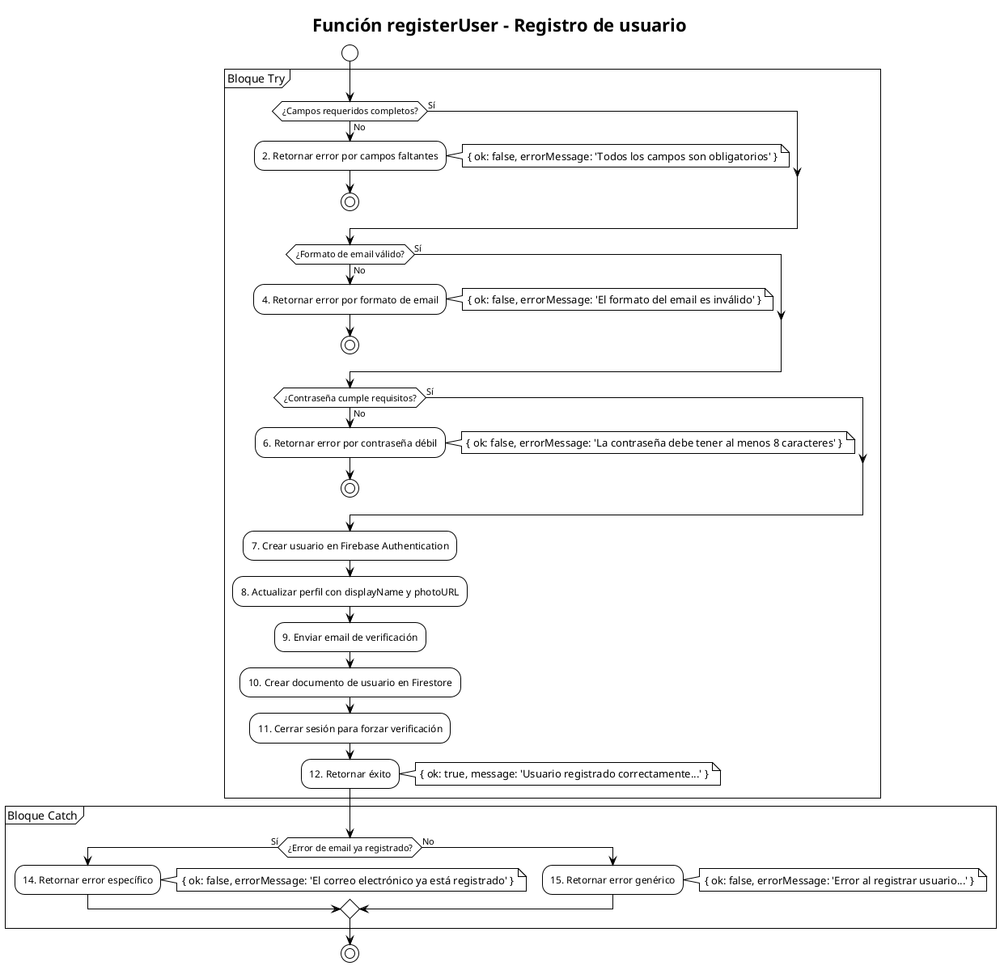

# PCB-M-01: REGISTRO DE USUARIO

## Módulo del sistema:

Autenticación

## Historia de usuario:

HU-A01 - Como visitante quiero registrarme en la plataforma para acceder a funcionalidades exclusivas para usuarios

## Número y nombre de la prueba:

PCB-M-01 - Registro de usuario

## Realizado por:

Valentin Alejandro Perez Zurita

## Fecha

15 de Abril del 2025

## Código Fuente

```js
/**
 * Registra un nuevo usuario en el sistema
 * @param {Object} userData - Datos del usuario a registrar
 * @returns {Promise<Object>} - Resultado de la operación
 */
export const registerUser = async (userData) => {
  try {
    // Validar que existan los campos requeridos
    if (!userData.email || !userData.password || !userData.displayName) {
      return { 
        ok: false, 
        errorMessage: 'Todos los campos son obligatorios' 
      };
    }
  
    // Validar formato de email
    const emailRegex = /^[^\s@]+@[^\s@]+\.[^\s@]+$/;
    if (!emailRegex.test(userData.email)) {
      return { 
        ok: false, 
        errorMessage: 'El formato del email es inválido' 
      };
    }
  
    // Validar complejidad de contraseña
    if (userData.password.length < 8) {
      return { 
        ok: false, 
        errorMessage: 'La contraseña debe tener al menos 8 caracteres' 
      };
    }
  
    // Crear usuario en Firebase Authentication
    const userCredential = await createUserWithEmailAndPassword(
      FirebaseAuth,
      userData.email,
      userData.password
    );
  
    // Obtener el usuario creado
    const user = userCredential.user;
  
    // Actualizar el perfil con el nombre de usuario
    await updateProfile(user, {
      displayName: userData.displayName,
      photoURL: userData.photoURL || null
    });
  
    // Enviar email de verificación
    await sendEmailVerification(user);
  
    // Crear documento de usuario en Firestore
    const userRef = doc(FirebaseDB, 'users', user.uid);
    await setDoc(userRef, {
      uid: user.uid,
      email: userData.email,
      displayName: userData.displayName,
      photoURL: userData.photoURL || null,
      role: 'customer',
      createdAt: serverTimestamp(),
      updatedAt: serverTimestamp()
    });
  
    // Cerrar sesión para forzar verificación de email
    await FirebaseAuth.signOut();
  
    return { 
      ok: true, 
      message: 'Usuario registrado correctamente. Por favor, verifica tu correo electrónico.'
    };
  } catch (error) {
    console.error('Error al registrar usuario:', error.message);
  
    // Manejar errores específicos de Firebase Auth
    if (error.code === 'auth/email-already-in-use') {
      return { 
        ok: false, 
        errorMessage: 'El correo electrónico ya está registrado' 
      };
    }
  
    return { 
      ok: false, 
      errorMessage: 'Error al registrar usuario. Inténtalo de nuevo más tarde.'
    };
  }
};
```

## Diagrama de flujo



## Cálculo de la Complejidad Ciclomática

**Número de regiones:**

- Regiones: 6

**Fórmula Aristas - Nodos + 2**

- Nodos: 15
- Aristas: 19
- Cálculo: V(G) = 19 - 15 + 2 = 6

**Nodos predicado + 1**

- Nodos predicado (decisiones): 5
  1. ¿Campos requeridos completos? (Nodo 1)
  2. ¿Formato de email válido? (Nodo 3)
  3. ¿Contraseña cumple requisitos? (Nodo 5)
  4. ¿Error de email ya registrado? (Nodo 13)
  5. Decisión implícita del bloque try-catch (entre nodo 7 y nodo 13)
- Cálculo: V(G) = 5 + 1 = 6

**Conclusión:** La complejidad ciclomática es 6, lo que implica que se deben identificar 6 caminos independientes dentro del grafo.

## Determinación del Conjunto Básico de Caminos Independientes

| Nº | Descripción                | Secuencia de nodos                                                      |
| --- | --------------------------- | ----------------------------------------------------------------------- |
| 1   | Falta de datos requeridos   | 1(No) → 2 → Fin                                                       |
| 2   | Email con formato inválido | 1(Sí) → 3(No) → 4 → Fin                                             |
| 3   | Contraseña demasiado corta | 1(Sí) → 3(Sí) → 5(No) → 6 → Fin                                   |
| 4   | Registro exitoso            | 1(Sí) → 3(Sí) → 5(Sí) → 7 → 8 → 9 → 10 → 11 → 12 → Fin      |
| 5   | Error: email ya registrado  | 1(Sí) → 3(Sí) → 5(Sí) → 7 → (excepción) → 13(Sí) → 14 → Fin |
| 6   | Error genérico             | 1(Sí) → 3(Sí) → 5(Sí) → 7 → (excepción) → 13(No) → 15 → Fin  |

## Derivación de Casos de Prueba

| Camino | Caso de Prueba      | Datos de Entrada                                                                                                                          | Resultado Esperado                                                                                                                                                                                                                                                |
| ------ | ------------------- | ----------------------------------------------------------------------------------------------------------------------------------------- | ----------------------------------------------------------------------------------------------------------------------------------------------------------------------------------------------------------------------------------------------------------------- |
| 1      | Datos incompletos   | userData = { email: "usuario@example.com", password: "", displayName: "Usuario" }                                                         | Retorna { ok: false, errorMessage: 'Todos los campos son obligatorios' }                                                                                                                                                                                          |
| 2      | Email inválido     | userData = { email: "usuario@invalido", password: "Password123", displayName: "Usuario" }                                                 | Retorna { ok: false, errorMessage: 'El formato del email es inválido' }                                                                                                                                                                                          |
| 3      | Contraseña débil  | userData = { email: "usuario@example.com", password: "123", displayName: "Usuario" }                                                      | Retorna { ok: false, errorMessage: 'La contraseña debe tener al menos 8 caracteres' }                                                                                                                                                                            |
| 4      | Registro exitoso    | userData = { email: "nuevo@example.com", password: "Password123", displayName: "Usuario Nuevo" }                                          | Se crea el usuario en Firebase Auth, se actualiza su perfil, se envía email de verificación, se crea documento en Firestore, se cierra sesión y retorna { ok: true, message: 'Usuario registrado correctamente. Por favor, verifica tu correo electrónico.' } |
| 5      | Email ya registrado | userData = { email: "existente@example.com", password: "Password123", displayName: "Usuario" }, donde el email ya existe en Firebase Auth | Retorna { ok: false, errorMessage: 'El correo electrónico ya está registrado' }                                                                                                                                                                                 |
| 6      | Error en Firebase   | userData válido pero hay un error de conexión o cualquier otro error no específico                                                     | Retorna { ok: false, errorMessage: 'Error al registrar usuario. Inténtalo de nuevo más tarde.' }                                                                                                                                                                |
