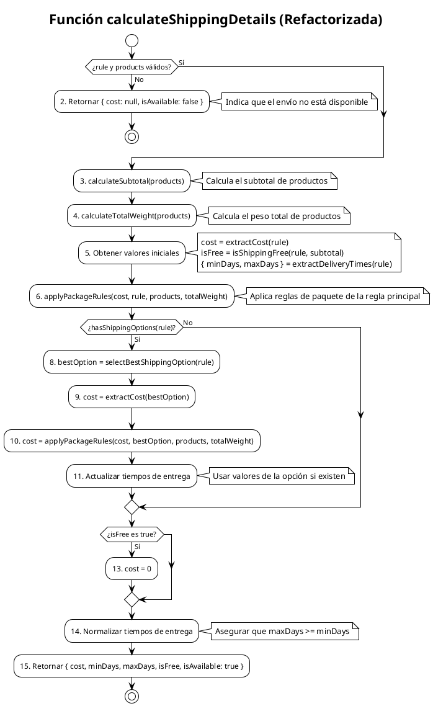

# PCB-M-03.1: CÁLCULO DE COSTO DE ENVÍO (REFACTORIZADO)

## Módulo del sistema:
Checkout - Envío

## Historia de usuario: 
HU-C03 - Como cliente quiero conocer el costo de envío basado en mi ubicación y peso de productos para planificar mi compra

## Número y nombre de la prueba:
PCB-M-03.1 - Cálculo de costo de envío (versión refactorizada)

## Realizado por:
Valentin Alejandro Perez Zurita

## Fecha
20 de Abril del 2025


## Código Fuente Refactorizado


```js
/**
 * Calcula el costo de envío basado en datos reales (versión refactorizada)
 * @param {Object} rule - Regla de envío
 * @param {Array} products - Productos a enviar
 * @returns {Object} - Información de costo y tiempo de entrega
 */
const calculateShippingDetails = (rule, products) => {
  // 1. Validación básica con valor predeterminado significativo
  if (!rule || !products || products.length === 0) {
    return { 
      cost: null, 
      minDays: null, 
      maxDays: null, 
      isFree: false, 
      isAvailable: false // Indica explícitamente que el envío no está disponible
    };
  }
  
  // 2. Extraer datos usando funciones auxiliares
  const subtotal = calculateSubtotal(products);
  const totalWeight = calculateTotalWeight(products);
  
  // 3. Calcular con la regla principal
  let cost = extractCost(rule);
  let isFree = isShippingFree(rule, subtotal);
  let { minDays, maxDays } = extractDeliveryTimes(rule);
  
  // 4. Aplicar reglas de paquetes
  cost = applyPackageRules(cost, rule, products, totalWeight);
  
  // 5. Usar opciones de mensajería si existen
  if (hasShippingOptions(rule)) {
    const bestOption = selectBestShippingOption(rule);
    cost = extractCost(bestOption);
    cost = applyPackageRules(cost, bestOption, products, totalWeight);
    
    // Actualizar tiempos
    const optionTimes = extractDeliveryTimes(bestOption);
    minDays = optionTimes.minDays || minDays;
    maxDays = optionTimes.maxDays || maxDays;
  }
  
  // 6. Envío gratuito si corresponde
  if (isFree) {
    cost = 0;
  }
  
  // 7. Normalizar tiempos de entrega
  if (minDays !== null && maxDays !== null && maxDays < minDays) {
    maxDays = minDays;
  }
  
  return { 
    cost, 
    minDays, 
    maxDays, 
    isFree,
    isAvailable: true 
  };
};

/**
 * Calcula el subtotal de los productos
 * @param {Array} products - Lista de productos
 * @returns {number} - Subtotal
 */
const calculateSubtotal = (products) => {
  return products.reduce((sum, item) => {
    const product = item.product || item;
    const price = parseFloat(product.price || 0);
    const quantity = parseInt(item.quantity || 1, 10);
    return sum + (price * quantity);
  }, 0);
};

/**
 * Calcula el peso total de los productos
 * @param {Array} products - Lista de productos
 * @returns {number} - Peso total
 */
const calculateTotalWeight = (products) => {
  return products.reduce((sum, item) => {
    const product = item.product || item;
    const weight = parseFloat(product.weight || 0);
    const quantity = parseInt(item.quantity || 1, 10);
    return sum + (weight * quantity);
  }, 0);
};

/**
 * Extrae el costo base de una configuración
 * @param {Object} config - Configuración (regla o opción)
 * @returns {number} - Costo base
 */
const extractCost = (config) => {
  const cost = parseFloat(config.precio_base || config.base_price || config.precio || 0);
  return cost >= 0 ? cost : 0; // Asegurar que no sea negativo
};

/**
 * Determina si se aplica envío gratis
 * @param {Object} rule - Regla de envío
 * @param {number} subtotal - Subtotal de la compra
 * @returns {boolean} - True si el envío es gratis
 */
const isShippingFree = (rule, subtotal) => {
  // Comprobar si está explícitamente configurado como gratis
  if (rule.envio_gratis === true || rule.free_shipping === true) {
    return true;
  }
  
  // Comprobar si se supera el monto mínimo para envío gratis
  if (rule.envio_gratis_monto_minimo && subtotal >= parseFloat(rule.envio_gratis_monto_minimo)) {
    return true;
  }
  
  return false;
};

/**
 * Extrae y normaliza los tiempos de entrega
 * @param {Object} config - Configuración (regla o opción)
 * @returns {Object} - Tiempos de entrega normalizados
 */
const extractDeliveryTimes = (config) => {
  let minDays = null;
  let maxDays = null;
  
  // Intentar obtener tiempo mínimo de entrega
  if (config.tiempo_minimo !== undefined && config.tiempo_minimo !== null) {
    minDays = parseInt(config.tiempo_minimo, 10);
  } else if (config.min_days !== undefined && config.min_days !== null) {
    minDays = parseInt(config.min_days, 10);
  } else if (config.minDays !== undefined && config.minDays !== null) {
    minDays = parseInt(config.minDays, 10);
  }
  
  // Intentar obtener tiempo máximo de entrega
  if (config.tiempo_maximo !== undefined && config.tiempo_maximo !== null) {
    maxDays = parseInt(config.tiempo_maximo, 10);
  } else if (config.max_days !== undefined && config.max_days !== null) {
    maxDays = parseInt(config.max_days, 10);
  } else if (config.maxDays !== undefined && config.maxDays !== null) {
    maxDays = parseInt(config.maxDays, 10);
  }
  
  // Intentar extraer de tiempo_entrega (formato "1-3 días" o "2 días")
  if ((minDays === null || maxDays === null) && config.tiempo_entrega) {
    const tiempoMatch = config.tiempo_entrega.match(/(\d+)[-\s]*(\d+)/);
    if (tiempoMatch && tiempoMatch.length >= 3) {
      if (minDays === null) minDays = parseInt(tiempoMatch[1], 10);
      if (maxDays === null) maxDays = parseInt(tiempoMatch[2], 10);
    } else if (config.tiempo_entrega.match(/(\d+)/)) {
      // Si solo hay un número (ej: "2 días")
      const singleMatch = config.tiempo_entrega.match(/(\d+)/);
      const days = parseInt(singleMatch[1], 10);
      if (minDays === null) minDays = days;
      if (maxDays === null) maxDays = days;
    }
  }
  
  return { minDays, maxDays };
};

/**
 * Aplica reglas de configuración de paquetes y calcula cargos extra
 * @param {number} baseCost - Costo base
 * @param {Object} config - Configuración (regla o opción)
 * @param {Array} products - Lista de productos
 * @param {number} totalWeight - Peso total de los productos
 * @returns {number} - Costo actualizado
 */
const applyPackageRules = (baseCost, config, products, totalWeight) => {
  let cost = baseCost;
  
  // Si no hay configuración de paquetes, retornar costo sin cambios
  if (!config.configuracion_paquetes) {
    return cost;
  }
  
  const pkgConfig = config.configuracion_paquetes;
  
  // Verificar si aplica cargo por peso extra
  if (pkgConfig.peso_maximo_paquete !== undefined && pkgConfig.costo_por_kg_extra !== undefined) {
    const maxWeight = parseFloat(pkgConfig.peso_maximo_paquete);
    const extraWeightCost = parseFloat(pkgConfig.costo_por_kg_extra);
    
    if (!isNaN(maxWeight) && !isNaN(extraWeightCost) && totalWeight > maxWeight) {
      const extraWeight = totalWeight - maxWeight;
      const extraCost = extraWeight * extraWeightCost;
      cost += extraCost;
    }
  }
  
  // Verificar si aplica cargo por producto extra
  if (pkgConfig.maximo_productos_por_paquete !== undefined && pkgConfig.costo_por_producto_extra !== undefined) {
    const maxProducts = parseInt(pkgConfig.maximo_productos_por_paquete, 10);
    const extraProductCost = parseFloat(pkgConfig.costo_por_producto_extra);
    
    if (!isNaN(maxProducts) && !isNaN(extraProductCost) && products.length > maxProducts) {
      const extraProducts = products.length - maxProducts;
      const extraCost = extraProducts * extraProductCost;
      cost += extraCost;
    }
  }
  
  return cost;
};

/**
 * Verifica si la regla tiene opciones de mensajería
 * @param {Object} rule - Regla de envío
 * @returns {boolean} - True si hay opciones de mensajería
 */
const hasShippingOptions = (rule) => {
  return Array.isArray(rule.opciones_mensajeria) && rule.opciones_mensajeria.length > 0;
};

/**
 * Selecciona la mejor opción de mensajería (más económica)
 * @param {Object} rule - Regla de envío
 * @returns {Object} - La opción más económica
 */
const selectBestShippingOption = (rule) => {
  // Ordenar por precio
  const sortedOptions = [...rule.opciones_mensajeria].sort((a, b) => 
    parseFloat(a.precio || 0) - parseFloat(b.precio || 0)
  );
  
  return sortedOptions[0]; // Retornar la opción más económica
};
```


## Diagrama de flujo





## Cálculo de la Complejidad Ciclomática


**Número de regiones:**
- Regiones: 4

**Fórmula Aristas - Nodos + 2**
- Nodos: 15
- Aristas: 17
- Cálculo: V(G) = 17 - 15 + 2 = 4

**Nodos predicado + 1**
- Nodos predicado (decisiones): 3
  1. ¿rule y products válidos? (Nodo 1)
  2. ¿hasShippingOptions(rule)? (Nodo 7)
  3. ¿isFree es true? (Nodo 12)
- Cálculo: V(G) = 3 + 1 = 4

**Conclusión:** La complejidad ciclomática es 4, lo que implica que se deben identificar 4 caminos independientes dentro del grafo.


## Determinación del Conjunto Básico de Caminos Independientes


| Nº | Descripción | Secuencia de nodos |
|---|---|---|
| 1 | Validación inicial falla | 1(No) → 2 → Fin |
| 2 | Costo desde regla principal | 1(Sí) → 3 → 4 → 5 → 6 → 7(No) → 12(No) → 14 → 15 → Fin |
| 3 | Costo con opciones de mensajería | 1(Sí) → 3 → 4 → 5 → 6 → 7(Sí) → 8 → 9 → 10 → 11 → 12(No) → 14 → 15 → Fin |
| 4 | Envío gratuito | 1(Sí) → 3 → 4 → 5 → 6 → 7(No) → 12(Sí) → 13 → 14 → 15 → Fin |


## Derivación de Casos de Prueba


| Camino | Caso de Prueba | Datos de Entrada | Resultado Esperado |
|---|---|---|---|
| 1 | Regla o productos inválidos | rule = null, products = [] | { cost: null, minDays: null, maxDays: null, isFree: false, isAvailable: false } |
| 2 | Costo desde regla principal | rule = { id: 1, precio_base: 150, configuracion_paquetes: { peso_maximo_paquete: 5, costo_por_kg_extra: 30 } }, products = [{ product: { price: 500, weight: 7 }, quantity: 1 }] | { cost: 210, minDays: null, maxDays: null, isFree: false, isAvailable: true } (150 + (7-5)*30 = 210) |
| 3 | Costo con opciones de mensajería | rule = { id: 2, precio_base: 200, opciones_mensajeria: [{ precio: 80, tiempo_minimo: 2, tiempo_maximo: 5 }, { precio: 150, tiempo_minimo: 1, tiempo_maximo: 2 }] }, products = [{ product: { price: 300, weight: 2 }, quantity: 1 }] | { cost: 80, minDays: 2, maxDays: 5, isFree: false, isAvailable: true } |
| 4 | Envío gratuito | rule = { id: 3, precio_base: 180, envio_gratis_monto_minimo: 1000 }, products = [{ product: { price: 600, weight: 2 }, quantity: 2 }] | { cost: 0, minDays: null, maxDays: null, isFree: true, isAvailable: true } (subtotal 1200 >= monto mínimo 1000) |


## Mejoras Implementadas


1. **Reducción de duplicidad**:
   - Se extrajo la lógica común a funciones auxiliares reutilizables
   - La lógica para calcular cargos extra se unificó en una sola función

2. **Mayor legibilidad**:
   - Cada función tiene un propósito claro y específico
   - El flujo principal es más directo y menos anidado

3. **Mejor manejo de "disponibilidad"**:
   - Se añadió la propiedad `isAvailable` para indicar claramente si el envío está disponible
   - Se utiliza `cost: null` (en vez de `cost: 0`) cuando no se puede calcular un costo válido
   - Clara diferenciación entre "envío gratuito" y "envío no disponible"

4. **Corrección en cálculo de peso total**:
   - Se considera la cantidad (quantity) al calcular el peso total
   - Evita subestimar el peso cuando hay múltiples unidades del mismo producto

5. **Normalización de datos**:
   - Tratamiento uniforme de configuraciones (regla y opciones)
   - Extracción de tiempos consistente para todos los formatos

6. **Mayor testabilidad**:
   - Funciones pequeñas con una sola responsabilidad
   - Más fácil de probar aisladamente cada aspecto 