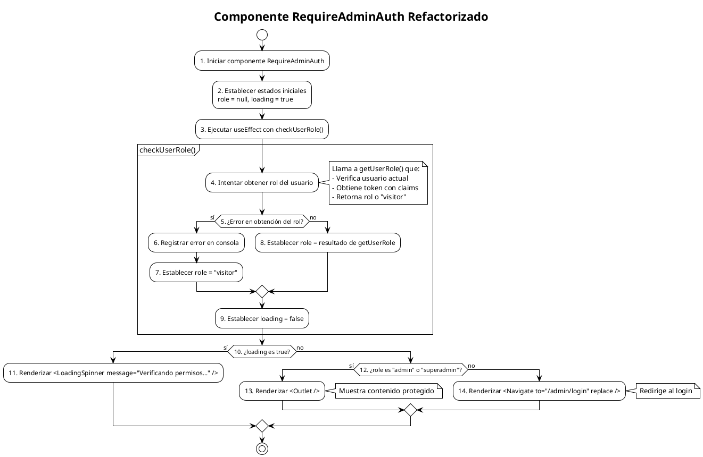

# PCB-M-04.1: AUTORIZACIÓN DE ADMINISTRADORES (REFACTORIZADO)

## Módulo del sistema:
Administración

## Historia de usuario: 
HU-AD01 - Como administrador quiero que el sistema permita el acceso a áreas administrativas solo a usuarios con rol de administrador o superadministrador, para mantener la seguridad del sistema.

## Número y nombre de la prueba:
PCB-M-04.1 - Proceso de autorización basado en roles (Refactorizado)

## Realizado por:
Valentin Alejandro Perez Zurita

## Fecha
19 de Abril del 2025

## Código Fuente Refactorizado

### RequireAdminAuth.jsx (Refactorizado)
```jsx
import { useState, useEffect } from "react";
import { Outlet, Navigate } from "react-router-dom";
import LoadingSpinner from "../ui/LoadingSpinner";
import { getUserRole } from "../../utils/authUtils";

const RequireAdminAuth = () => {
  const [role, setRole] = useState(null);
  const [loading, setLoading] = useState(true);

  useEffect(() => {
    const checkUserRole = async () => {
      try {
        const userRole = await getUserRole();
        setRole(userRole);
      } catch (error) {
        console.error("Error al verificar el rol:", error);
        setRole("visitor");
      } finally {
        setLoading(false);
      }
    };

    checkUserRole();
  }, []);

  if (loading) {
    return <LoadingSpinner message="Verificando permisos..." />;
  }

  return (role === "admin" || role === "superadmin") ? (
    <Outlet />
  ) : (
    <Navigate to="/admin/login" replace />
  );
};

export default RequireAdminAuth;
```

### Función de utilidad `getUserRole()`
```jsx
// src/utils/authUtils.js

import { auth } from "../firebase/config";

export const getUserRole = async () => {
  try {
    const currentUser = auth.currentUser;
    
    if (!currentUser) {
      return "visitor";
    }
    
    const tokenResult = await currentUser.getIdTokenResult();
    return tokenResult.claims.role || "visitor";
  } catch (error) {
    console.error("Error al obtener el rol del usuario:", error);
    return "visitor";
  }
};
```

## Diagrama de flujo



## Cálculo de la Complejidad Ciclomática

**Número de regiones:**
- Regiones: 3

**Fórmula Aristas - Nodos + 2**
- Nodos: 14
- Aristas: 15
- Cálculo: V(G) = 15 - 14 + 2 = 3

**Nodos predicado + 1**
- Nodos predicado (decisiones): 2
  1. ¿Error en obtención del rol? (Nodo 5)
  2. ¿loading es true? (Nodo 10)
  3. ¿role es "admin" o "superadmin"? (Nodo 12)
- Cálculo: V(G) = 2 + 1 = 3

**Conclusión:** La complejidad ciclomática es 3, lo que implica que se deben identificar 3 caminos independientes dentro del grafo.

## Determinación del Conjunto Básico de Caminos Independientes

| Nº | Descripción | Secuencia de nodos |
|---|---|---|
| 1 | Componente en estado de carga | 1 → 2 → 3 → 4 → 5(No) → 8 → 9 → 10(Sí) → 11 → Fin |
| 2 | Usuario con rol de administrador | 1 → 2 → 3 → 4 → 5(No) → 8 → 9 → 10(No) → 12(Sí) → 13 → Fin |
| 3 | Usuario sin permisos administrativos | 1 → 2 → 3 → 4 → 5(No) → 8 → 9 → 10(No) → 12(No) → 14 → Fin |

## Derivación de Casos de Prueba

| Camino | Caso de Prueba | Datos de Entrada | Resultado Esperado |
|---|---|---|---|
| 1 | Componente en estado de carga | loading = true | Se muestra el componente LoadingSpinner con el mensaje "Verificando permisos..." (Nodo 11) |
| 2 | Usuario con rol de administrador | loading = false, role = "admin" | Se renderiza el componente Outlet permitiendo acceso al contenido protegido (Nodo 13) |
| 3 | Usuario sin permisos administrativos | loading = false, role = "visitor" | Se renderiza el componente Navigate redirigiendo al usuario a "/admin/login" (Nodo 14) |

## Mejoras Implementadas en la Refactorización

1. **Eliminación de duplicidad**:
   - Se eliminó la verificación redundante del usuario actual en Firebase
   - Toda la lógica de obtención del rol se centralizó en `getUserRole()`

2. **Simplificación del código**:
   - Reducción de complejidad ciclomática de 5 a 3
   - Código más directo y con menos ramas condicionales

3. **Mejor separación de responsabilidades**:
   - `getUserRole()`: Encargada únicamente de la autenticación y obtención del rol
   - `RequireAdminAuth`: Enfocado en la lógica de renderizado condicional

4. **Manejo de errores más robusto**:
   - Uso de bloques try-catch-finally en lugar de promesas encadenadas
   - Garantía de actualización del estado de carga incluso en caso de error

5. **Mayor facilidad de prueba**:
   - Componentes más pequeños y con responsabilidad única
   - Menos caminos de ejecución posibles
   - Mejor aislamiento de la lógica de autenticación 