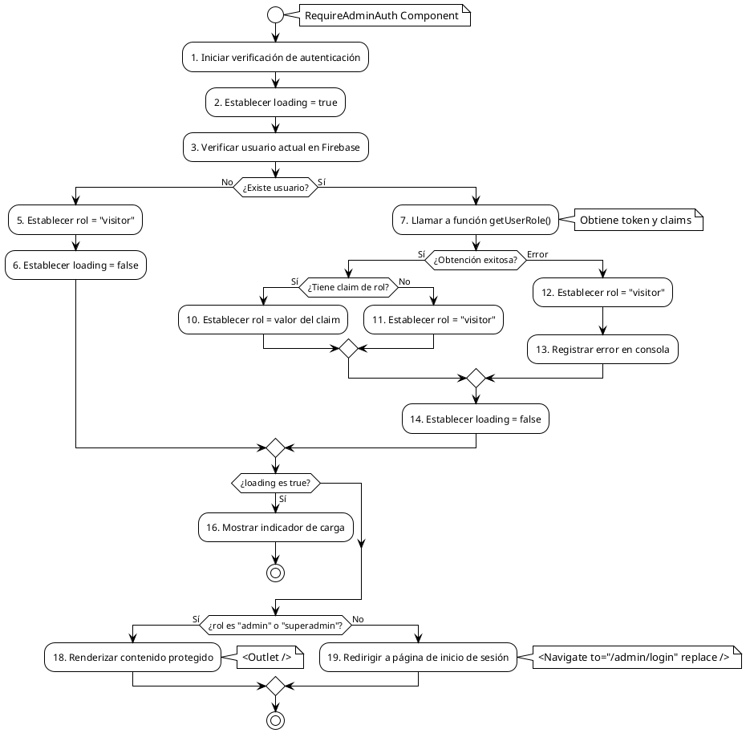

# PCB-M-04: PROCESO DE AUTORIZACIÓN BASADO EN ROLES

## Módulo del sistema:
Auth - Autorización

## Historia de usuario: 
HU-A05 - Como administrador quiero que el sistema controle el acceso a áreas protegidas basado en roles para garantizar la seguridad de la información

## Número y nombre de la prueba:
PCB-M-04 - Proceso de autorización basado en roles

## Realizado por:
Valentin Alejandro Perez Zurita

## Fecha
15 de Abril del 2025


## Código Fuente

### RequireAdminAuth.jsx

```jsx
import { Navigate, Outlet } from 'react-router-dom';
import { useEffect, useState } from 'react';
import { getUserRole } from '../../../../config/firebase/authUtils.js';
import { FirebaseAuth } from '../../../../config/firebase/firebaseConfig.js'

export const RequireAdminAuth = () => {

  const [role, setRole] = useState(null);
  const [loading, setLoading] = useState(true);

  // Check if the user is an admin or super admin
  useEffect(() => {

    // Get the current user
    const user = FirebaseAuth.currentUser;

    // If there is no user, set the role to visitor
    if (!user) {
      setRole('visitor');
      setLoading(false);
      return;
    }

    // Get the user role
    getUserRole().then((userRole) => {
      setRole(userRole);
    })
      .catch((error) => {
        console.error("Error obteniendo el rol:", error);
        setRole("visitor");
      })
      .finally(() => {
        setLoading(false);
      });
  }, []);

  // Show loading message
  if (loading) {
    return <p>Cargando...</p>;
  }

  // Redirect to the login page if the user is not an admin or super admin
  return (role === 'admin' || role === 'superadmin')
    ? <Outlet />
    : <Navigate to="/admin/login" replace />;
};
```

### authUtils.js

```js
import { FirebaseAuth } from "./firebaseConfig.js";

// ✅ Obtener el rol del usuario autenticado
export const getUserRole = async () => {
  const user = FirebaseAuth.currentUser;
  if (!user) return "visitor";

  try {
    const idTokenResult = await user.getIdTokenResult(true);
    return idTokenResult.claims.role || "visitor";
  } catch (error) {
    console.error("Error obteniendo el rol:", error);
    return "visitor";
  }
};
```


## Diagrama de flujo





## Cálculo de la Complejidad Ciclomática


**Número de regiones:**
- Regiones: 5

**Fórmula Aristas - Nodos + 2**
- Nodos: 19
- Aristas: 22
- Cálculo: V(G) = 22 - 19 + 2 = 5

**Nodos predicado + 1**
- Nodos predicado (decisiones): 4
  1. ¿Existe usuario? (Nodo 4)
  2. ¿Obtención exitosa? (Nodo 8)
  3. ¿Tiene claim de rol? (Nodo 9)
  4. ¿loading es true? (Nodo 15)
  5. ¿rol es "admin" o "superadmin"? (Nodo 17)
- Cálculo: V(G) = 4 + 1 = 5

**Conclusión:** La complejidad ciclomática es 5, lo que implica que se deben identificar 5 caminos independientes dentro del grafo.


## Determinación del Conjunto Básico de Caminos Independientes


| Nº | Descripción | Secuencia de nodos |
|---|---|---|
| 1 | Usuario no existe | 1 → 2 → 3 → 4(No) → 5 → 6 → 15(No) → 17(No) → 19 → Fin |
| 2 | Error al obtener rol | 1 → 2 → 3 → 4(Sí) → 7 → 8(Error) → 12 → 13 → 14 → 15(No) → 17(No) → 19 → Fin |
| 3 | Usuario sin claim de rol | 1 → 2 → 3 → 4(Sí) → 7 → 8(Sí) → 9(No) → 11 → 14 → 15(No) → 17(No) → 19 → Fin |
| 4 | Usuario con rol "user" | 1 → 2 → 3 → 4(Sí) → 7 → 8(Sí) → 9(Sí) → 10("user") → 14 → 15(No) → 17(No) → 19 → Fin |
| 5 | Usuario con rol "admin" | 1 → 2 → 3 → 4(Sí) → 7 → 8(Sí) → 9(Sí) → 10("admin") → 14 → 15(No) → 17(Sí) → 18 → Fin |


## Derivación de Casos de Prueba


| Camino | Caso de Prueba | Datos de Entrada | Resultado Esperado |
|---|---|---|---|
| 1 | Usuario no autenticado | FirebaseAuth.currentUser = null | setRole('visitor'), setLoading(false), redirección a '/admin/login' |
| 2 | Error en obtención de token | FirebaseAuth.currentUser = { ... }, getIdTokenResult() lanza error | setRole('visitor'), mensaje de error en consola, redirección a '/admin/login' |
| 3 | Usuario sin claim de rol | FirebaseAuth.currentUser = { ... }, idTokenResult = { claims: { } } | setRole('visitor'), redirección a '/admin/login' |
| 4 | Usuario con rol "user" | FirebaseAuth.currentUser = { ... }, idTokenResult = { claims: { role: 'user' } } | setRole('user'), redirección a '/admin/login' |
| 5 | Usuario con rol "admin" | FirebaseAuth.currentUser = { ... }, idTokenResult = { claims: { role: 'admin' } } | setRole('admin'), renderiza <Outlet /> permitiendo acceso |


## Análisis de la función getUserRole

La función `getUserRole` implementa un proceso de autorización sencillo pero efectivo:

1. Verifica si existe un usuario actual en Firebase
2. Si no existe, devuelve 'visitor' inmediatamente
3. Si existe, intenta obtener un token con los claims actualizados
4. Extrae el rol de los claims, o devuelve 'visitor' si no existe
5. Maneja posibles errores devolviendo 'visitor' por defecto

Este enfoque garantiza que:
- Solo usuarios con roles específicos ('admin', 'superadmin') acceden a áreas protegidas
- Cada verificación de rol consulta tokens actualizados para reflejar cambios de permisos
- Fallos en el sistema de autenticación resultan en acceso denegado por defecto (seguridad)
- La implementación es robusta ante errores, evitando fallos en la aplicación

## Observaciones de seguridad

El componente forma parte del sistema de protección de rutas y garantiza que:

1. Solo usuarios con roles administrativos puedan acceder a rutas del panel de administración
2. La verificación se realiza utilizando claims de Firebase (verificados en el servidor)
3. Se implementa un principio de "denegar por defecto", donde ante cualquier error o falta de autenticación se deniega el acceso
4. Los usuarios no autorizados son redirigidos al login administrativo

Estas medidas contribuyen a mantener la seguridad general del sistema Cactilia.