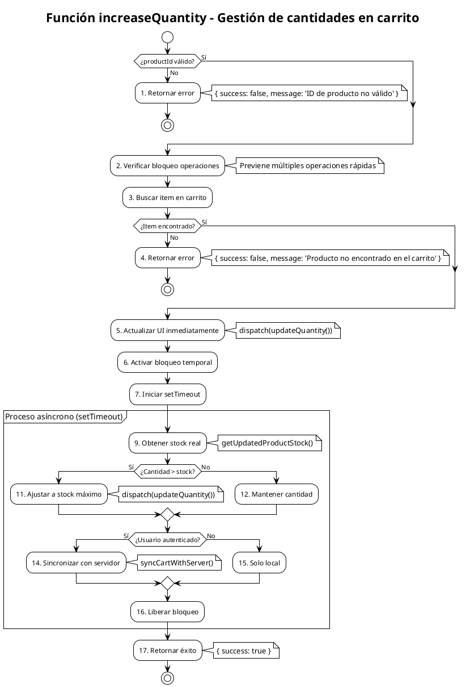
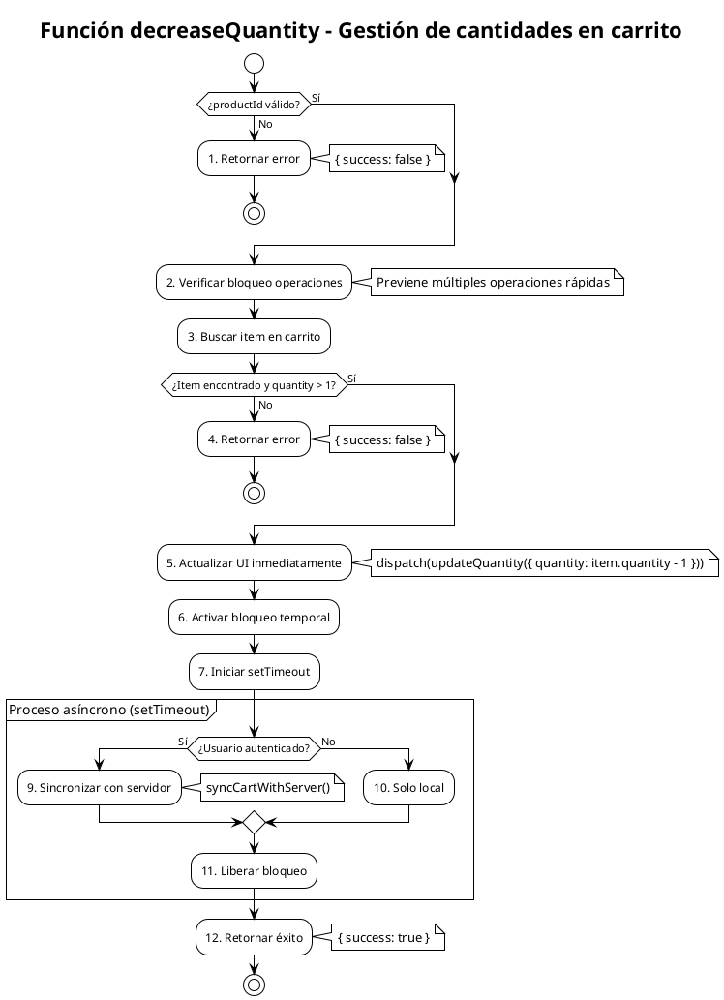

# PCB-M-05: GESTIÓN DE CANTIDADES EN CARRITO

## Módulo del sistema:
Carrito de Compras

## Historia de usuario: 
HU-C05 - Como cliente quiero modificar las cantidades de los productos en mi carrito para ajustar mi pedido según mis necesidades

## Número y nombre de la prueba:
PCB-M-05 - Gestión de cantidades en carrito

## Realizado por:
Valentin Alejandro Perez Zurita

## Fecha
15 de Abril del 2025


## Código Fuente

### Función increaseQuantity

A continuación se presenta la función `increaseQuantity` del hook `useCartOperations` que gestiona el incremento de cantidades de productos en el carrito:

```js
/**
 * Incrementa la cantidad de un producto en el carrito
 * @param {string} productId - ID del producto
 * @returns {Promise<Object>} Resultado de la operación
 */
const increaseQuantity = useCallback(async (productId) => {
  if (!productId) return { success: false, message: 'ID de producto no válido' };

  // Simplificamos el bloqueo para que no sea tan restrictivo
  if (incrementLocks.current[productId]) {
    // Si hay bloqueo, permitimos continuar pero lo registramos
    console.log('Operación rápida detectada:', productId);
  }

  const item = items.find(item => item.id === productId);
  if (!item) {
    return { success: false, message: 'Producto no encontrado en el carrito' };
  }

  // Actualización optimista - actualizamos UI inmediatamente
  dispatch(updateQuantity({ id: productId, quantity: item.quantity + 1 }));
  
  // Marcar como bloqueado brevemente
  incrementLocks.current[productId] = true;
  
  // Validación en segundo plano sin bloquear UI
  setTimeout(async () => {
    try {
      // Verificar stock en segundo plano
      const currentStock = await getUpdatedProductStock(productId);
      
      // Si excede el stock, revertir al stock máximo
      if (item.quantity + 1 > currentStock) {
        dispatch(updateQuantity({ id: productId, quantity: currentStock }));
        console.warn(`Cantidad ajustada a stock disponible (${currentStock})`);
      }
      
      // Sincronizar con el servidor si necesario
      if (uid) dispatch(syncCartWithServer());
    } catch (error) {
      console.error('Error en validación de stock:', error);
    } finally {
      // Liberar bloqueo rápidamente
      incrementLocks.current[productId] = false;
    }
  }, 300); // Retraso mínimo para mejor UX

  return { success: true };
}, [dispatch, items, uid, getUpdatedProductStock]);
```

### Función decreaseQuantity

A continuación se presenta la función `decreaseQuantity` del mismo hook, que gestiona el decremento de cantidades:

```js
/**
 * Decrementa la cantidad de un producto en el carrito
 * @param {string} productId - ID del producto
 * @returns {Object} Resultado de la operación
 */
const decreaseQuantity = useCallback((productId) => {
  if (!productId) return { success: false };

  // Simplificamos el bloqueo para permitir operaciones rápidas
  if (incrementLocks.current[productId]) {
    console.log('Operación rápida detectada (decremento):', productId);
  }

  const item = items.find(item => item.id === productId);
  if (!item || item.quantity <= 1) {
    return { success: false };
  }

  // Actualización optimista - actualizamos UI inmediatamente
  dispatch(updateQuantity({ id: productId, quantity: item.quantity - 1 }));
  
  // Marcar como bloqueado brevemente
  incrementLocks.current[productId] = true;
  
  // Sincronizar con el servidor en segundo plano
  setTimeout(() => {
    if (uid) dispatch(syncCartWithServer());
    // Liberar bloqueo rápidamente
    incrementLocks.current[productId] = false;
  }, 300);
  
  return { success: true };
}, [dispatch, items, uid]);
```


## Diagrama de flujo para increaseQuantity



## Diagrama de flujo para decreaseQuantity




## Cálculo de la Complejidad Ciclomática

### Para la función increaseQuantity:

**Número de regiones:**
- Regiones: 5

**Fórmula Aristas - Nodos + 2**
- Nodos: 17
- Aristas: 20
- Cálculo: V(G) = 20 - 17 + 2 = 5

**Nodos predicado + 1**
- Nodos predicado (decisiones): 4
  1. ¿productId válido? (Nodo 1)
  2. ¿Item encontrado? (Nodo 4)
  3. ¿Cantidad > stock? (Nodo 10)
  4. ¿Usuario autenticado? (Nodo 13)
- Cálculo: V(G) = 4 + 1 = 5

**Conclusión:** La complejidad ciclomática de increaseQuantity es 5.

### Para la función decreaseQuantity:

**Número de regiones:**
- Regiones: 3

**Fórmula Aristas - Nodos + 2**
- Nodos: 12
- Aristas: 13
- Cálculo: V(G) = 13 - 12 + 2 = 3

**Nodos predicado + 1**
- Nodos predicado (decisiones): 2
  1. ¿productId válido? (Nodo 1)
  2. ¿Item encontrado y quantity > 1? (Nodo 4)
- Cálculo: V(G) = 2 + 1 = 3

**Conclusión:** La complejidad ciclomática de decreaseQuantity es 3.


## Determinación del Conjunto Básico de Caminos Independientes

### Para increaseQuantity:

| Nº | Descripción | Secuencia de nodos |
|---|---|---|
| 1 | Flujo feliz - producto incrementado con éxito y stock suficiente (usuario autenticado) | 1 → 2 → 3 → 4(Sí) → 5 → 6 → 7 → 9 → 10(No) → 12 → 13(Sí) → 14 → 16 → 17 → Fin |
| 2 | Flujo alternativo - stock insuficiente (usuario autenticado) | 1 → 2 → 3 → 4(Sí) → 5 → 6 → 7 → 9 → 10(Sí) → 11 → 13(Sí) → 14 → 16 → 17 → Fin |
| 3 | Flujo alternativo - usuario no autenticado | 1 → 2 → 3 → 4(Sí) → 5 → 6 → 7 → 9 → 10(No) → 12 → 13(No) → 15 → 16 → 17 → Fin |
| 4 | Error - ID de producto inválido | 1(No) → Fin |
| 5 | Error - Producto no encontrado en carrito | 1 → 2 → 3 → 4(No) → Fin |

### Para decreaseQuantity:

| Nº | Descripción | Secuencia de nodos |
|---|---|---|
| 1 | Flujo feliz - decremento exitoso (usuario autenticado) | 1 → 2 → 3 → 4(Sí) → 5 → 6 → 7 → 8(Sí) → 9 → 11 → 12 → Fin |
| 2 | Flujo alternativo - usuario no autenticado | 1 → 2 → 3 → 4(Sí) → 5 → 6 → 7 → 8(No) → 10 → 11 → 12 → Fin |
| 3 | Error - ID inválido o cantidad ≤ 1 | 1(No) → Fin o 1 → 2 → 3 → 4(No) → Fin |


## Derivación de Casos de Prueba

### Para increaseQuantity:

| Camino | Caso de Prueba | Datos de Entrada | Resultado Esperado |
|---|---|---|---|
| 1 | Incremento exitoso con usuario autenticado | productId: "prod123" <br> item: {id: "prod123", quantity: 2, stock: 10} <br> uid: "user456" <br> currentStock: 10 | Se incrementa la cantidad a 3 inmediatamente en la UI. Se obtiene el stock real (10) que es suficiente. Se sincroniza el carrito con el servidor. Retorna {success: true}. |
| 2 | Incremento con ajuste de stock (usuario autenticado) | productId: "prod123" <br> item: {id: "prod123", quantity: 9, stock: 10} <br> uid: "user456" <br> currentStock: 9 | Se incrementa la cantidad a 10 inmediatamente en la UI. Se obtiene el stock real (9) que es insuficiente, por lo que se ajusta la cantidad a 9. Se sincroniza el carrito con el servidor. Retorna {success: true}. |
| 3 | Incremento exitoso con usuario no autenticado | productId: "prod123" <br> item: {id: "prod123", quantity: 2, stock: 10} <br> uid: null <br> currentStock: 10 | Se incrementa la cantidad a 3 inmediatamente en la UI. Se obtiene el stock real (10) que es suficiente. No se sincroniza con el servidor por falta de autenticación. Retorna {success: true}. |
| 4 | Error por ID de producto inválido | productId: null | Retorna inmediatamente {success: false, message: 'ID de producto no válido'} sin realizar ninguna operación en el carrito. |
| 5 | Error por producto no encontrado en carrito | productId: "prod999" <br> items: [{id: "prod123", quantity: 2, stock: 10}] | Retorna {success: false, message: 'Producto no encontrado en el carrito'} sin realizar ninguna operación en el carrito. |

### Para decreaseQuantity:

| Camino | Caso de Prueba | Datos de Entrada | Resultado Esperado |
|---|---|---|---|
| 1 | Decremento exitoso con usuario autenticado | productId: "prod123" <br> item: {id: "prod123", quantity: 3} <br> uid: "user456" | Se decrementa la cantidad a 2 inmediatamente en la UI. Se sincroniza el carrito con el servidor. Retorna {success: true}. |
| 2 | Decremento exitoso con usuario no autenticado | productId: "prod123" <br> item: {id: "prod123", quantity: 3} <br> uid: null | Se decrementa la cantidad a 2 inmediatamente en la UI. No se sincroniza con el servidor por falta de autenticación. Retorna {success: true}. |
| 3 | Error por ID inválido | productId: null | Retorna inmediatamente {success: false} sin realizar ninguna operación en el carrito. |
| 3 | Error por cantidad mínima | productId: "prod123" <br> item: {id: "prod123", quantity: 1} | Retorna {success: false} sin decrementar la cantidad por estar ya en el mínimo permitido (1). |


## Análisis Comparativo

La comparación entre las funciones `increaseQuantity` y `decreaseQuantity` revela aspectos importantes del diseño del sistema:

1. **Validación de stock**: `increaseQuantity` realiza validación asíncrona del stock disponible para evitar que se soliciten cantidades que no están disponibles, mientras que `decreaseQuantity` no requiere esta validación ya que solo reduce la cantidad.

2. **Complejidad**: `increaseQuantity` tiene mayor complejidad ciclomática (5 vs 3) debido a la necesidad de validar el stock en tiempo real.

3. **Comportamiento optimista**: Ambas funciones implementan una actualización optimista, mostrando el cambio inmediatamente en la UI y luego realizando operaciones de validación o sincronización en segundo plano.

4. **Manejo de errores**: `increaseQuantity` proporciona mensajes de error más descriptivos para ayudar al usuario a entender por qué no se puede incrementar la cantidad.

Esta diferencia en complejidad está justificada por los distintos requisitos de cada operación: incrementar requiere validar disponibilidad de stock, mientras que decrementar solo necesita asegurar que no se llegue a cantidades negativas.