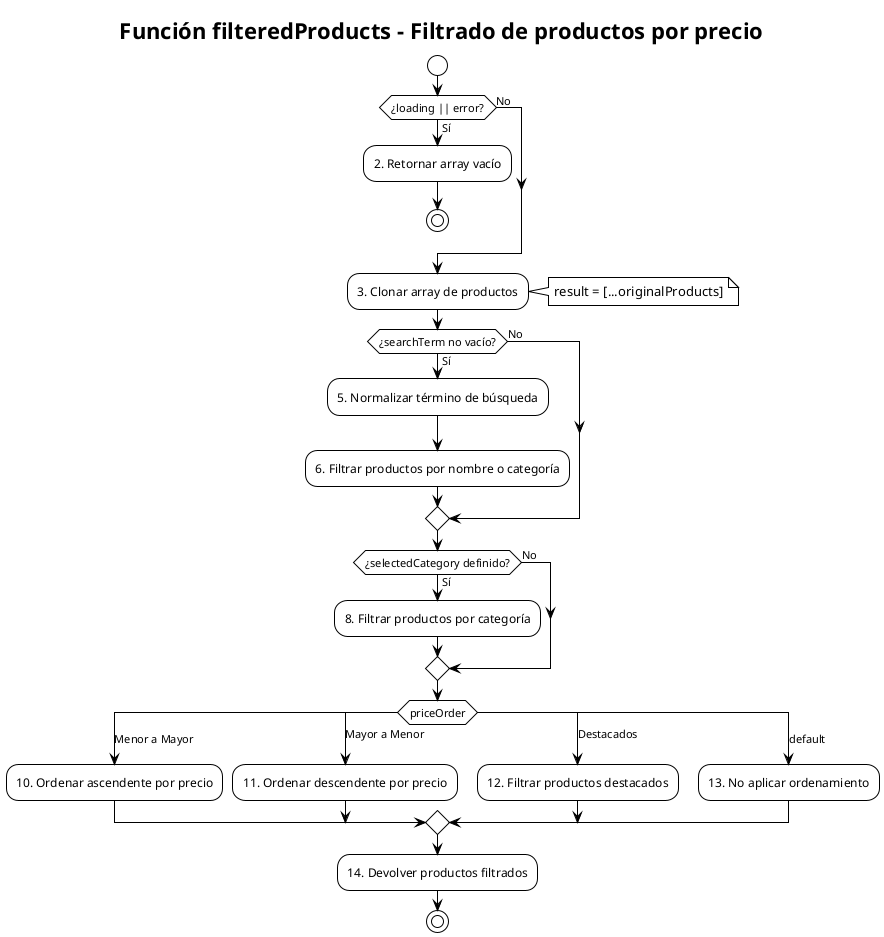

# PCB-M-06: FILTRADO DE PRODUCTOS POR PRECIO

## Módulo del sistema:
Shop

## Historia de usuario: 
HU-S03 - Como cliente quiero filtrar los productos por precio y otras características para encontrar más fácilmente los productos que me interesan

## Número y nombre de la prueba:
PCB-M-06 - Filtrado de productos por precio

## Realizado por:
Valentin Alejandro Perez Zurita

## Fecha
18 de Abril del 2025


## Código Fuente


```js
/**
 * Función que filtra productos según diferentes criterios
 * Parte del hook useProducts en src/modules/shop/hooks/useProducts.js
 */

const filteredProducts = useMemo(() => {
  // 🛑 Si hay carga o error, devolver un array vacío
  if (loading || error) return [];

  let result = [...originalProducts];

  // 🔍 Filtrar por término de búsqueda (nombre o categoría)
  if (searchTerm.trim() !== "") {
    const normalizedSearchTerm = searchTerm.toLowerCase().trim();
    result = result.filter((prod) => 
      // Buscar en el nombre del producto
      (prod.name && prod.name.toLowerCase().includes(normalizedSearchTerm)) || 
      // Buscar en la categoría del producto
      (prod.category && prod.category.toLowerCase().includes(normalizedSearchTerm))
    );
  }

  // 🏷️ Filtrar por categoría
  if (selectedCategory) {
    result = result.filter((prod) => prod.category?.toLowerCase() === selectedCategory.toLowerCase());
  }

  // 💲 Ordenar por precio
  switch (priceOrder) {
    case "Menor a Mayor":
      result.sort((a, b) => a.price - b.price);
      break;
    case "Mayor a Menor":
      result.sort((a, b) => b.price - a.price);
      break;
    case "Destacados":
      result = result.filter((prod) => prod.featured);
      break;
    default:
      break;
  }

  // ✅ Devolver los productos filtrados
  return result;

}, [originalProducts, loading, error, searchTerm, selectedCategory, priceOrder]);
```


## Diagrama de flujo





## Cálculo de la Complejidad Ciclomática


**Número de regiones:**
- Regiones: 5

**Fórmula Aristas - Nodos + 2**
- Nodos: 14
- Aristas: 17
- Cálculo: V(G) = 17 - 14 + 2 = 5

**Nodos predicado + 1**
- Nodos predicado (decisiones): 4
  1. Decisión 1: ¿loading || error? (Nodo 1)
  2. Decisión 2: ¿searchTerm no vacío? (Nodo 4)
  3. Decisión 3: ¿selectedCategory definido? (Nodo 7)
  4. Decisión 4: switch (priceOrder) con 4 casos (Nodo 9)
- Cálculo: V(G) = 4 + 1 = 5

**Conclusión:** La complejidad ciclomática es 5, lo que implica que se deben identificar 5 caminos independientes dentro del grafo.


## Determinación del Conjunto Básico de Caminos Independientes


| Nº | Descripción | Secuencia de nodos |
|---|---|---|
| 1 | Loading o error activo | 1(Sí) → 2 → Fin |
| 2 | Sin filtros ni ordenamiento | 1(No) → 3 → 4(No) → 7(No) → 9(default) → 13 → 14 → Fin |
| 3 | Con búsqueda y ordenamiento ascendente | 1(No) → 3 → 4(Sí) → 5 → 6 → 7(No) → 9(Menor a Mayor) → 10 → 14 → Fin |
| 4 | Con categoría y ordenamiento descendente | 1(No) → 3 → 4(No) → 7(Sí) → 8 → 9(Mayor a Menor) → 11 → 14 → Fin |
| 5 | Filtro por destacados | 1(No) → 3 → 4(No) → 7(No) → 9(Destacados) → 12 → 14 → Fin |


## Derivación de Casos de Prueba


| Camino | Caso de Prueba | Datos de Entrada | Resultado Esperado |
|---|---|---|---|
| 1 | Loading o error activo | loading = true, error = null, originalProducts = [{...}, {...}] | Retorna un array vacío [] |
| 2 | Sin filtros ni ordenamiento | loading = false, error = null, originalProducts = [{id: "p1", name: "Producto 1", price: 100}, {id: "p2", name: "Producto 2", price: 200}], searchTerm = "", selectedCategory = "", priceOrder = "" | Retorna una copia del array original sin modificaciones: [{id: "p1", name: "Producto 1", price: 100}, {id: "p2", name: "Producto 2", price: 200}] |
| 3 | Con búsqueda y ordenamiento ascendente | loading = false, error = null, originalProducts = [{id: "p1", name: "Maceta Grande", price: 150}, {id: "p2", name: "Maceta Pequeña", price: 80}, {id: "p3", name: "Cactus Espinoso", price: 120}], searchTerm = "maceta", selectedCategory = "", priceOrder = "Menor a Mayor" | Retorna array filtrado y ordenado: [{id: "p2", name: "Maceta Pequeña", price: 80}, {id: "p1", name: "Maceta Grande", price: 150}] |
| 4 | Con categoría y ordenamiento descendente | loading = false, error = null, originalProducts = [{id: "p1", name: "Cactus A", category: "cactus", price: 100}, {id: "p2", name: "Suculenta B", category: "suculentas", price: 200}, {id: "p3", name: "Cactus C", category: "cactus", price: 150}], searchTerm = "", selectedCategory = "cactus", priceOrder = "Mayor a Menor" | Retorna array filtrado por categoría y ordenado descendente: [{id: "p3", name: "Cactus C", category: "cactus", price: 150}, {id: "p1", name: "Cactus A", category: "cactus", price: 100}] |
| 5 | Filtro por destacados | loading = false, error = null, originalProducts = [{id: "p1", name: "Producto 1", featured: true, price: 100}, {id: "p2", name: "Producto 2", featured: false, price: 80}, {id: "p3", name: "Producto 3", featured: true, price: 150}], searchTerm = "", selectedCategory = "", priceOrder = "Destacados" | Retorna solo productos destacados: [{id: "p1", name: "Producto 1", featured: true, price: 100}, {id: "p3", name: "Producto 3", featured: true, price: 150}] |
</rewritten_file> 