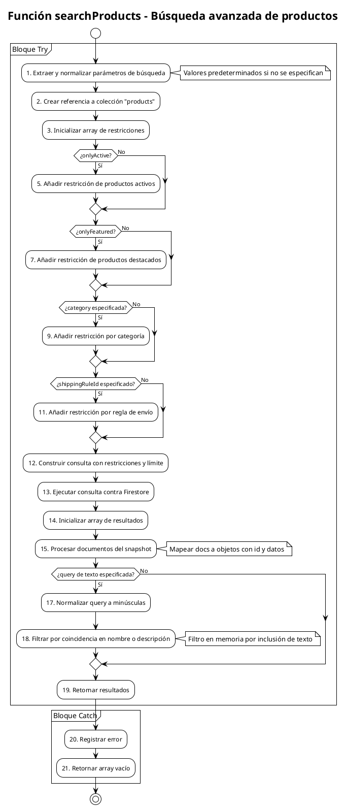

# PCB-M-09: BÚSQUEDA AVANZADA DE PRODUCTOS

## Módulo del sistema:
Shop

## Historia de usuario: 
HU-P03 - Como cliente quiero buscar productos por palabras clave para encontrar fácilmente lo que estoy buscando

## Número y nombre de la prueba:
PCB-M-09 - Búsqueda avanzada de productos

## Realizado por:
Valentin Alejandro Perez Zurita

## Fecha
18 de Abril del 2025


## Código Fuente


```js
/**
 * Busca productos que coincidan con criterios específicos
 * Extracto de src/modules/shop/services/productQueryService.js
 *
 * @param {Object} criteria - Criterios de búsqueda
 * @param {string} criteria.query - Texto a buscar en nombre/descripción
 * @param {string} criteria.category - Categoría a filtrar
 * @param {string} criteria.shippingRuleId - ID de la regla de envío
 * @param {boolean} criteria.onlyActive - Solo productos activos
 * @param {boolean} criteria.onlyFeatured - Solo productos destacados
 * @param {number} criteria.maxResults - Número máximo de resultados
 * @returns {Promise<Array<Object>>} Lista de productos que coinciden
 */
async function searchProducts(criteria = {}) {
  try {
    // Valores predeterminados
    const {
      query = '',
      category = '',
      shippingRuleId = '',
      onlyActive = true,
      onlyFeatured = false,
      maxResults = 50
    } = criteria;

    // Crear consulta base
    const productsRef = collection(FirebaseDB, 'products');
    let constraints = [];

    // Añadir restricciones según criterios
    if (onlyActive) {
      constraints.push(where('active', '==', true));
    }

    if (onlyFeatured) {
      constraints.push(where('featured', '==', true));
    }

    if (category) {
      constraints.push(where('category', '==', category));
    }

    if (shippingRuleId) {
      constraints.push(where('shippingRuleId', '==', shippingRuleId));
    }

    // Ejecutar consulta
    const productsQuery = query(
      productsRef,
      ...constraints,
      limit(maxResults)
    );

    const querySnapshot = await getDocs(productsQuery);
    let results = [];

    // Procesar resultados
    querySnapshot.forEach(doc => {
      results.push({
        id: doc.id,
        ...doc.data()
      });
    });

    // Filtrar por texto de búsqueda si es necesario
    if (query) {
      const normalizedQuery = query.toLowerCase();
      results = results.filter(product =>
        product.name?.toLowerCase().includes(normalizedQuery) ||
        product.description?.toLowerCase().includes(normalizedQuery)
      );
    }

    return results;
  } catch (error) {
    logError('Error en búsqueda de productos', error, { criteria });
    return [];
  }
}
```


## Diagrama de flujo





## Cálculo de la Complejidad Ciclomática


**Número de regiones:**
- Regiones: 7

**Fórmula Aristas - Nodos + 2**
- Nodos: 21
- Aristas: 26
- Cálculo: V(G) = 26 - 21 + 2 = 7

**Nodos predicado + 1**
- Nodos predicado (decisiones): 6
  1. Decisión 1: ¿onlyActive? (Nodo 4)
  2. Decisión 2: ¿onlyFeatured? (Nodo 6)
  3. Decisión 3: ¿category especificada? (Nodo 8)
  4. Decisión 4: ¿shippingRuleId especificado? (Nodo 10)
  5. Decisión 5: ¿query de texto especificada? (Nodo 16)
  6. Decisión implícita del bloque try-catch (entre nodo 1 y nodo 20)
- Cálculo: V(G) = 6 + 1 = 7

**Conclusión:** La complejidad ciclomática es 7, lo que implica que se deben identificar 7 caminos independientes dentro del grafo.


## Determinación del Conjunto Básico de Caminos Independientes


| Nº | Descripción | Secuencia de nodos |
|---|---|---|
| 1 | Error en ejecución | 1 → (excepción) → 20 → 21 → Fin |
| 2 | Búsqueda sin filtros ni texto (solo activos por defecto) | 1 → 2 → 3 → 4(Sí) → 5 → 6(No) → 8(No) → 10(No) → 12 → 13 → 14 → 15 → 16(No) → 19 → Fin |
| 3 | Búsqueda de productos destacados | 1 → 2 → 3 → 4(Sí) → 5 → 6(Sí) → 7 → 8(No) → 10(No) → 12 → 13 → 14 → 15 → 16(No) → 19 → Fin |
| 4 | Búsqueda por categoría | 1 → 2 → 3 → 4(Sí) → 5 → 6(No) → 8(Sí) → 9 → 10(No) → 12 → 13 → 14 → 15 → 16(No) → 19 → Fin |
| 5 | Búsqueda por regla de envío | 1 → 2 → 3 → 4(Sí) → 5 → 6(No) → 8(No) → 10(Sí) → 11 → 12 → 13 → 14 → 15 → 16(No) → 19 → Fin |
| 6 | Búsqueda con texto, sin filtros adicionales | 1 → 2 → 3 → 4(Sí) → 5 → 6(No) → 8(No) → 10(No) → 12 → 13 → 14 → 15 → 16(Sí) → 17 → 18 → 19 → Fin |
| 7 | Búsqueda combinada (texto + filtros) | 1 → 2 → 3 → 4(Sí) → 5 → 6(Sí) → 7 → 8(Sí) → 9 → 10(No) → 12 → 13 → 14 → 15 → 16(Sí) → 17 → 18 → 19 → Fin |


## Derivación de Casos de Prueba


| Camino | Caso de Prueba | Datos de Entrada | Resultado Esperado |
|---|---|---|---|
| 1 | Error en la consulta | Firestore arroja error durante la ejecución | Se registra el error y retorna array vacío [] |
| 2 | Solo productos activos | criteria = { onlyActive: true } | Retorna array con todos los productos activos, sin filtro adicional |
| 3 | Solo productos destacados | criteria = { onlyActive: true, onlyFeatured: true } | Retorna array con productos que son activos y destacados |
| 4 | Filtro por categoría | criteria = { category: "Cactus" } | Retorna array con productos activos de la categoría "Cactus" |
| 5 | Filtro por regla de envío | criteria = { shippingRuleId: "rule123" } | Retorna array con productos activos que usan la regla de envío "rule123" |
| 6 | Búsqueda por texto | criteria = { query: "suculenta" } | Retorna array con productos activos cuyo nombre o descripción contiene "suculenta" |
| 7 | Búsqueda combinada | criteria = { query: "mini", onlyFeatured: true, category: "Cactus" } | Retorna array con productos activos, destacados, de categoría "Cactus" y que contengan "mini" en nombre o descripción |
</rewritten_file> 