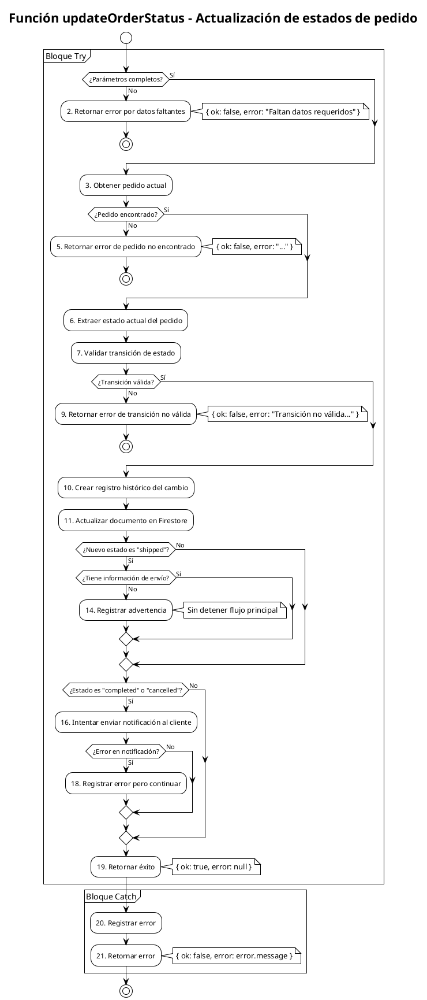

# PCB-M-10: ACTUALIZACIÓN DE ESTADOS DE PEDIDO

## Módulo del sistema:
Administración

## Historia de usuario: 
HU-AD05 - Como administrador quiero actualizar el estado de los pedidos para gestionar el ciclo de vida de las órdenes y mantener informados a los clientes

## Número y nombre de la prueba:
PCB-M-10 - Actualización de estados de pedido

## Realizado por:
Valentin Alejandro Perez Zurita

## Fecha
18 de Abril del 2025


## Código Fuente


```js
/**
 * Actualiza el estado de un pedido y registra el cambio
 * Extracto de src/modules/admin/components/orders/services/orderAdminService.js
 * 
 * @param {string} orderId - ID del pedido
 * @param {string} newStatus - Nuevo estado
 * @param {string} adminId - ID del administrador
 * @param {string} notes - Notas sobre el cambio (opcional)
 * @returns {Promise<Object>} - Resultado de la operación
 */
export const updateOrderStatus = async (orderId, newStatus, adminId, notes = '') => {
  try {
    if (!orderId || !newStatus || !adminId) {
      return { ok: false, error: 'Faltan datos requeridos' };
    }

    // Obtener el pedido actual
    const result = await getOrderById(orderId);
    if (!result.ok) {
      return result;
    }

    const order = result.data;
    const currentStatus = order.status;

    // Verificar si el cambio de estado es válido según el flujo de trabajo
    const isValidTransition = validateStatusTransition(currentStatus, newStatus);
    if (!isValidTransition) {
      return { 
        ok: false, 
        error: `Transición no válida: ${currentStatus} → ${newStatus}` 
      };
    }

    // Crear registro histórico del cambio
    const statusChange = {
      from: currentStatus,
      to: newStatus,
      changedAt: new Date(),
      changedBy: adminId,
      notes
    };

    // Actualizar el pedido
    const orderRef = doc(FirebaseDB, ORDERS_COLLECTION, orderId);
    await updateDoc(orderRef, {
      status: newStatus,
      statusHistory: [...(order.statusHistory || []), statusChange],
      updatedAt: serverTimestamp()
    });

    // Si el cambio es a "shipped", verificar si hay información de envío
    if (newStatus === 'shipped' && (!order.shipping || !order.shipping.trackingInfo)) {
      // Registrar una advertencia interna
      console.warn(`Orden ${orderId} marcada como enviada sin información de seguimiento`);
    }

    // Si el cambio es a estado "completed" o "cancelled", notificar al cliente
    if (newStatus === 'completed' || newStatus === 'cancelled') {
      try {
        await sendOrderStatusNotification(order.userId, orderId, newStatus, notes);
      } catch (notificationError) {
        console.error('Error al enviar notificación:', notificationError);
        // No interrumpir el flujo si hay error en la notificación
      }
    }

    return { ok: true, error: null };
  } catch (error) {
    console.error('Error al actualizar estado del pedido:', error);
    return { ok: false, error: error.message };
  }
};

/**
 * Valida si la transición de estado es permitida según el flujo de trabajo
 * @param {string} currentStatus - Estado actual
 * @param {string} newStatus - Nuevo estado
 * @returns {boolean} - true si la transición es válida
 */
const validateStatusTransition = (currentStatus, newStatus) => {
  // Definir transiciones permitidas
  const allowedTransitions = {
    'pending': ['processing', 'cancelled'],
    'processing': ['shipped', 'cancelled'],
    'shipped': ['delivered', 'cancelled'],
    'delivered': ['completed', 'returned'],
    'completed': ['returned'],
    'returned': [],
    'cancelled': ['pending'] // Solo admins pueden reactivar
  };

  // Verificar si la transición está permitida
  return allowedTransitions[currentStatus]?.includes(newStatus) || false;
};
```


## Diagrama de flujo





## Cálculo de la Complejidad Ciclomática


**Número de regiones:**
- Regiones: 9

**Fórmula Aristas - Nodos + 2**
- Nodos: 21
- Aristas: 28
- Cálculo: V(G) = 28 - 21 + 2 = 9

**Nodos predicado + 1**
- Nodos predicado (decisiones): 8
  1. Decisión 1: ¿Parámetros completos? (Nodo 1)
  2. Decisión 2: ¿Pedido encontrado? (Nodo 4)
  3. Decisión 3: ¿Transición válida? (Nodo 8)
  4. Decisión 4: ¿Nuevo estado es "shipped"? (Nodo 12)
  5. Decisión 5: ¿Tiene información de envío? (Nodo 13)
  6. Decisión 6: ¿Estado es "completed" o "cancelled"? (Nodo 15)
  7. Decisión 7: ¿Error en notificación? (Nodo 17)
  8. Decisión implícita del bloque try-catch (entre nodo 1 y nodo 20)
- Cálculo: V(G) = 8 + 1 = 9

**Conclusión:** La complejidad ciclomática es 9, lo que implica que se deben identificar 9 caminos independientes dentro del grafo.


## Determinación del Conjunto Básico de Caminos Independientes


| Nº | Descripción | Secuencia de nodos |
|---|---|---|
| 1 | Error: parámetros incompletos | 1(No) → 2 → Fin |
| 2 | Error: pedido no encontrado | 1(Sí) → 3 → 4(No) → 5 → Fin |
| 3 | Error: transición no válida | 1(Sí) → 3 → 4(Sí) → 6 → 7 → 8(No) → 9 → Fin |
| 4 | Excepción inesperada | 1(Sí) → 3 → (excepción) → 20 → 21 → Fin |
| 5 | Actualización simple sin notificaciones | 1(Sí) → 3 → 4(Sí) → 6 → 7 → 8(Sí) → 10 → 11 → 12(No) → 15(No) → 19 → Fin |
| 6 | Actualización a "shipped" sin tracking | 1(Sí) → 3 → 4(Sí) → 6 → 7 → 8(Sí) → 10 → 11 → 12(Sí) → 13(No) → 14 → 15(No) → 19 → Fin |
| 7 | Actualización a "shipped" con tracking | 1(Sí) → 3 → 4(Sí) → 6 → 7 → 8(Sí) → 10 → 11 → 12(Sí) → 13(Sí) → 15(No) → 19 → Fin |
| 8 | Actualización a "completed" con notificación exitosa | 1(Sí) → 3 → 4(Sí) → 6 → 7 → 8(Sí) → 10 → 11 → 12(No) → 15(Sí) → 16 → 17(No) → 19 → Fin |
| 9 | Actualización a "cancelled" con error en notificación | 1(Sí) → 3 → 4(Sí) → 6 → 7 → 8(Sí) → 10 → 11 → 12(No) → 15(Sí) → 16 → 17(Sí) → 18 → 19 → Fin |


## Derivación de Casos de Prueba


| Camino | Caso de Prueba | Datos de Entrada | Resultado Esperado |
|---|---|---|---|
| 1 | Parámetros incompletos | orderId = null, newStatus = "shipped", adminId = "admin123" | Retorna { ok: false, error: 'Faltan datos requeridos' } |
| 2 | Pedido no encontrado | orderId = "nonexistent", newStatus = "shipped", adminId = "admin123", getOrderById retorna { ok: false, error: "Pedido no encontrado" } | Retorna { ok: false, error: "Pedido no encontrado" } |
| 3 | Transición no válida | orderId = "order123", newStatus = "completed", adminId = "admin123", order.status = "processing" | Retorna { ok: false, error: "Transición no válida: processing → completed" } |
| 4 | Excepción inesperada | orderId = "order123", newStatus = "shipped", adminId = "admin123", updateDoc arroja error | Retorna { ok: false, error: "Mensaje del error lanzado" } |
| 5 | Actualización a "processing" | orderId = "order123", newStatus = "processing", adminId = "admin123", order.status = "pending" | Actualiza el documento, actualiza historial y retorna { ok: true, error: null } |
| 6 | Actualización a "shipped" sin tracking | orderId = "order123", newStatus = "shipped", adminId = "admin123", order.status = "processing", order.shipping = null | Registra advertencia, actualiza documento y retorna { ok: true, error: null } |
| 7 | Actualización a "shipped" con tracking | orderId = "order123", newStatus = "shipped", adminId = "admin123", order.status = "processing", order.shipping = { trackingInfo: {...} } | Actualiza documento y retorna { ok: true, error: null } |
| 8 | Actualización a "completed" con notificación | orderId = "order123", newStatus = "completed", adminId = "admin123", order.status = "delivered" | Envía notificación, actualiza documento y retorna { ok: true, error: null } |
| 9 | Actualización a "cancelled" con error en notificación | orderId = "order123", newStatus = "cancelled", adminId = "admin123", order.status = "pending", sendOrderStatusNotification arroja error | Registra error de notificación, continúa flujo y retorna { ok: true, error: null } |
</rewritten_file> 